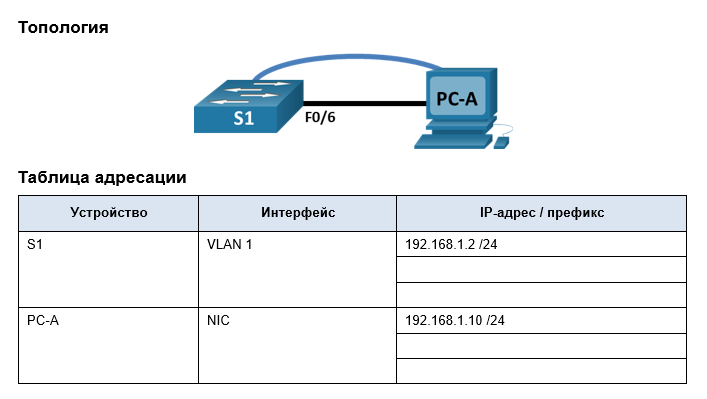
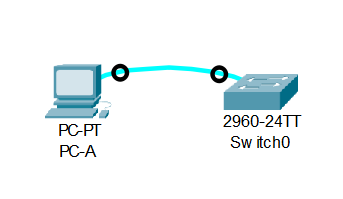

# Часть 1. Создание сети и проверка настроек коммутатора по умолчанию
## Шаг 1. Создайте сеть согласно топологии.

### a. Подсоедините консольный кабель, как показано в топологии. На данном этапе не подключайте кабель Ethernet компьютера PC-A.

### b.	Установите консольное подключение к коммутатору с компьютера PC-A с помощью Tera Term или другой программы эмуляции терминала.
Устанавливаем подключение к коммутатору с помощью терминала эмуляции.


Консольный кабель при первоначальной настройке необходимо использовать по причине отсутсвия настроек сетевых интерфейсов, то есть подключение по SSH или Telnet не является возможным.


## Шаг 2. Проверьте настройки коммутатора по умолчанию.
### a. Войдите в прививилегированный режим EXEC и убедитесь, что на коммутаторе находится пустой файл конфигурации. Выполните очистку настроек и перезагрузите коммутатор, если ваш коммутатор имеет настройки, отличные от настроек по умолчанию.
```markdown
Switch>en
Switch#sh run
Switch#sh running-config 
Building configuration...

Current configuration : 1080 bytes
!
version 15.0
no service timestamps log datetime msec
no service timestamps debug datetime msec
no service password-encryption
!
hostname Switch
!
!
!
!
!
!
spanning-tree mode pvst
spanning-tree extend system-id
!
interface FastEthernet0/1
!
interface FastEthernet0/2
!
interface FastEthernet0/3
!
interface FastEthernet0/4
!
interface FastEthernet0/5
!
interface FastEthernet0/6
!
interface FastEthernet0/7
!
interface FastEthernet0/8
!
interface FastEthernet0/9
!
interface FastEthernet0/10
!
interface FastEthernet0/11
!
interface FastEthernet0/12
!
interface FastEthernet0/13
!
interface FastEthernet0/14
!
interface FastEthernet0/15
!
interface FastEthernet0/16
!
interface FastEthernet0/17
!
interface FastEthernet0/18
!
interface FastEthernet0/19
!
interface FastEthernet0/20
!
interface FastEthernet0/21
!
interface FastEthernet0/22
!
interface FastEthernet0/23
!
interface FastEthernet0/24
!
interface GigabitEthernet0/1
!
interface GigabitEthernet0/2
!
interface Vlan1
 no ip address
 shutdown
!
!
!
!
line con 0
!
line vty 0 4
 login
line vty 5 15
 login
!
!
!
!
end
```
Найстройки коммутатора по умолчанию. Очистка не требуется.


### b.	Изучите текущий файл running configuration.
Вопросы:    
- Сколько интерфейсов FastEthernet имеется на коммутаторе 2960?  
```
interface FastEthernet0/1
!
interface FastEthernet0/2
!
interface FastEthernet0/3
!
interface FastEthernet0/4
!
interface FastEthernet0/5
!
interface FastEthernet0/6
!
interface FastEthernet0/7
!
interface FastEthernet0/8
!
interface FastEthernet0/9
!
interface FastEthernet0/10
!
interface FastEthernet0/11
!
interface FastEthernet0/12
!
interface FastEthernet0/13
!
interface FastEthernet0/14
!
interface FastEthernet0/15
!
interface FastEthernet0/16
!
interface FastEthernet0/17
!
interface FastEthernet0/18
!
interface FastEthernet0/19
!
interface FastEthernet0/20
!
interface FastEthernet0/21
!
interface FastEthernet0/22
!
interface FastEthernet0/23
!
interface FastEthernet0/24
```

Коммутатор имеет 24 порта FastEthernet 


- Сколько интерфейсов Gigabit Ethernet имеется на коммутаторе 2960?   
```
interface GigabitEthernet0/1
!
interface GigabitEthernet0/2
!
```

Коммутатор имеет 2 порта Gigabit Ethernet 

- Каков диапазон значений, отображаемых в vty-линиях?

```markdown

line vty 0 4
 login
line vty 5 15
 login
```
Всего 16 линий 

### c.	Изучите файл загрузочной конфигурации (startup configuration), который содержится в энергонезависимом ОЗУ (NVRAM).
- 
Почему появляется это сообщение?

```markdown
Switch#show  startup-config 
startup-config is not present
```

Сообщение об отсутствии файла startup configuration мы получаем в виду того, что running-config еще не записан.


### d. 	Изучите характеристики SVI для VLAN 1.
- Назначен ли IP-адрес сети VLAN 1?


```markdown
interface Vlan1
 no ip address
```
running-config Говорит, что IP адрес для VLAN1 не назначен

- Какой MAC-адрес имеет SVI? Данный интерфейс включен?
```
Switch>en
Switch#
Switch#sh int vlan1
Vlan1 is administratively down, line protocol is down
  Hardware is CPU Interface, address is 00d0.bcec.d372 (bia 00d0.bcec.d372)
  MTU 1500 bytes, BW 100000 Kbit, DLY 1000000 usec,
     reliability 255/255, txload 1/255, rxload 1/255
  Encapsulation ARPA, loopback not set
  ARP type: ARPA, ARP Timeout 04:00:00
  Last input 21:40:21, output never, output hang never
  Last clearing of "show interface" counters never
  Input queue: 0/75/0/0 (size/max/drops/flushes); Total output drops: 0
  Queueing strategy: fifo
  Output queue: 0/40 (size/max)
  5 minute input rate 0 bits/sec, 0 packets/sec
  5 minute output rate 0 bits/sec, 0 packets/sec
     1682 packets input, 530955 bytes, 0 no buffer
     Received 0 broadcasts (0 IP multicast)
     0 runts, 0 giants, 0 throttles
     0 input errors, 0 CRC, 0 frame, 0 overrun, 0 ignored
     563859 packets output, 0 bytes, 0 underruns
     0 output errors, 23 interface resets
     0 output buffer failures, 0 output buffers swapped out
```
Vlan1 выключен и имеет MAC - 00d0.bcec.d372


### e.Изучите IP-свойства интерфейса SVI сети VLAN 1.
- Какие выходные данные вы видите?
```markdown
Switch#show ip int Vlan 1
Vlan1 is administratively down, line protocol is down
  Internet protocol processing disabled
```
Vlan1 отключен

### f.	Подсоедините кабель Ethernet компьютера PC-A к порту 6 на коммутаторе и изучите IP-свойства интерфейса SVI сети VLAN 1. Дождитесь согласования параметров скорости и дуплекса между коммутатором и ПК.

- Какие выходные данные вы видите?
```markdown
Switch#
%LINK-5-CHANGED: Interface FastEthernet0/6, changed state to up

%LINEPROTO-5-UPDOWN: Line protocol on Interface FastEthernet0/6, changed state to up
```
### g. Изучите сведения о версии ОС Cisco IOS на коммутаторе.
- Под управлением какой версии ОС Cisco IOS работает коммутатор?
```markdown
Switch#sh ver
Cisco IOS Software, C2960 Software (C2960-LANBASEK9-M), Version 15.0(2)SE4, RELEASE SOFTWARE (fc1)
Technical Support: http://www.cisco.com/techsupport
Copyright (c) 1986-2013 by Cisco Systems, Inc.
Compiled Wed 26-Jun-13 02:49 by mnguyen

ROM: Bootstrap program is C2960 boot loader
BOOTLDR: C2960 Boot Loader (C2960-HBOOT-M) Version 12.2(25r)FX, RELEASE SOFTWARE (fc4)

Switch uptime is 39 minutes
System returned to ROM by power-on
System image file is "flash:c2960-lanbasek9-mz.150-2.SE4.bin"


This product contains cryptographic features and is subject to United
States and local country laws governing import, export, transfer and
use. Delivery of Cisco cryptographic products does not imply
third-party authority to import, export, distribute or use encryption.
Importers, exporters, distributors and users are responsible for
compliance with U.S. and local country laws. By using this product you
agree to comply with applicable laws and regulations. If you are unable
to comply with U.S. and local laws, return this product immediately.

A summary of U.S. laws governing Cisco cryptographic products may be found at:
http://www.cisco.com/wwl/export/crypto/tool/stqrg.html

If you require further assistance please contact us by sending email to
export@cisco.com.

cisco WS-C2960-24TT-L (PowerPC405) processor (revision B0) with 65536K bytes of memory.
Processor board ID FOC1010X104
Last reset from power-on
1 Virtual Ethernet interface
24 FastEthernet interfaces
2 Gigabit Ethernet interfaces
The password-recovery mechanism is enabled.

64K bytes of flash-simulated non-volatile configuration memory.
Base ethernet MAC Address       : 00:D0:BC:EC:D3:72
Motherboard assembly number     : 73-10390-03
Power supply part number        : 341-0097-02
Motherboard serial number       : FOC10093R12
Power supply serial number      : AZS1007032H
Model revision number           : B0
Motherboard revision number     : B0
Model number                    : WS-C2960-24TT-L
System serial number            : FOC1010X104
Top Assembly Part Number        : 800-27221-02
Top Assembly Revision Number    : A0
Version ID                      : V02
CLEI Code Number                : COM3L00BRA
Hardware Board Revision Number  : 0x01


Switch Ports Model              SW Version            SW Image
------ ----- -----              ----------            ----------
*    1 26    WS-C2960-24TT-L    15.0(2)SE4            C2960-LANBASEK9-M


Configuration register is 0xF
```

Версия ОС - 15.0(2)SE4 

- Как называется файл образа системы?


```markdown
Switch>show flash: 
Directory of flash:/

    1  -rw-     4670455          <no date>  2960-lanbasek9-mz.150-2.SE4.bin
    2  -rw-         616          <no date>  vlan.dat

64016384 bytes total (59345313 bytes free)
```
имя  образа системы	- C2960-LANBASEK9-M    
2960-lanbasek9-mz.150-2.SE4.bin  - файл образа системы

### h.	Изучите свойства по умолчанию интерфейса FastEthernet, который используется компьютером PC-A.

```markdown
Switch#sh int fa 0/6
FastEthernet0/6 is down, line protocol is down (disabled)
  Hardware is Lance, address is 00d0.ff27.0506 (bia 00d0.ff27.0506)
 BW 100000 Kbit, DLY 1000 usec,
     reliability 255/255, txload 1/255, rxload 1/255
  Encapsulation ARPA, loopback not set
  Keepalive set (10 sec)
  Half-duplex, 100Mb/s
  input flow-control is off, output flow-control is off
  ARP type: ARPA, ARP Timeout 04:00:00
  Last input 00:00:08, output 00:00:05, output hang never
  Last clearing of "show interface" counters never
  Input queue: 0/75/0/0 (size/max/drops/flushes); Total output drops: 0
  Queueing strategy: fifo
  Output queue :0/40 (size/max)
  5 minute input rate 0 bits/sec, 0 packets/sec
  5 minute output rate 0 bits/sec, 0 packets/sec
     956 packets input, 193351 bytes, 0 no buffer
     Received 956 broadcasts, 0 runts, 0 giants, 0 throttles
     0 input errors, 0 CRC, 0 frame, 0 overrun, 0 ignored, 0 abort
     0 watchdog, 0 multicast, 0 pause input
     0 input packets with dribble condition detected
     2357 packets output, 263570 bytes, 0 underruns
     0 output errors, 0 collisions, 10 interface resets
     0 babbles, 0 late collision, 0 deferred
     0 lost carrier, 0 no carrier
     0 output buffer failures, 0 output buffers swapped out
```
- Интерфейс включен или выключен?      
Интерфейс выключен

- Что нужно сделать, чтобы включить интерфейс?     
для включения нужно сделать
```markdown
Switch(config)#interface fa 0/6
Switch(config-if)#no shutdown
```

- Какой MAC-адрес у интерфейса?     
MAC - 00d0.ff27.0506    

- Какие настройки скорости и дуплекса заданы в интерфейсе?     
Full-duplex, 100Mb/s

### i. 	Изучите флеш-память.
```markdown
Switch>en
Switch#dir flash
Directory of flash:/

    1  -rw-     4670455          <no date>  2960-lanbasek9-mz.150-2.SE4.bin
    2  -rw-         616          <no date>  vlan.dat

64016384 bytes total (59345313 bytes free)
```
 - Какое имя присвоено образу Cisco IOS?     
 2960-lanbasek9-mz.150-2.SE4.bin  - файл образа системы

#  Часть 2. Настройка базовых параметров сетевых устройств

## Шаг 1. Настройте базовые параметры коммутатора.
### a.	В режиме глобальной конфигурации скопируйте следующие базовые параметры конфигурации и вставьте их в файл на коммутаторе S1. 
```markdown
Switch#conf t
Enter configuration commands, one per line.  End with CNTL/Z.
Switch(config)#no ip domain-lookup
Switch(config)#hostname S1
S1(config)#ser
S1(config)#service pass
S1(config)#service password-encryption 
S1(config)#enable secret class
S1(config)#banner motd # Unauthorized access is strictly prohibited.#
```
### b.	Назначьте IP-адрес интерфейсу SVI на коммутаторе. Благодаря этому вы получите возможность удаленного управления коммутатором.
```
S1(config)#int vlan1
S1(config-if)#ip add
S1(config-if)#ip address 192.168.1.2 255.255.255.0
S1(config-if)#no sh
S1(config-if)#no shutdown 
```
### c.Доступ через порт консоли также следует ограничить  с помощью пароля. Используйте cisco в качестве пароля для входа в консоль 
```
S1(config)#line con 0
S1(config-line)#pasword cisco
S1(config-line)#password cisco
S1(config-line)#login
S1(config-line)#logging  synchronous 
S1(config-line)#end
S1#
```

### d. 	Настройте каналы виртуального соединения для удаленного управления (vty), чтобы коммутатор разрешил доступ через Telnet.
```
S1#conf t
Enter configuration commands, one per line.  End with CNTL/Z.
S1(config)#line vty 0 15
S1(config-line)#password cisco
S1(config-line)#login 
S1(config-line)#end
S1#
```
 - Для чего нужна команда login?    
Команда login используется для включения аутентификации. Использование команды login без параметров  включает аутентификацию по указанному паролю (password cisco в данном случае).


## Шаг 2. Настройте IP-адрес на компьютере PC-A.


# Часть 3. Проверка сетевых подключений

## Шаг 1. Отобразите конфигурацию коммутатора.

### a.
```
S1#sh run
Building configuration...

Current configuration : 1317 bytes
!
version 15.0
no service timestamps log datetime msec
no service timestamps debug datetime msec
service password-encryption
!
hostname S1
!
enable secret 5 $1$mERr$9cTjUIEqNGurQiFU.ZeCi1
!
!
!
no ip domain-lookup
!
!
!
spanning-tree mode pvst
spanning-tree extend system-id
!
interface FastEthernet0/1
!
interface FastEthernet0/2
!
interface FastEthernet0/3
!
interface FastEthernet0/4
!
interface FastEthernet0/5
!
interface FastEthernet0/6
!
interface FastEthernet0/7
!
interface FastEthernet0/8
!
interface FastEthernet0/9
!
interface FastEthernet0/10
!
interface FastEthernet0/11
!
interface FastEthernet0/12
!
interface FastEthernet0/13
!
interface FastEthernet0/14
!
interface FastEthernet0/15
!
interface FastEthernet0/16
!
interface FastEthernet0/17
!
interface FastEthernet0/18
!
interface FastEthernet0/19
!
interface FastEthernet0/20
!
interface FastEthernet0/21
!
interface FastEthernet0/22
!
interface FastEthernet0/23
!
interface FastEthernet0/24
!
interface GigabitEthernet0/1
!
interface GigabitEthernet0/2
!
interface Vlan1
 ip address 192.168.1.2 255.255.255.0
!
banner motd ^C Unauthorized access is strictly prohibited.^C
!
!
!
line con 0
 password 7 0822455D0A16
 logging synchronous
 login
!
line vty 0 4
 password 7 0822455D0A16
 login
line vty 5 15
 password 7 0822455D0A16
 login
!
!
!
!
end
```
### b.	Проверьте параметры VLAN 1.
```
S1#sh int vlan1
Vlan1 is up, line protocol is down
  Hardware is CPU Interface, address is 00d0.bcec.d372 (bia 00d0.bcec.d372)
  Internet address is 192.168.1.2/24
  MTU 1500 bytes, BW 100000 Kbit, DLY 1000000 usec,
     reliability 255/255, txload 1/255, rxload 1/255
  Encapsulation ARPA, loopback not set
  ARP type: ARPA, ARP Timeout 04:00:00
  Last input 21:40:21, output never, output hang never
  Last clearing of "show interface" counters never
  Input queue: 0/75/0/0 (size/max/drops/flushes); Total output drops: 0
  Queueing strategy: fifo
  Output queue: 0/40 (size/max)
  5 minute input rate 0 bits/sec, 0 packets/sec
  5 minute output rate 0 bits/sec, 0 packets/sec
     1682 packets input, 530955 bytes, 0 no buffer
     Received 0 broadcasts (0 IP multicast)
     0 runts, 0 giants, 0 throttles
     0 input errors, 0 CRC, 0 frame, 0 overrun, 0 ignored
     563859 packets output, 0 bytes, 0 underruns
     0 output errors, 23 interface resets
     0 output buffer failures, 0 output buffers swapped out
```
- Какова полоса пропускания этого интерфейса?      
BW 100000 Kbit

##  Шаг 2. Протестируйте сквозное соединение, отправив эхо-запрос.
### a.	В командной строке компьютера PC-A с помощью утилиты ping проверьте связь сначала с адресом PC-A.
```
C:\>ping 192.168.1.10

Pinging 192.168.1.10 with 32 bytes of data:

Reply from 192.168.1.10: bytes=32 time=20ms TTL=128
Reply from 192.168.1.10: bytes=32 time=8ms TTL=128
Reply from 192.168.1.10: bytes=32 time=9ms TTL=128
Reply from 192.168.1.10: bytes=32 time<1ms TTL=128
```
### b.	Из командной строки компьютера PC-A отправьте эхо-запрос на административный адрес интерфейса SVI коммутатора S1.
```
C:\>ping 192.168.1.2 

Pinging 192.168.1.2 with 32 bytes of data:

Reply from 192.168.1.2: bytes=32 time=12ms TTL=255
Reply from 192.168.1.2: bytes=32 time<1ms TTL=255
Reply from 192.168.1.2: bytes=32 time<1ms TTL=255
```

## Шаг 3. Проверьте удаленное управление коммутатором S1.
### a.	Откройте Tera Term или другую программу эмуляции терминала с возможностью Telnet. 


### b.	Выберите сервер Telnet и укажите адрес управления SVI для подключения к S1.  Пароль: cisco.


```
Trying 192.168.1.2 ...Open Unauthorized access is strictly prohibited.


User Access Verification

Password: 
```

### c.	После ввода пароля cisco вы окажетесь в командной строке пользовательского режима. Для перехода в исполнительский режим EXEC введите команду enable и используйте секретный пароль class.
```
S1>en
Password: 
```
### d.	Сохраните конфигурацию.
```
S1#copy run
S1#copy running-config st
S1#copy running-config startup-config 
S1#copy running-config startup-config 
Destination filename [startup-config]? 
Building configuration...
[OK]
```
### e.	Чтобы завершить сеанс Telnet, введите exit.
```
S1#exit
```

#	Вопросы для повторения
### 1.	Зачем необходимо настраивать пароль VTY для коммутатора?
Настраивать пароль vty необходимо для обеспечения доступа к консоли через telnet или SSH
### 2.	Что нужно сделать, чтобы пароли не отправлялись в незашифрованном виде?
Необходимо использовать команду service password-encryption


