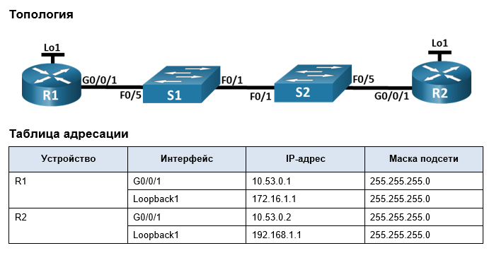
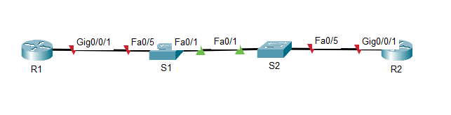

# Лабораторная работа. Настройка протокола OSPFv2 для одной области



# Цели
- Часть 1. Создание сети и настройка основных параметров устройства
- Часть 2. Настройка и проверка базовой работы протокола  OSPFv2 для одной области
- Часть 3. Оптимизация и проверка конфигурации OSPFv2 для одной области

# Часть 1. Создание сети и настройка основных параметров устройства

## Шаг 1. Создайте сеть согласно топологии.


## Шаг 2. Произведите базовую настройку маршрутизаторов.
a.	Назначьте маршрутизатору имя устройства.    
b.	Отключите поиск DNS, чтобы предотвратить попытки маршрутизатора неверно преобразовывать введенные команды таким образом, как будто они являются именами узлов.      
c.	Назначьте class в качестве зашифрованного пароля привилегированного режима EXEC.        
d.	Назначьте cisco в качестве пароля консоли и включите вход в систему по паролю.      
e.	Назначьте cisco в качестве пароля VTY и включите вход в систему по паролю.      
f.	Зашифруйте открытые пароли.     
g.	Создайте баннер с предупреждением о запрете несанкционированного доступа к устройству.      
h.	Сохраните текущую конфигурацию в файл загрузочной конфигурации      

```

Router>en
Router#conf t
Enter configuration commands, one per line.  End with CNTL/Z.
Router(config)#host R1
R1(config)#no ip domain-lookup
R1(config)#banner motd # Unauthorized access is strictly prohibited.#
R1(config)#service password-encryption
R1(config)#enable secret class
R1(config)#line con 0
R1(config-line)#password cisco
R1(config-line)#login
R1(config-line)#end
R1#conf t
Enter configuration commands, one per line.  End with CNTL/Z.
R1(config)#line vty 0 15
R1(config-line)#password cisco
R1(config-line)#login
R1(config-line)#end
%SYS-5-CONFIG_I: Configured from console by console

R1(config-line)#end
R1#
%SYS-5-CONFIG_I: Configured from console by console

R1#copy run st
Destination filename [startup-config]? 
Building configuration...
[OK]
R1#
```
АНлаогично для R2

## Шаг 3. Настройте базовые параметры каждого коммутатора.
a.	Назначьте маршрутизатору имя устройства.    
b.	Отключите поиск DNS, чтобы предотвратить попытки маршрутизатора неверно преобразовывать введенные команды таким образом, как будто они являются именами узлов.      
c.	Назначьте class в качестве зашифрованного пароля привилегированного режима EXEC.        
d.	Назначьте cisco в качестве пароля консоли и включите вход в систему по паролю.      
e.	Назначьте cisco в качестве пароля VTY и включите вход в систему по паролю.      
f.	Зашифруйте открытые пароли.     
g.	Создайте баннер с предупреждением о запрете несанкционированного доступа к устройству.      
h.	Сохраните текущую конфигурацию в файл загрузочной конфигурации      
```
Switch>en
Switch#conf t
Enter configuration commands, one per line.  End with CNTL/Z.
Switch(config)#host S1
S1(config)#no ip domain-lookup
S1(config)#banner motd # Unauthorized access is strictly prohibited.#
S1(config)#service password-encryption
S1(config)#enable secret class
S1(config)#line con 0
S1(config-line)#password cisco
S1(config-line)#login
S1(config-line)#end
S1#conf t
Enter configuration commands, one per line.  End with CNTL/Z.
S1(config)#line vty 0 15
S1(config-line)#password cisco
S1(config-line)#login
S1(config-line)#end
S1#
%SYS-5-CONFIG_I: Configured from console by console

%SYS-5-CONFIG_I: Configured from console by console

S1#copy run st
Destination filename [startup-config]? 
Building configuration...
[OK]
S1#
```
Аналогично для S2

# Часть 2. Настройка и проверка базовой работы протокола OSPFv2 для одной области

## Шаг 1. Настройте адреса интерфейса и базового OSPFv2 на каждом маршрутизаторе.

### a.	Настройте адреса интерфейсов на каждом маршрутизаторе, как показано в таблице адресации выше.
R1
```
R1(config)#int G0/0/1
R1(config-if)#ip add 10.53.0.1 255.255.255.0
R1(config-if)#no sh
%LINK-5-CHANGED: Interface GigabitEthernet0/0/1, changed state to up

%LINEPROTO-5-UPDOWN: Line protocol on Interface GigabitEthernet0/0/1, changed state to up

R1(config-if)#int Loopback1

R1(config-if)#
%LINK-5-CHANGED: Interface Loopback1, changed state to up

%LINEPROTO-5-UPDOWN: Line protocol on Interface Loopback1, changed state to up

R1(config-if)#ip add 172.16.1.1 255.255.255.0
```

R2
```
R2(config)#int G0/0/1
R2(config-if)#ip add 10.53.0.2 255.255.255.0
R2(config-if)#no sh

R2(config-if)#
%LINK-5-CHANGED: Interface GigabitEthernet0/0/1, changed state to up

%LINEPROTO-5-UPDOWN: Line protocol on Interface GigabitEthernet0/0/1, changed state to up
int Loopback1

R2(config-if)#
%LINK-5-CHANGED: Interface Loopback1, changed state to up

%LINEPROTO-5-UPDOWN: Line protocol on Interface Loopback1, changed state to up
ip add 192.168.1.1 255.255.255.0
R2(config-if)#
```

### b.	Перейдите в режим конфигурации маршрутизатора OSPF, используя идентификатор процесса 56.
R1
```
R1(config)#router ospf 56
R1(config-router)#
```
R2
```
R2(config)#router ospf 56
R2(config-router)#
```

### c.	Настройте статический идентификатор маршрутизатора для каждого маршрутизатора (1.1.1.1 для R1, 2.2.2.2 для R2).
R1
```
R1(config-router)#router-id 1.1.1.1
```

R2
```
R2(config-router)#router-id 2.2.2.2
```


### d.	Настройте инструкцию сети для сети между R1 и R2, поместив ее в область 0.

```
R1(config)#int g0/0/1
R1(config-if)#ip ospf 56 area 0
```

R2
```
R2(config)#int g0/0/1
R2(config-if)#ip ospf 56 area 0
```

### e.	Только на R2 добавьте конфигурацию, необходимую для объявления сети Loopback 1 в область OSPF 0.

R2
```
R2(config)#int lo1
R2(config-if)#ip ospf 56 area 0
```

### f.	Убедитесь, что OSPFv2 работает между маршрутизаторами. Выполните команду, чтобы убедиться, что R1 и R2 сформировали смежность.
R1
```
R1#sh ip ospf neighbor 


Neighbor ID     Pri   State           Dead Time   Address         Interface
2.2.2.2           1   FULL/DR         00:00:37    10.53.0.2       GigabitEthernet0/0/1
R1#

```

R2
```
R2#sh ip ospf neighbor 


Neighbor ID     Pri   State           Dead Time   Address         Interface
1.1.1.1           1   FULL/BDR        00:00:36    10.53.0.1       GigabitEthernet0/0/1
R2#
```

- Какой маршрутизатор является DR? Какой маршрутизатор является BDR? Каковы критерии отбора?
- R1 - DR, R2 - BDR. 

### g.	На R1 выполните команду show ip route ospf, чтобы убедиться, что сеть R2 Loopback1 присутствует в таблице маршрутизации. Обратите внимание, что поведение OSPF по умолчанию заключается в объявлении интерфейса обратной связи в качестве маршрута узла с использованием 32-битной маски.
R1
```
R1#sh ip route
Codes: L - local, C - connected, S - static, R - RIP, M - mobile, B - BGP
       D - EIGRP, EX - EIGRP external, O - OSPF, IA - OSPF inter area
       N1 - OSPF NSSA external type 1, N2 - OSPF NSSA external type 2
       E1 - OSPF external type 1, E2 - OSPF external type 2, E - EGP
       i - IS-IS, L1 - IS-IS level-1, L2 - IS-IS level-2, ia - IS-IS inter area
       * - candidate default, U - per-user static route, o - ODR
       P - periodic downloaded static route

Gateway of last resort is not set

     10.0.0.0/8 is variably subnetted, 2 subnets, 2 masks
C       10.53.0.0/24 is directly connected, GigabitEthernet0/0/1
L       10.53.0.1/32 is directly connected, GigabitEthernet0/0/1
     172.16.0.0/16 is variably subnetted, 2 subnets, 2 masks
C       172.16.1.0/24 is directly connected, Loopback1
L       172.16.1.1/32 is directly connected, Loopback1
     192.168.1.0/32 is subnetted, 1 subnets
O       192.168.1.1/32 [110/2] via 10.53.0.2, 00:00:55, GigabitEthernet0/0/1

R1#
```

### h.	Запустите Ping до  адреса интерфейса R2 Loopback 1 из R1. Выполнение команды ping должно быть успешным.
R1
```
R1#ping 192.168.1.1

Type escape sequence to abort.
Sending 5, 100-byte ICMP Echos to 192.168.1.1, timeout is 2 seconds:
!!!!!
Success rate is 100 percent (5/5), round-trip min/avg/max = 0/0/0 ms
```


# Часть 3. Оптимизация и проверка конфигурации OSPFv2 для одной области
## Шаг 1. Реализация различных оптимизаций на каждом маршрутизаторе.


### a.	На R1 настройте приоритет OSPF интерфейса G0/0/1 на 50, чтобы убедиться, что R1 является назначенным маршрутизатором.


### b.	Настройте таймеры OSPF на G0/0/1 каждого маршрутизатора для таймера приветствия, составляющего 30 секунд.


### c.	На R1 настройте статический маршрут по умолчанию, который использует интерфейс Loopback 1 в качестве интерфейса выхода. Затем распространите маршрут по умолчанию в OSPF. Обратите внимание на сообщение консоли после установки маршрута по умолчанию.


### d.	добавьте конфигурацию, необходимую для OSPF для обработки R2 Loopback 1 как сети точка-точка. Это приводит к тому, что OSPF объявляет Loopback 1 использует маску подсети интерфейса.


### e.	Только на R2 добавьте конфигурацию, необходимую для предотвращения отправки объявлений OSPF в сеть Loopback 1.


### f.	Измените базовую пропускную способность для маршрутизаторов. После этой настройки перезапустите OSPF с помощью команды clear ip ospf process . Обратите внимание на сообщение консоли после установки новой опорной полосы пропускания.


## Шаг 2. Убедитесь, что оптимизация OSPFv2 реализовалась.

## a.	Выполните команду show ip ospf interface g0/0/1 на R1 и убедитесь, что приоритет интерфейса установлен равным 50, а временные интервалы — Hello 30, Dead 120, а тип сети по умолчанию — Broadcast


### b.	На R1 выполните команду show ip route ospf, чтобы убедиться, что сеть R2 Loopback1 присутствует в таблице маршрутизации. Обратите внимание на разницу в метрике между этим выходным и предыдущим выходным. Также обратите внимание, что маска теперь составляет 24 бита, в отличие от 32 битов, ранее объявленных.


### c.	Введите команду show ip route ospf на маршрутизаторе R2. Единственная информация о маршруте OSPF должна быть распространяемый по умолчанию маршрут R1.

### d.	Запустите Ping до адреса интерфейса R1 Loopback 1 из R2. Выполнение команды ping должно быть успешным.

- Почему стоимость OSPF для маршрута по умолчанию отличается от стоимости OSPF в R1 для сети 192.168.1.0/24?
