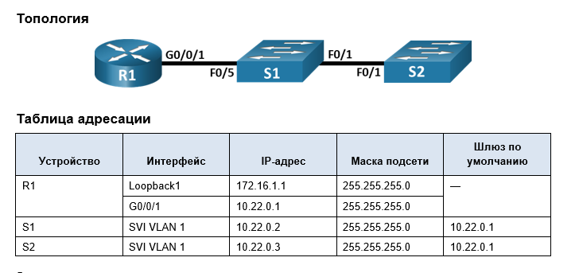
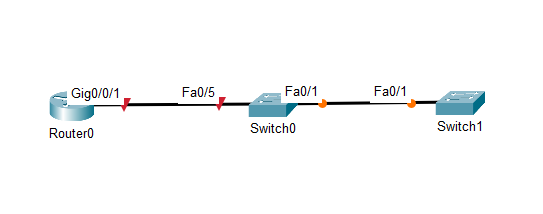

# Лабораторная работа - Настройка протоколов CDP, LLDP и NTP


## Задачи

- Часть 1. Создание сети и настройка основных параметров устройства
- Часть 2. Обнаружение сетевых ресурсов с помощью протокола CDP
- Часть 3. Обнаружение сетевых ресурсов с помощью протокола LLDP
- Часть 4. Настройка и проверка NTP

# Часть 1. Создание сети и настройка основных параметров устройства
В первой части лабораторной работы вам предстоит создать топологию сети и настроить основные параметры для маршрутизатора и коммутаторов.
## Шаг 1. Создайте сеть согласно топологии.
Подключите устройства, как показано в топологии, и подсоедините необходимые кабели.


## Шаг 2. Настройте базовые параметры для маршрутизатора.

- a.	Назначьте маршрутизатору имя устройства.
- b.	Отключите поиск DNS, чтобы предотвратить попытки маршрутизатора неверно преобразовывать введенные команды таким образом, как будто они являются именами узлов.
- c.	Назначьте class в качестве зашифрованного пароля привилегированного режима EXEC.
- d.	Назначьте cisco в качестве пароля консоли и включите вход в систему по паролю.
- e.	Назначьте cisco в качестве пароля VTY и включите вход в систему по паролю.
- f.	Зашифруйте открытые пароли.
- g.	Создайте баннер с предупреждением о запрете несанкционированного доступа к устройству.
- h.	Настройка интерфейсов, перечисленных в таблице выше
- i.	Сохраните текущую конфигурацию в файл загрузочной конфигурации.
```
Router>
Router>en
Router#conf t
Enter configuration commands, one per line.  End with CNTL/Z.
Router(config)#host R1
R1(config)#no ip domain-lookup
R1(config)#banner motd # Unauthorized access is strictly prohibited.#
R1(config)#service password-encryption
R1(config)#enable secret class
R1(config)#line con 0
R1(config-line)#password cisco
R1(config-line)#login
R1(config-line)#line vty 0 15
R1(config-line)#password cisco
R1(config-line)#login
R1(config-line)#int G0/0/1
R1(config-if)#ip add 10.22.0.1 255.255.255.0
R1(config-if)#no sh

R1(config-if)#
%LINK-5-CHANGED: Interface GigabitEthernet0/0/1, changed state to up

%LINEPROTO-5-UPDOWN: Line protocol on Interface GigabitEthernet0/0/1, changed state to up
R1(config-if)#int lo1

R1(config-if)#
%LINK-5-CHANGED: Interface Loopback1, changed state to up

%LINEPROTO-5-UPDOWN: Line protocol on Interface Loopback1, changed state to up

R1(config-if)#
R1(config-if)#ip add 172.16.1.1 255.255.255.0
R1(config-if)#ex
R1(config)#ex
R1#copy run st
Destination filename [startup-config]? 
Building configuration...
[OK]
R1#

```
## Шаг 3. Настройте базовые параметры каждого коммутатора.

- a.	Присвойте коммутатору имя устройства.
- b.	Отключите поиск DNS, чтобы предотвратить попытки маршрутизатора неверно преобразовывать введенные команды таким образом, как будто они являются именами узлов.
- c.	Назначьте class в качестве зашифрованного пароля привилегированного режима EXEC.
- d.	Назначьте cisco в качестве пароля консоли и включите вход в систему по паролю.
- e.	Назначьте cisco в качестве пароля VTY и включите вход в систему по паролю.
- f.	Зашифруйте открытые пароли.
- g.	Создайте баннер, который предупреждает всех, кто обращается к устройству, видит баннерное сообщение «Только авторизованные пользователи!».  
- h.	Отключите неиспользуемые интерфейсы
- i.	Сохраните текущую конфигурацию в файл загрузочной конфигурации.         

S1
```
Switch>
Switch>en
Switch#conf t
Enter configuration commands, one per line.  End with CNTL/Z.
Switch(config)#host S1
S1(config)#no ip domain-lookup
S1(config)#banner motd # Unauthorized access is strictly prohibited.#
S1(config)#service password-encryption
S1(config)#enable secret class
S1(config)#line con 0
S1(config-line)#password cisco
S1(config-line)#login
S1(config-line)#line vty 0 15
S1(config-line)#password cisco
S1(config-line)#login
S1(config-line)# int ra f0/2-4, f0/6-24, g0/1-2
S1(config-if-range)#sh

%LINK-5-CHANGED: Interface FastEthernet0/2, changed state to administratively down

\\\\\\\\\\\

%LINK-5-CHANGED: Interface GigabitEthernet0/1, changed state to administratively down

%LINK-5-CHANGED: Interface GigabitEthernet0/2, changed state to administratively down
S1(config-if-range)#ex
S1(config)#ex
S1#
%SYS-5-CONFIG_I: Configured from console by console

S1#copy run st
Destination filename [startup-config]? 
Building configuration...
[OK]
S1#
```

S2
```
Switch>en
Switch#conf t
Enter configuration commands, one per line.  End with CNTL/Z.
Switch(config)#host S2
S2(config)#no ip domain-lookup
S2(config)#banner motd # Unauthorized access is strictly prohibited.#
S2(config)#service password-encryption
S2(config)#enable secret class
S2(config)#line con 0
S2(config-line)#password cisco
S2(config-line)#login
S2(config-line)#line vty 0 15
S2(config-line)#password cisco
S2(config-line)#login
S2(config-line)#int ra f0/2-24, g0/1-2
S2(config-if-range)#sh

%LINK-5-CHANGED: Interface FastEthernet0/2, changed state to administratively down

\\\\\\\\\\\\\\

%LINK-5-CHANGED: Interface GigabitEthernet0/2, changed state to administratively down
S2(config-if-range)#ex
S2(config)#ex
S2#
%SYS-5-CONFIG_I: Configured from console by console

S2#copy run st
Destination filename [startup-config]? 
Building configuration...
[OK]
S2#
```
# Часть 2. Обнаружение сетевых ресурсов с помощью протокола CDP
На устройствах Cisco протокол CDP включен по умолчанию. Воспользуйтесь CDP, чтобы обнаружить порты, к которым подключены кабели.

- a.	На R1 используйте соответствующую команду show cdp, чтобы определить, сколько интерфейсов включено CDP, сколько из них включено и сколько отключено.
 
```
R1#sh cdp ?
  entry      Information for specific neighbor entry
  interface  CDP interface status and configuration
  neighbors  CDP neighbor entries
  <cr>
R1#sh cdp int
R1#sh cdp interface 
Vlan1 is administratively down, line protocol is down
  Sending CDP packets every 60 seconds
  Holdtime is 180 seconds
GigabitEthernet0/0/0 is administratively down, line protocol is down
  Sending CDP packets every 60 seconds
  Holdtime is 180 seconds
GigabitEthernet0/0/1 is up, line protocol is up
  Sending CDP packets every 60 seconds
  Holdtime is 180 seconds
GigabitEthernet0/0/2 is administratively down, line protocol is down
  Sending CDP packets every 60 seconds
  Holdtime is 180 seconds
```
по show cdp interface можно понять, что в обьявлении интерфейсов участвует 3 физических и один виртуальный интерфейс. Только GigabitEthernet0/0/1 is up, соответственно активен только один.
 
- b.	На R1 используйте соответствующую команду show cdp, чтобы определить версию IOS, используемую на S1.

```
R1#sh cdp ent S1

Device ID: S1
Entry address(es): 
Platform: cisco 2960, Capabilities: Switch
Interface: GigabitEthernet0/0/1, Port ID (outgoing port): FastEthernet0/5
Holdtime: 127

Version :
Cisco IOS Software, C2960 Software (C2960-LANBASEK9-M), Version 15.0(2)SE4, RELEASE SOFTWARE (fc1)
Technical Support: http://www.cisco.com/techsupport
Copyright (c) 1986-2013 by Cisco Systems, Inc.
Compiled Wed 26-Jun-13 02:49 by mnguyen

advertisement version: 2
Duplex: full

R1#
```
Вопрос:
Какая версия IOS используется на  S1?       

Version 15.0(2)
 
- c.	На S1 используйте соответствующую команду show cdp, чтобы определить, сколько пакетов CDP было выданных.
```
S1#sh cdp ?
  entry      Information for specific neighbor entry
  interface  CDP interface status and configuration
  neighbors  CDP neighbor entries
  <cr>
```

Вопрос:
Сколько пакетов имеет выход CDP с момента последнего сброса счетчика?

Увы, CPT не умеет show cdp traffic

 
- d.	Настройте SVI для VLAN 1 на S1 и S2, используя IP-адреса, указанные в таблице адресации выше. Настройте шлюз по умолчанию для каждого коммутатора на основе таблицы адресов.

S1
```
S1(config)#int vlan 1
S1(config-if)#ip add 10.22.0.2 255.255.255.0 
S1(config-if)#no sh

S1(config-if)#
%LINK-5-CHANGED: Interface Vlan1, changed state to up

%LINEPROTO-5-UPDOWN: Line protocol on Interface Vlan1, changed state to up

S1(config-if)#ex
S1(config)#ip default-g
S1(config)#ip default-gateway 10.22.0.1
S1(config)#
```

S2
```
S2(config)#int vlan 1
S2(config-if)#ip add 10.22.0.3 255.255.255.0
S2(config-if)#no sh

S2(config-if)#
%LINK-5-CHANGED: Interface Vlan1, changed state to up

%LINEPROTO-5-UPDOWN: Line protocol on Interface Vlan1, changed state to up
ex
S2(config)#ip default-g
S2(config)#ip default-gateway 10.22.0.1
S2(config)#
```
 
- e.	На R1 выполните команду show cdp entry S1 .

```
R1#sh cdp entry S1

Device ID: S1
Entry address(es): 
  IP address : 10.22.0.2
Platform: cisco 2960, Capabilities: Switch
Interface: GigabitEthernet0/0/1, Port ID (outgoing port): FastEthernet0/5
Holdtime: 166

Version :
Cisco IOS Software, C2960 Software (C2960-LANBASEK9-M), Version 15.0(2)SE4, RELEASE SOFTWARE (fc1)
Technical Support: http://www.cisco.com/techsupport
Copyright (c) 1986-2013 by Cisco Systems, Inc.
Compiled Wed 26-Jun-13 02:49 by mnguyen

advertisement version: 2
Duplex: full

R1#
```
Вопрос:
Какие дополнительные сведения доступны теперь?


Появился IP адрес SVI Vlan 1, который мы только что настроили

- f.	Отключить CDP глобально на всех устройствах. 

R1
```
R1(config)#no cdp run
```
S1
```
S1(config)#no cdp run
```

S2
```
S2(config)#no cdp run
```

# Часть 3. Обнаружение сетевых ресурсов с помощью протокола LLDP
На устройствах Cisco протокол LLDP может быть включен по умолчанию. Воспользуйтесь LLDP, чтобы обнаружить порты, к которым подключены кабели.
Откройте окно конфигурации
- a.	Введите соответствующую команду lldp, чтобы включить LLDP на всех устройствах в топологии.    

R1
```
R1(config)#lldp run
```
S1
```
S1(config)#lldp run
```

S2
```
S2(config)#lldp run
```
- b.	На S1 выполните соответствующую команду lldp, чтобы предоставить подробную информацию о S2. 

```

S1#sh lldp neighbors detail 
------------------------------------------------
Chassis id: 0001.639B.2602
Port id: Gig0/0/1
Port Description: GigabitEthernet0/0/1
System Name: R1
System Description:
Cisco IOS XE Software, Version 03.13.04.S - Extended Support Release
Cisco IOS Software, ISR Software (X86_64_LINUX_IOSD-UNIVERSALK9-M), Version 15.5(3)S5, RELEASE SOFTWARE (fc2)
Technical Support: http://www.cisco.com/techsupport
Copyright (c) 1986-2017 by Cisco Systems, Inc.
Compiled Mon 05-Oct-15 11:24 by mcpre
Time remaining: 90 seconds
System Capabilities: R
Enabled Capabilities: R
Management Addresses - not advertised
Auto Negotiation - supported, enabled
Physical media capabilities:
    1000baseT(FD)
    100baseT(FD)
Media Attachment Unit type: 10
Vlan ID: 1
------------------------------------------------
Chassis id: 00E0.B06C.B901
Port id: Fa0/1
Port Description: FastEthernet0/1
System Name: S2
System Description:
Cisco IOS Software, C2960 Software (C2960-LANBASEK9-M), Version 15.0(2)SE4, RELEASE SOFTWARE (fc1)
Technical Support: http://www.cisco.com/techsupport
Copyright (c) 1986-2013 by Cisco Systems, Inc.
Compiled Wed 26-Jun-13 02:49 by mnguyen
Time remaining: 90 seconds
System Capabilities: B
Enabled Capabilities: B
Management Addresses - not advertised
Auto Negotiation - supported, enabled
Physical media capabilities:
    100baseT(FD)
    100baseT(HD)
    1000baseT(HD)
Media Attachment Unit type: 10
Vlan ID: 1

Total entries displayed: 2
```
Вопрос:
Что такое chassis ID  для коммутатора S2?
S2
```
S2#sh int fa0/1
FastEthernet0/1 is up, line protocol is up (connected)
  Hardware is Lance, address is 00e0.b06c.b901 (bia 00e0.b06c.b901)

```
Это MAC интерфейса f0/1 S2

- c.	Соединитесь через консоль на всех устройствах и используйте команды LLDP, необходимые для отображения топологии физической сети только из выходных данных команды show. 


R1
```
R1#sh lld neighbors 
Capability codes:
    (R) Router, (B) Bridge, (T) Telephone, (C) DOCSIS Cable Device
    (W) WLAN Access Point, (P) Repeater, (S) Station, (O) Other
Device ID           Local Intf     Hold-time  Capability      Port ID
S1                  Gig0/0/1       120        B               Fa0/5

Total entries displayed: 1
R1#

```

S1
```
S1#sh lldp nei
Capability codes:
    (R) Router, (B) Bridge, (T) Telephone, (C) DOCSIS Cable Device
    (W) WLAN Access Point, (P) Repeater, (S) Station, (O) Other
Device ID           Local Intf     Hold-time  Capability      Port ID
R1                  Fa0/5          120        R               Gig0/0/1
S2                  Fa0/1          120        B               Fa0/1

Total entries displayed: 2
S1#
```

S2
```
S2#sh lldp neighbors 
Capability codes:
    (R) Router, (B) Bridge, (T) Telephone, (C) DOCSIS Cable Device
    (W) WLAN Access Point, (P) Repeater, (S) Station, (O) Other
Device ID           Local Intf     Hold-time  Capability      Port ID
S1                  Fa0/1          120        B               Fa0/1

Total entries displayed: 1
S2#
```
 
# Часть 4. Настройка NTP
В части 4 необходимо настроить маршрутизатор R1 в качестве сервера NTP, а маршрутизатор R2 в качестве клиента NTP маршрутизатора R1. Необходимо выполнить синхронизацию времени для Syslog и отладочных функций. Если время не синхронизировано, сложно определить, какое сетевое событие стало причиной данного сообщения.
## Шаг 1. Выведите на экран текущее время.
Откройте окно конфигурации
Введите команду show clock для отображения текущего времени на R1. Запишите отображаемые сведения о текущем времени в следующей таблице.
R1
```
R1#sh clock det
*1:33:6.401 UTC Mon Mar 1 1993
Time source is hardware calendar
```


			
## Шаг 2. Установите время.
С помощью команды clock set установите время на маршрутизаторе R1. Введенное время должно быть в формате UTC. 
 
```
R1#clock set 12:25 20 Aug 2025
R1#sh clock det
12:25:9.460 UTC Wed Aug 20 2025
Time source is user configuration
```
## Шаг 3. Настройте главный сервер NTP.
Настройте R1 в качестве хозяина NTP с уровнем слоя 4.
```
R1(config)#ntp master 4
```
## Шаг 4. Настройте клиент NTP.
- a.	Выполните соответствующую команду на S1 и S2, чтобы просмотреть настроенное время. Запишите текущее время,  в следующей таблице.
S1
```
S1#sh clock det
*2:1:5.99 UTC Mon Mar 1 1993
Time source is hardware calendar
S1#
```

S2
```
S2#sh clock det
*2:1:44.528 UTC Mon Mar 1 1993
Time source is hardware calendar
```

		
- b.	Настройте S1 и S2 в качестве клиентов NTP. Используйте соответствующие команды NTP для получения времени от интерфейса G0/0/1 R1, а также для периодического обновления календаря или аппаратных часов коммутатора.

S1
```
S1(config)#ntp server 10.22.0.1
```

S2
```
S2(config)#nt server 10.22.0.1
```
## Шаг 5. Проверьте настройку NTP.
- a.	Используйте соответствующую команду show , чтобы убедиться, что S1 и S2 синхронизированы с R1.
Примечание. Синхронизация метки времени на маршрутизаторе R2 с меткой времени на маршрутизаторе R1 может занять несколько минут.

S1
```S1(config)#do sh clock
12:58:49.488 UTC Wed Aug 20 2025
S1(config)#do sh ntp st
Clock is synchronized, stratum 16, reference is 10.22.0.1
nominal freq is 250.0000 Hz, actual freq is 249.9990 Hz, precision is 2**24
reference time is 292FFB6C.000003C0 (1:48:28.960 UTC Sat Feb 9 2058)
clock offset is 1.00 msec, root delay is 0.00  msec
root dispersion is 10.68 msec, peer dispersion is 0.12 msec.
loopfilter state is 'CTRL' (Normal Controlled Loop), drift is - 0.000001193 s/s system poll interval is 4, last update was 8 sec ago.
S1(config)#
```
S2
```
S2(config)#do sh ntp stat
Clock is synchronized, stratum 16, reference is 10.22.0.1
nominal freq is 250.0000 Hz, actual freq is 249.9990 Hz, precision is 2**24
reference time is 292FDF0B.000001F8 (23:47:23.504 UTC Fri Feb 8 2058)
clock offset is 0.00 msec, root delay is 0.00  msec
root dispersion is 10.45 msec, peer dispersion is 0.12 msec.
loopfilter state is 'CTRL' (Normal Controlled Loop), drift is - 0.000001193 s/s system poll interval is 4, last update was 6 sec ago.
S2(config)#
```
- b.	Выполните соответствующую команду на S1 и S2, чтобы просмотреть настроенное время и сравнить ранее записанное время.
S1
```
S1(config)#do sh clock
12:58:49.488 UTC Wed Aug 20 2025
```
S2
```
S2(config)#do sh clock
12:59:26.771 UTC Wed Aug 20 2025
```
Вопрос для повторения
Для каких интерфейсов в пределах сети не следует использовать протоколы обнаружения сетевых ресурсов? Поясните ответ.


Не следует использовать протоколы обнаружения на внешних интерфейсах из соображений безопасности, так как злоумышленник может получить информацию о внутренней сети