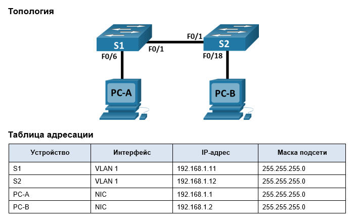
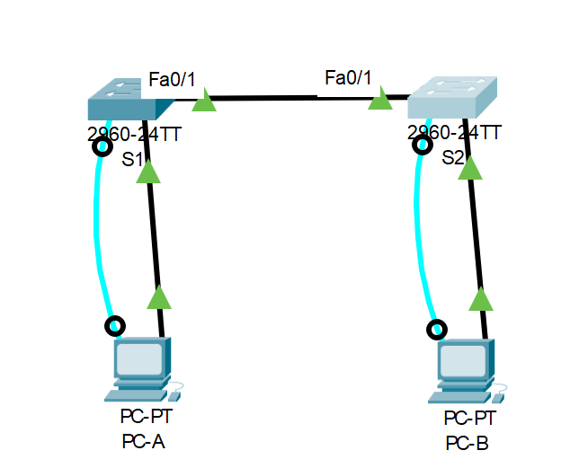
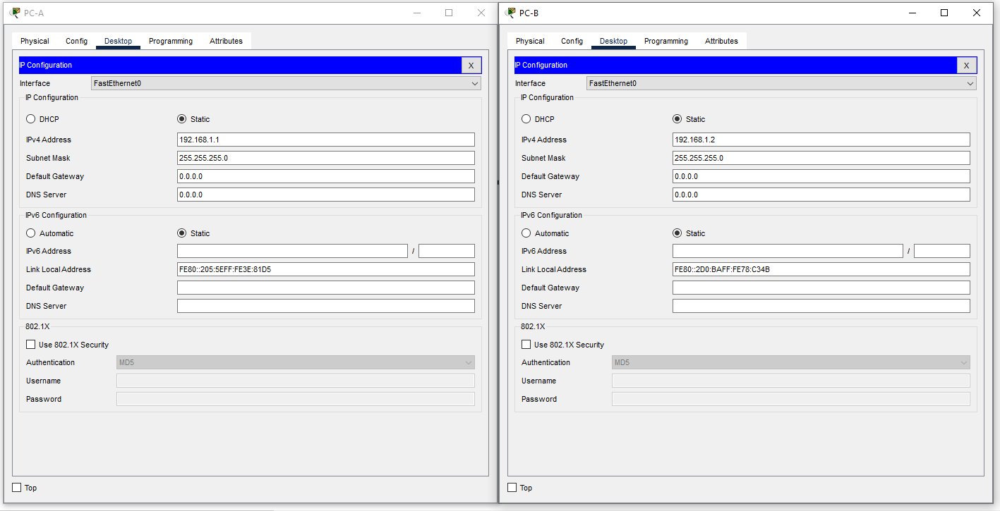

# Часть 1. Создание и настройка сети
## Шаг 1. Подключите сеть в соответствии с топологией.


## Шаг 2. Настройте узлы ПК.

## Шаг 3. Выполните инициализацию и перезагрузку коммутаторов.
Для инициализации коммутатора нам необходимо удалить файл конфигурации виртуальных сетей и startup-config, после чего выполнить перезагрузку.

Проверяем наличие файла vlan.dat:
```
Press RETURN to get started!

 Unauthorized access is strictly prohibited.

User Access Verification

Password: 

S1>en
Password: 
S1#sh fl
S1#sh flash: 
Directory of flash:/

    1  -rw-     4670455          <no date>  2960-lanbasek9-mz.150-2.SE4.bin
    2  -rw-        1318          <no date>  config.text

64016384 bytes total (59344611 bytes free)
```
В моем случае его нет. Если бы был, то удаляем его командой delete vlan.dat

Стираем загрузочный конфиг:
```
S1#erase start
S1#erase startup-config 
Erasing the nvram filesystem will remove all configuration files! Continue? [confirm]
[OK]
Erase of nvram: complete
%SYS-7-NV_BLOCK_INIT: Initialized the geometry of nvram
```
И перезагружаем коммутатор:
```
S1#reload
Proceed with reload? [confirm]
```
## Шаг 4. Настройте базовые параметры каждого коммутатора.

### a.	Настройте имена устройств в соответствии с топологией.

```
Switch>en
Switch#hostname S1
Switch#conf t
Enter configuration commands, one per line.  End with CNTL/Z.
Switch(config)#hos
Switch(config)#hostname S1
S1(config)#

```
### b.	Настройте IP-адреса, как указано в таблице адресации.
```
S1>en
S1#conf t
Enter configuration commands, one per line.  End with CNTL/Z.
S1(config)#int vlan1
S1(config-if)#ip add
S1(config-if)#ip address 192.168.1.11 255.255.255.0
S1(config-if)#no sh
S1(config-if)#no shutdown 

S1(config-if)#
%LINK-5-CHANGED: Interface Vlan1, changed state to up

%LINEPROTO-5-UPDOWN: Line protocol on Interface Vlan1, changed state to up
int fa 0/6
S1(config-if)#no sh
S1(config-if)#int fa 0/1
S1(config-if)#no sh
S1(config-if)#exit
```
### c.	Назначьте cisco в качестве паролей консоли и VTY.
```
S1#conf t
Enter configuration commands, one per line.  End with CNTL/Z.
S1(config)#line vty 0 15
S1(config-line)#password cisco
S1(config-line)#login
S1(config-line)#
```
### d. 	Назначьте class в качестве пароля доступа к привилегированному режиму EXEC.
```
S1(config)#service password-encryption
S1(config)#enable secret class
S1(config)#end
S1#
```
Аналогично проделываем для второго коммутатора.
Для базовой настройки коммутаторов, с целью сокращения времени в будущем, написал следующую последовательность:
```markdown
en
conf t
no ip domain-lookup
hostname *S2*
banner motd *# Unauthorized access is strictly prohibited.#*
int vlan1
ip address *192.168.1.12 255.255.255.0*
no shutdown
interface *fa 0/18*
no shutdown
interface *fa 0/1*
no shutdown
exit
service password-encryption
enable secret class
line con 0
password *cisco*
login
logging  synchronous 
end
conf t
line vty *0 15*
password *cisco*
login
end

```
Переменные выделены  и заключены в **

# Часть 2. Изучение таблицы МАС-адресов коммутатора
## Шаг 1. Запишите МАС-адреса сетевых устройств.
### a.	Откройте командную строку на PC-A и PC-B и введите команду ipconfig /all.
PC-A
```
C:\>ipconfig /all

FastEthernet0 Connection:(default port)

   Connection-specific DNS Suffix..: 
   Physical Address................: 0005.5E3E.81D5
   Link-local IPv6 Address.........: FE80::205:5EFF:FE3E:81D5
   IPv6 Address....................: ::
   IPv4 Address....................: 192.168.1.1
   Subnet Mask.....................: 255.255.255.0
   Default Gateway.................: ::
                                     0.0.0.0
   DHCP Servers....................: 0.0.0.0
   DHCPv6 IAID.....................: 
   DHCPv6 Client DUID..............: 00-01-00-01-75-80-25-B9-00-05-5E-3E-81-D5
   DNS Servers.....................: ::
                                     0.0.0.0
```
PC-B
```
C:\>ipconfig /all

FastEthernet0 Connection:(default port)

   Connection-specific DNS Suffix..: 
   Physical Address................: 00D0.BA78.C34B
   Link-local IPv6 Address.........: FE80::2D0:BAFF:FE78:C34B
   IPv6 Address....................: ::
   IPv4 Address....................: 192.168.1.2
   Subnet Mask.....................: 255.255.255.0
   Default Gateway.................: ::
                                     0.0.0.0
   DHCP Servers....................: 0.0.0.0
   DHCPv6 IAID.....................: 
   DHCPv6 Client DUID..............: 00-01-00-01-CA-13-6D-C1-00-D0-BA-78-C3-4B
   DNS Servers.....................: ::
                                     0.0.0.0
```
- Назовите физические адреса адаптера Ethernet.

MAC-адрес компьютера PC-A: 0005.5E3E.81D5
MAC-адрес компьютера PC-B: 00D0.BA78.C34B

### b.	Подключитесь к коммутаторам S1 и S2 через консоль и введите команду show interface F0/1 на каждом коммутаторе.

S1
```
Password: 

S1>en
Password: 
S1#sh int fa 0/1
FastEthernet0/1 is up, line protocol is up (connected)
  Hardware is Lance, address is 0010.112a.d701 (bia 0010.112a.d701)
 BW 100000 Kbit, DLY 1000 usec,
     reliability 255/255, txload 1/255, rxload 1/255
  Encapsulation ARPA, loopback not set
  Keepalive set (10 sec)
  Full-duplex, 100Mb/s
  input flow-control is off, output flow-control is off
  ARP type: ARPA, ARP Timeout 04:00:00
  Last input 00:00:08, output 00:00:05, output hang never
  Last clearing of "show interface" counters never
  Input queue: 0/75/0/0 (size/max/drops/flushes); Total output drops: 0
  Queueing strategy: fifo
  Output queue :0/40 (size/max)
  5 minute input rate 0 bits/sec, 0 packets/sec
  5 minute output rate 0 bits/sec, 0 packets/sec
     956 packets input, 193351 bytes, 0 no buffer
     Received 956 broadcasts, 0 runts, 0 giants, 0 throttles
     0 input errors, 0 CRC, 0 frame, 0 overrun, 0 ignored, 0 abort
     0 watchdog, 0 multicast, 0 pause input
     0 input packets with dribble condition detected
     2357 packets output, 263570 bytes, 0 underruns
     0 output errors, 0 collisions, 10 interface resets
     0 babbles, 0 late collision, 0 deferred
     0 lost carrier, 0 no carrier
     0 output buffer failures, 0 output buffers swapped out
```

S2
```
Password: 

S2>en
Password: 
S2#sh int fa 0/1
FastEthernet0/1 is up, line protocol is up (connected)
  Hardware is Lance, address is 0090.2bad.db01 (bia 0090.2bad.db01)
 BW 100000 Kbit, DLY 1000 usec,
     reliability 255/255, txload 1/255, rxload 1/255
  Encapsulation ARPA, loopback not set
  Keepalive set (10 sec)
  Full-duplex, 100Mb/s
  input flow-control is off, output flow-control is off
  ARP type: ARPA, ARP Timeout 04:00:00
  Last input 00:00:08, output 00:00:05, output hang never
  Last clearing of "show interface" counters never
  Input queue: 0/75/0/0 (size/max/drops/flushes); Total output drops: 0
  Queueing strategy: fifo
  Output queue :0/40 (size/max)
  5 minute input rate 0 bits/sec, 0 packets/sec
  5 minute output rate 0 bits/sec, 0 packets/sec
     956 packets input, 193351 bytes, 0 no buffer
     Received 956 broadcasts, 0 runts, 0 giants, 0 throttles
     0 input errors, 0 CRC, 0 frame, 0 overrun, 0 ignored, 0 abort
     0 watchdog, 0 multicast, 0 pause input
     0 input packets with dribble condition detected
     2357 packets output, 263570 bytes, 0 underruns
     0 output errors, 0 collisions, 10 interface resets
     0 babbles, 0 late collision, 0 deferred
     0 lost carrier, 0 no carrier
     0 output buffer failures, 0 output buffers swapped out
```
- Назовите адреса оборудования во второй строке выходных данных команды (или зашитый адрес — bia).  

МАС-адрес коммутатора S1 Fast Ethernet 0/1: 0010.112a.d701  
МАС-адрес коммутатора S2 Fast Ethernet 0/1: 0090.2bad.db01

## Шаг 2. Просмотрите таблицу МАС-адресов коммутатора.
### a.	Подключитесь к коммутатору S2 через консоль и войдите в привилегированный режим EXEC.
```
S2>en
Password: 
S2#
```
### b.	В привилегированном режиме EXEC введите команду show mac address-table и нажмите клавишу ввода.
```
S2#show mac address-table 
          Mac Address Table
-------------------------------------------

Vlan    Mac Address       Type        Ports
----    -----------       --------    -----

   1    0010.112a.d701    DYNAMIC     Fa0/1
```
- Если вы не записали МАС-адреса сетевых устройств в шаге 1, как можно определить, каким устройствам принадлежат МАС-адреса, используя только выходные данные команды show mac address-table? Работает ли это решение в любой ситуации?     

Мы видим MAC коммутатора S1 на порту fa 0/1     

По таблице мы можем узнать MAC (колонка Mac address) непосредственно подключенного к порту (колонка Ports) устройства. В случае, если мы знаем топологию сети (те не частые в реальности случаи, когда сеть задокументирована), можно определить какому устройству принадлежит MAC.
По MAC так же можно определить вендора сетевого оборудования (воспользовавшись, таблицами или сервисами в интернет, например https://2ip.ru/mac-address/ ) и в некоторых случаях предположить тип устройства.

## Шаг 3. Очистите таблицу МАС-адресов коммутатора S2 и снова отобразите таблицу МАС-адресов.
### a.	В привилегированном режиме EXEC введите команду clear mac address-table dynamic и нажмите клавишу Enter.
```
S2#clear mac address-table dynamic
```
### b.	Снова быстро введите команду show mac address-table.
```
S2#show mac address-table 
          Mac Address Table
-------------------------------------------

Vlan    Mac Address       Type        Ports
----    -----------       --------    -----
```
- Указаны ли в таблице МАС-адресов адреса для VLAN 1? Указаны ли другие МАС-адреса?

В таблице нет MAC адресов, таблица очищена

- Через 10 секунд введите команду show mac address-table и нажмите клавишу ввода. 

```
S2#show mac address-table 
          Mac Address Table
-------------------------------------------

Vlan    Mac Address       Type        Ports
----    -----------       --------    -----

   1    0010.112a.d701    DYNAMIC     Fa0/1
```
- Появились ли в таблице МАС-адресов новые адреса?  

Да, мы снова видим MAC коммутатора S1 на порту fa 0/1

## Шаг 4. С компьютера PC-B отправьте эхо-запросы устройствам в сети и просмотрите таблицу МАС-адресов коммутатора.
### a.	На компьютере PC-B откройте командную строку и еще раз введите команду arp -a.
```
C:\>arp -a
No ARP Entries Found
```
- Не считая адресов многоадресной и широковещательной рассылки, сколько пар IP- и МАС-адресов устройств было получено через протокол ARP?

Ни одной пары IP и MAC адресов в таблице нет
### b.	Из командной строки PC-B отправьте эхо-запросы на компьютер PC-A, а также коммутаторы S1 и S2.
```
C:\>ping 192.168.1.1

Pinging 192.168.1.1 with 32 bytes of data:

Reply from 192.168.1.1: bytes=32 time<1ms TTL=128
Reply from 192.168.1.1: bytes=32 time<1ms TTL=128
Reply from 192.168.1.1: bytes=32 time<1ms TTL=128
Reply from 192.168.1.1: bytes=32 time<1ms TTL=128

Ping statistics for 192.168.1.1:
    Packets: Sent = 4, Received = 4, Lost = 0 (0% loss),
Approximate round trip times in milli-seconds:
    Minimum = 0ms, Maximum = 0ms, Average = 0ms

C:\>ping 192.168.1.11

Pinging 192.168.1.11 with 32 bytes of data:

Request timed out.
Reply from 192.168.1.11: bytes=32 time<1ms TTL=255
Reply from 192.168.1.11: bytes=32 time<1ms TTL=255
Reply from 192.168.1.11: bytes=32 time<1ms TTL=255

Ping statistics for 192.168.1.11:
    Packets: Sent = 4, Received = 3, Lost = 1 (25% loss),
Approximate round trip times in milli-seconds:
    Minimum = 0ms, Maximum = 0ms, Average = 0ms

C:\>ping 192.168.1.12

Pinging 192.168.1.12 with 32 bytes of data:

Request timed out.
Reply from 192.168.1.12: bytes=32 time<1ms TTL=255
Reply from 192.168.1.12: bytes=32 time=16ms TTL=255
Reply from 192.168.1.12: bytes=32 time<1ms TTL=255

Ping statistics for 192.168.1.12:
    Packets: Sent = 4, Received = 3, Lost = 1 (25% loss),
Approximate round trip times in milli-seconds:
    Minimum = 0ms, Maximum = 16ms, Average = 5ms
```
- От всех ли устройств получены ответы? Если нет, проверьте кабели и IP-конфигурации.

Ответ получен от всех устройств, но первый пакет в случае пинга коммутаторов был отброшен в виду превышения времени обработки запроса.
### c.	Подключившись через консоль к коммутатору S2, введите команду show mac address-table.
```
S2#sh mac address-table 
          Mac Address Table
-------------------------------------------

Vlan    Mac Address       Type        Ports
----    -----------       --------    -----

   1    0010.112a.d701    DYNAMIC     Fa0/1
   1    00d0.ba78.c34b    DYNAMIC     Fa0/18
S2#
```
- Добавил ли коммутатор в таблицу МАС-адресов дополнительные МАС-адреса? Если да, то какие адреса и устройства?

Мы видим, что добавился MAC PC-B, подключенного к порту fa 0/18 и имеющего MAC адрес 00d0.ba78.c34b

- На компьютере PC-B откройте командную строку и еще раз введите команду arp -a

```
C:\>arp -a
  Internet Address      Physical Address      Type
  192.168.1.1           0005.5e3e.81d5        dynamic
  192.168.1.11          0005.5e62.bea8        dynamic
  192.168.1.12          0002.4a5e.4b41        dynamic

```
- Появились ли в ARP-кэше компьютера PC-B дополнительные записи для всех сетевых устройств, которым были отправлены эхо-запросы?

Появились ARP записи всех устройств, которым отправлялись запросы.

## 	Вопрос для повторения
В виду того, что ARP протокол является открытым, он является не безопасным. В крупных сетях отправка ARP запросов влечет за собой дополнительную нагрузку на канал, по сути кратную количеству устройств, подключенных к этой сети.