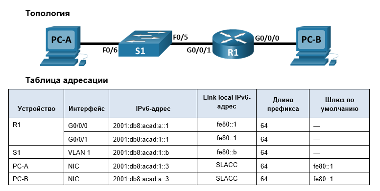
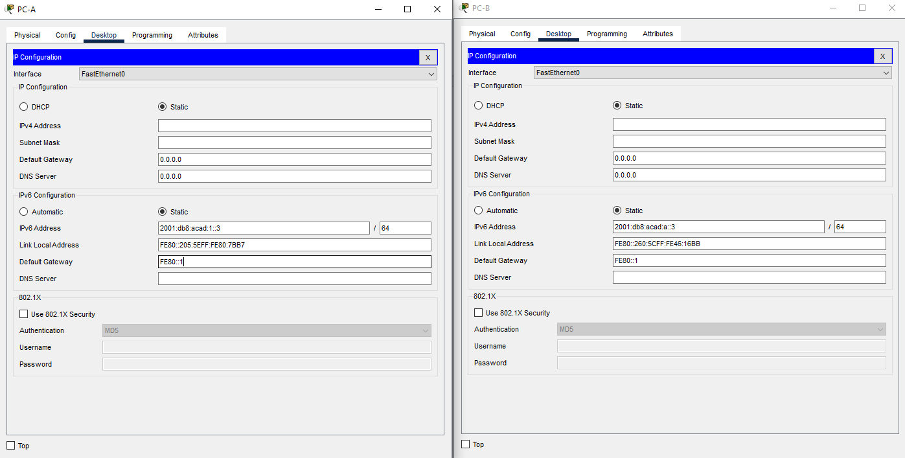
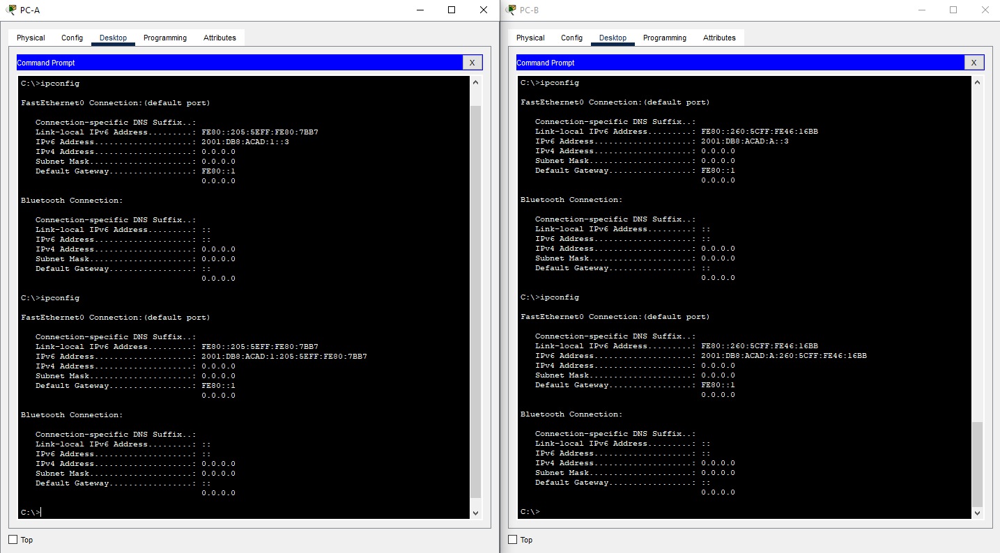

# Лабораторная работа. Настройка IPv6-адресов на сетевых устройствах 
## Топология

## Задачи
- Часть 1. Настройка топологии и конфигурация основных параметров маршрутизатора и коммутатора
- Часть 2. Ручная настройка IPv6-адресов
- Часть 3. Проверка сквозного соединения

## Подготовка коммутатора
Шаблон по умолчанию менеджера базы данных 2960 Switch Database Manager (SDM) не поддерживает IPv6. Перед назначением IPv6-адреса SVI VLAN 1 может понадобиться выполнение команды sdm prefer dual-ipv4-and-ipv6 default для включения IPv6-адресации.
Шаблон default bias, который по умолчанию используется диспетчером SDM (диспетчер базы данных коммутатора), не предоставляет возможностей адресации IPv6. Убедитесь, что SDM использует шаблон dual-ipv4-and-ipv6 или lanbase-routing. Новый шаблон будет использоваться после перезагрузки. 
```
Switch>en
Switch#conf t
Enter configuration commands, one per line.  End with CNTL/Z.
Switch(config)#sdm prefer dual-ipv4-and-ipv6 default
Changes to the running SDM preferences have been stored, but cannot take effect until the next reload.
Use 'show sdm prefer' to see what SDM preference is currently active.
Switch(config)#end
Switch#reload
System configuration has been modified. Save? [yes/no]:yes
Building configuration...
[OK]
Proceed with reload? [confirm]
```
...
```

Press RETURN to get started!


Switch>en
Switch#sh sdm prefer
 The current template is "dual-ipv4-and-ipv6 default" template.
 The selected template optimizes the resources in
 the switch to support this level of features for
 0 routed interfaces and 1024 VLANs.

  number of unicast mac addresses:                  4K
  number of IPv4 IGMP groups + multicast routes:    0.25K
  number of IPv4 unicast routes:                    0
  number of IPv6 multicast groups:                  0.375k
  number of directly-connected IPv6 addresses:      0
  number of indirect IPv6 unicast routes:           0
  number of IPv4 policy based routing aces:         0
  number of IPv4/MAC qos aces:                      0.125K
  number of IPv4/MAC security aces:                 0.375K
  number of IPv6 policy based routing aces:         0
  number of IPv6 qos aces:                          0.625k
  number of IPv6 security aces:                     0.125K

Switch#
```

# Часть 1. Настройка топологии и конфигурация основных параметров маршрутизатора и коммутатора
## Шаг 1. Настройте маршрутизатор.
```
Router>en
Router#conf t
Enter configuration commands, one per line.  End with CNTL/Z.
Router(config)#no ip domain-lookup
Router(config)#hostname R1
R1(config)#banner motd # Unauthorized access is strictly prohibited.#
R1(config)#service password-encryption
R1(config)#enable secret class
R1(config)#line con 0
R1(config-line)#password cisco
R1(config-line)#login
R1(config-line)#logging  synchronous 
R1(config-line)#end
R1#conf t
Enter configuration commands, one per line.  End with CNTL/Z.
R1(config)#line vty 0 15
R1(config-line)#password cisco
R1(config-line)#login
R1(config-line)#end
%SYS-5-CONFIG_I: Configured from console by console

R1(config-line)#end
R1#
%SYS-5-CONFIG_I: Configured from console by console

R1#exit

```
## Шаг 2. Настройте коммутатор.
```
S1>
S1>en
S1#conf t
Enter configuration commands, one per line.  End with CNTL/Z.
S1(config)#no ip domain-lookup
S1(config)#hostname S1
S1(config)#banner motd # Unauthorized access is strictly prohibited.#
S1(config)#service password-encryption
S1(config)#enable secret class
S1(config)#line con 0
S1(config-line)#password cisco
S1(config-line)#login
S1(config-line)#logging  synchronous 
S1(config-line)#end
S1#conf t
Enter configuration commands, one per line.  End with CNTL/Z.
S1(config)#line vty 0 15
S1(config-line)#password cisco
S1(config-line)#login
S1(config-line)#end
%SYS-5-CONFIG_I: Configured from console by console

S1(config-line)#end
S1#exit
```

# Часть 2. Ручная настройка IPv6-адресов
## Шаг 1. Назначьте IPv6-адреса интерфейсам Ethernet на R1.
### a.	Назначьте глобальные индивидуальные IPv6-адреса, указанные в таблице адресации обоим интерфейсам Ethernet на R1.
```
R1>en
Password: 
R1#conf t
Enter configuration commands, one per line.  End with CNTL/Z.
R1(config)#int G0/0/0
R1(config-if)#ipv
R1(config-if)#ipv6 add
R1(config-if)#ipv6 address 2001:db8:acad:a::1
% Incomplete command.
R1(config-if)#ipv6 address 2001:db8:acad:a::1/64
R1(config-if)#no sh

R1(config-if)#
%LINK-5-CHANGED: Interface GigabitEthernet0/0/0, changed state to up

%LINEPROTO-5-UPDOWN: Line protocol on Interface GigabitEthernet0/0/0, changed state to up

R1(config-if)#int G0/0/1
R1(config-if)#ipv6 address 2001:db8:acad:1::1/64
R1(config-if)#no sh

R1(config-if)#
%LINK-5-CHANGED: Interface GigabitEthernet0/0/1, changed state to up

%LINEPROTO-5-UPDOWN: Line protocol on Interface GigabitEthernet0/0/1, changed state to up

R1(config-if)#
```

### b.	Введите команду show ipv6 interface brief, чтобы проверить, назначен ли каждому интерфейсу корректный индивидуальный IPv6-адрес.

```
R1>sh ipv6 int brief 
GigabitEthernet0/0/0       [up/up]
    FE80::20A:F3FF:FEB2:3701
    2001:DB8:ACAD:A::1
GigabitEthernet0/0/1       [up/up]
    FE80::20A:F3FF:FEB2:3702
    2001:DB8:ACAD:1::1
Vlan1                      [administratively down/down]
    unassigned
R1>
```
### c.	Чтобы обеспечить соответствие локальных адресов канала индивидуальному адресу, вручную введите локальные адреса канала на каждом интерфейсе Ethernet на R1

```
R1#conf t
Enter configuration commands, one per line.  End with CNTL/Z.
R1(config)#int g0/0/0
R1(config-if)#ipv6 add
R1(config-if)#ipv6 address fe80::1 lin
R1(config-if)#ipv6 address fe80::1 link-local 
R1(config-if)#int G0/0/1
R1(config-if)#ipv6 address fe80::1 link-local 
R1(config-if)#
```

### d.	Используйте выбранную команду, чтобы убедиться, что локальный адрес связи изменен на fe80::1.  
```
R1#sh ipv6 int brief
GigabitEthernet0/0/0       [up/up]
    FE80::1
    2001:DB8:ACAD:A::1
GigabitEthernet0/0/1       [up/up]
    FE80::1
    2001:DB8:ACAD:1::1
Vlan1                      [administratively down/down]
    unassigned
R1#
```

## Шаг 2. Активируйте IPv6-маршрутизацию на R1.
### a.	В командной строке на PC-B введите команду ipconfig, чтобы получить данные IPv6-адреса, назначенного интерфейсу ПК.

```
Cisco Packet Tracer PC Command Line 1.0
C:\>ipconfig

FastEthernet0 Connection:(default port)

   Connection-specific DNS Suffix..: 
   Link-local IPv6 Address.........: FE80::260:5CFF:FE46:16BB
   IPv6 Address....................: ::
   IPv4 Address....................: 0.0.0.0
   Subnet Mask.....................: 0.0.0.0
   Default Gateway.................: ::
                                     0.0.0.0
```
- Назначен ли индивидуальный IPv6-адрес сетевой интерфейсной карте (NIC) на PC-B?

Назначен Link-local IPv6 Address - FE80::260:5CFF:FE46:16BB , сгенерированный по EUI-64 на основе MAC адреса


### b.	Активируйте IPv6-маршрутизацию на R1 с помощью команды IPv6 unicast-routing

```
R1#conf t
Enter configuration commands, one per line.  End with CNTL/Z.
R1(config)#ipv6 uni
R1(config)#ipv6 unicast-routing 
R1(config)#
```

### c.	Теперь, когда R1 входит в группу многоадресной рассылки всех маршрутизаторов, еще раз введите команду ipconfig на PC-B. Проверьте данные IPv6-адреса.

```
C:\>ipconfig

FastEthernet0 Connection:(default port)

   Connection-specific DNS Suffix..: 
   Link-local IPv6 Address.........: FE80::260:5CFF:FE46:16BB
   IPv6 Address....................: 2001:DB8:ACAD:A:260:5CFF:FE46:16BB
   IPv4 Address....................: 0.0.0.0
   Subnet Mask.....................: 0.0.0.0
   Default Gateway.................: FE80::1
                                     0.0.0.0

```
- Почему PC-B получил глобальный префикс маршрутизации и идентификатор подсети, которые вы настроили на R1?

Все IPv6 маршрутизаторы являются членами группы многоадресной рассылки FF02::2
Можно убедиться заглянув в свойства настроенного интерфейса G0/0/0 :

```
R1#sh ipv6 int G0/0/0
GigabitEthernet0/0/0 is up, line protocol is up
  IPv6 is enabled, link-local address is FE80::1
  No Virtual link-local address(es):
  Global unicast address(es):
    2001:DB8:ACAD:A::1, subnet is 2001:DB8:ACAD:A::/64
  Joined group address(es):
    FF02::1
    FF02::2
    FF02::1:FF00:1
  MTU is 1500 bytes
  ICMP error messages limited to one every 100 milliseconds
  ICMP redirects are enabled
  ICMP unreachables are sent
  ND DAD is enabled, number of DAD attempts: 1
  ND reachable time is 30000 milliseconds
  ND advertised reachable time is 0 (unspecified)
  ND advertised retransmit interval is 0 (unspecified)
  ND router advertisements are sent every 200 seconds
  ND router advertisements live for 1800 seconds
  ND advertised default router preference is Medium
  Hosts use stateless autoconfig for addresses.
  ```
Соответственно, маршрутизатор через RA сообщения распространяет в сети информацию о префиксе своей сети и своем LLA, который можно использовать в качестве шлюза.

## Шаг 3. Назначьте IPv6-адреса интерфейсу управления (SVI) на S1.

### a.	Назначьте адрес IPv6 для S1. Также назначьте этому интерфейсу локальный адрес канала fe80::b.

```
S1#conf t
Enter configuration commands, one per line.  End with CNTL/Z.
S1(config)#int vlan1
S1(config-if)#ipv6 add
S1(config-if)#ipv6 address fe80::b
S1(config-if)#ipv6 address fe80::b lin
S1(config-if)#ipv6 address fe80::b link-local 
S1(config-if)#no sh
```

### b.	Проверьте правильность назначения IPv6-адресов интерфейсу управления с помощью команды show ipv6 interface vlan1.

```
S1>sh ipv6 int vlan 1
Vlan1 is administratively down, line protocol is down
  IPv6 is tentative, link-local address is FE80::B [TEN]
  No Virtual link-local address(es):
  No global unicast address is configured
  Joined group address(es):
    FF02::1
  MTU is 1500 bytes
  ICMP error messages limited to one every 100 milliseconds
  ICMP redirects are enabled
  ICMP unreachables are sent
  Output features: Check hwidb
  ND DAD is enabled, number of DAD attempts: 1
  ND reachable time is 30000 milliseconds
S1>
```

## Шаг 4. Назначьте компьютерам статические IPv6-адреса.

### a.	Откройте окно Свойства Ethernet для каждого ПК и назначьте адресацию IPv6.


### b.	Убедитесь, что оба компьютера имеют правильную информацию адреса IPv6. Каждый компьютер должен иметь два глобальных адреса IPv6: один статический и один SLACC.



# Часть 3. Проверка сквозного подключения
- С PC-A отправьте эхо-запрос на FE80::1. Это локальный адрес канала, назначенный G0/1 на R1.

```
C:\>ping FE80::1

Pinging FE80::1 with 32 bytes of data:

Reply from FE80::1: bytes=32 time<1ms TTL=255
Reply from FE80::1: bytes=32 time<1ms TTL=255
Reply from FE80::1: bytes=32 time<1ms TTL=255
Reply from FE80::1: bytes=32 time<1ms TTL=255

Ping statistics for FE80::1:
    Packets: Sent = 4, Received = 4, Lost = 0 (0% loss),
Approximate round trip times in milli-seconds:
    Minimum = 0ms, Maximum = 0ms, Average = 0ms
```

- Отправьте эхо-запрос на интерфейс управления S1 с PC-A.

```
C:\>ping fe80::b

Pinging fe80::b with 32 bytes of data:

Reply from FE80::B: bytes=32 time<1ms TTL=255
Reply from FE80::B: bytes=32 time<1ms TTL=255
Reply from FE80::B: bytes=32 time<1ms TTL=255
Reply from FE80::B: bytes=32 time<1ms TTL=255

Ping statistics for FE80::B:
    Packets: Sent = 4, Received = 4, Lost = 0 (0% loss),
Approximate round trip times in milli-seconds:
    Minimum = 0ms, Maximum = 0ms, Average = 0ms

```

- Введите команду tracert на PC-A, чтобы проверить наличие сквозного подключения к PC-B.

```
C:\>tracert 2001:db8:acad:a::3

Tracing route to 2001:db8:acad:a::3 over a maximum of 30 hops: 

  1   4 ms      0 ms      0 ms      2001:DB8:ACAD:1::1
  2   0 ms      0 ms      0 ms      2001:DB8:ACAD:A::3
```

- С PC-B отправьте эхо-запрос на PC-A.
```
C:\>ping 2001:db8:acad:1::3

Pinging 2001:db8:acad:1::3 with 32 bytes of data:

Reply from 2001:DB8:ACAD:1::3: bytes=32 time<1ms TTL=127
Reply from 2001:DB8:ACAD:1::3: bytes=32 time<1ms TTL=127
Reply from 2001:DB8:ACAD:1::3: bytes=32 time<1ms TTL=127
Reply from 2001:DB8:ACAD:1::3: bytes=32 time<1ms TTL=127

Ping statistics for 2001:DB8:ACAD:1::3:
    Packets: Sent = 4, Received = 4, Lost = 0 (0% loss),
Approximate round trip times in milli-seconds:
    Minimum = 0ms, Maximum = 0ms, Average = 0ms
```

- С PC-B отправьте эхо-запрос на локальный адрес канала G0/0 на R1.

```
C:\> ping fe80::1

Pinging fe80::1 with 32 bytes of data:

Reply from FE80::1: bytes=32 time<1ms TTL=255
Reply from FE80::1: bytes=32 time=13ms TTL=255
Reply from FE80::1: bytes=32 time<1ms TTL=255
Reply from FE80::1: bytes=32 time<1ms TTL=255

Ping statistics for FE80::1:
    Packets: Sent = 4, Received = 4, Lost = 0 (0% loss),
Approximate round trip times in milli-seconds:
    Minimum = 0ms, Maximum = 13ms, Average = 3ms
```

## Вопросы для повторения

1.	Почему обоим интерфейсам Ethernet на R1 можно назначить один и тот же локальный адрес канала — FE80::1?

LLA должен быть уникален в пределах канала, это позволяет использовать один LLA на разных портах маршрутизатора.

2.	Какой идентификатор подсети в индивидуальном IPv6-адресе 2001:db8:acad::aaaa:1234/64?

IP адрес в полном виде - 2001:0db8:acad:0000:0000:0000:aaaa:1234/64     
Префикс - 64 бита.      
Перввые 48 бит префикса (3 хекстета) 2001:0db8:acad - это префикс глобальной маршрутизации, выдаваемый провайдером пользователю.        
Следующие 16 бит префикса (4-й хекстет) - **0000** - идентификатор подсети, который можно использовать для создания подсетей, и позволяет создать до 65536 подсетей.        
Последние 64 бита - идентификатор интерфейса