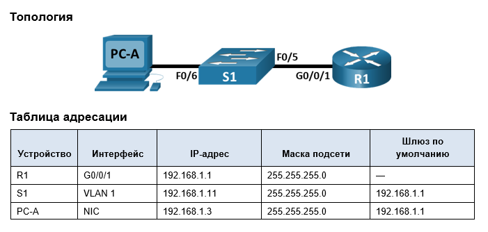
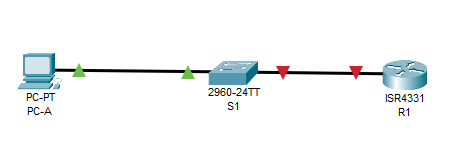
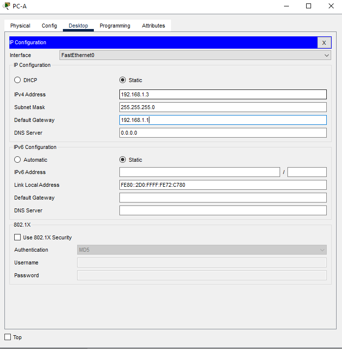
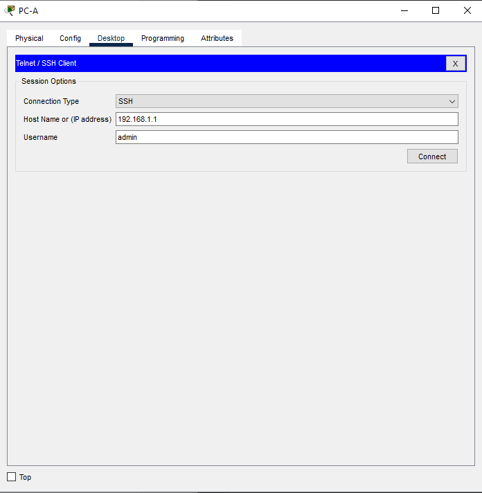

# Лабораторная работа. Доступ к сетевым устройствам по протоколу SSH

# 	Задачи

Часть 1. Настройка основных параметров устройства   
Часть 2. Настройка маршрутизатора для доступа по протоколу SSH  
Часть 3. Настройка коммутатора для доступа по протоколу SSH     
Часть 4. SSH через интерфейс командной строки (CLI) коммутатора

# Часть 1. Настройка основных параметров устройств

## Шаг 1. Создайте сеть согласно топологии.


## Шаг 2. Выполните инициализацию и перезагрузку маршрутизатора и коммутатора.

Switch:
```
Switch>
Switch>en
Switch#dir flash
Switch#dir flash: 
Directory of flash:/

    1  -rw-     4670455          <no date>  2960-lanbasek9-mz.150-2.SE4.bin

64016384 bytes total (59345929 bytes free)

Switch#er
Switch#erase st
Switch#erase startup-config 
Erasing the nvram filesystem will remove all configuration files! Continue? [confirm]
[OK]
Erase of nvram: complete
%SYS-7-NV_BLOCK_INIT: Initialized the geometry of nvram
Switch#reload
```

Router:
```
Router>en
Router#dir flash
Router#dir flash
Directory of flash:/

    3  -rw-   486899872          <no date>  isr4300-universalk9.16.06.04.SPA.bin
    2  -rw-       28282          <no date>  sigdef-category.xml
    1  -rw-      227537          <no date>  sigdef-default.xml

3249049600 bytes total (2761893909 bytes free)
Router#er
Router#erase st
Router#erase startup-config 
Erasing the nvram filesystem will remove all configuration files! Continue? [confirm]
[OK]
Erase of nvram: complete
%SYS-7-NV_BLOCK_INIT: Initialized the geometry of nvram
Router#reload
Proceed with reload? [confirm]
Initializing Hardware ...
```
## Шаг 3. Настройте маршрутизатор.  

 a.	Подключитесь к маршрутизатору с помощью консоли и активируйте привилегированный режим EXEC.     
b.	Войдите в режим конфигурации.   
c.	Отключите поиск DNS, чтобы предотвратить попытки маршрутизатора неверно преобразовывать введенные команды таким образом, как будто они являются именами узлов.      
d.	Назначьте class в качестве зашифрованного пароля привилегированного режима EXEC.        
e.	Назначьте cisco в качестве пароля консоли и включите вход в систему по паролю.      
f.	Назначьте cisco в качестве пароля VTY и включите вход в систему по паролю.  
g.	Зашифруйте открытые пароли.     
h.	Создайте баннер, который предупреждает о запрете несанкционированного доступа.      
i.	Настройте и активируйте на маршрутизаторе интерфейс G0/0/1, используя информацию, приведенную в таблице адресации.      
j.	Сохраните текущую конфигурацию в файл загрузочной конфигурации.     

```
Router>
Router>en
Router#conf t
Enter configuration commands, one per line.  End with CNTL/Z.
Router(config)#no ip domain-lookup
Router(config)#banner motd # Unauthorized access is strictly prohibited.#
Router(config)#int G0/0/1
Router(config-if)#ip address 192.168.1.1 255.255.255.0
Router(config-if)#no shutdown
Router(config-if)#exit
Router(config)#service password-encryption
Router(config)#enable secret class
Router(config)#line con 0
Router(config-line)#password cisco
Router(config-line)#login
Router(config-line)#logging  synchronous 
Router(config-line)#end
Router#conf t
Enter configuration commands, one per line.  End with CNTL/Z.
Router(config)#line vty 0 15
Router(config-line)#password cisco
Router(config-line)#login
%SYS-5-CONFIG_I: Configured from console by console

Router(config-line)#login
Router(config-line)#end
Router#
```
## Шаг 4. Настройте компьютер PC-A.


## Шаг 5. Проверьте подключение к сети.
Пошлите с PC-A команду Ping на маршрутизатор R1. 
```
Cisco Packet Tracer PC Command Line 1.0
C:\>ping 192.168.1.1

Pinging 192.168.1.1 with 32 bytes of data:

Reply from 192.168.1.1: bytes=32 time=36ms TTL=255
Reply from 192.168.1.1: bytes=32 time<1ms TTL=255
Reply from 192.168.1.1: bytes=32 time=1ms TTL=255
Reply from 192.168.1.1: bytes=32 time<1ms TTL=255

Ping statistics for 192.168.1.1:
    Packets: Sent = 4, Received = 4, Lost = 0 (0% loss),
Approximate round trip times in milli-seconds:
    Minimum = 0ms, Maximum = 36ms, Average = 9ms

C:\>
```

# Часть 2. Настройка маршрутизатора для доступа по протоколу SSH

## Шаг 1. Настройте аутентификацию устройств.
### a.	Задайте имя устройства.
```
Router#conf t
Enter configuration commands, one per line.  End with CNTL/Z.
Router(config)#hostname R1
R1(config)#
```
### b.	Задайте домен для устройства.
```
R1(config)#ip domain-name my-otus-lab.org
R1(config)#
```
## Шаг 2. Создайте ключ шифрования с указанием его длины.
```
R1(config)#crypto key generate rsa general-keys modulus 2048
The name for the keys will be: R1.my-otus-lab.org

% The key modulus size is 2048 bits
% Generating 2048 bit RSA keys, keys will be non-exportable...[OK]
*Mar 1 1:19:29.446: %SSH-5-ENABLED: SSH 1.99 has been enabled
R1(config)#
```

## Шаг 3. Создайте имя пользователя в локальной базе учетных записей.
```
R1(config)#username admin privilege 15 password Adm1nP@55 
R1(config)#
```
## Шаг 4. Активируйте протокол SSH на линиях VTY.
### a.	Активируйте протоколы Telnet и SSH на входящих линиях VTY с помощью команды transport input.
```
R1(config)#line vty 0 15
R1(config-line)#trans
R1(config-line)#transport inp
R1(config-line)#transport input all
```
### b.	Измените способ входа в систему таким образом, чтобы использовалась проверка пользователей по локальной базе учетных записей.
```
R1(config-line)#login loc
R1(config-line)#login local 
R1(config-line)#
```
### Шаг 5. Сохраните текущую конфигурацию в файл загрузочной конфигурации.
```
R1#cop
R1#copy run st
Destination filename [startup-config]? 
Building configuration...
[OK]
R1#
```
## Шаг 6. Установите соединение с маршрутизатором по протоколу SSH.


```
Password: 

 Unauthorized access is strictly prohibited.

R1#
```
# Часть 3. Настройка коммутатора для доступа по протоколу SSH

## Шаг 1. Настройте основные параметры коммутатора.
Откройте окно конфигурации
a.	Подключитесь к коммутатору с помощью консольного подключения и активируйте привилегированный режим EXEC.
b.	Войдите в режим конфигурации.
c.	Отключите поиск DNS, чтобы предотвратить попытки маршрутизатора неверно преобразовывать введенные команды таким образом, как будто они являются именами узлов.
d.	Назначьте class в качестве зашифрованного пароля привилегированного режима EXEC.
e.	Назначьте cisco в качестве пароля консоли и включите вход в систему по паролю.
f.	Назначьте cisco в качестве пароля VTY и включите вход в систему по паролю.
g.	Зашифруйте открытые пароли.
h.	Создайте баннер, который предупреждает о запрете несанкционированного доступа.
i.	Настройте и активируйте на коммутаторе интерфейс VLAN 1, используя информацию, приведенную в таблице адресации.
j.	Сохраните текущую конфигурацию в файл загрузочной конфигурации.
```
Switch>
Switch>en
Switch#conf t
Enter configuration commands, one per line.  End with CNTL/Z.
Switch(config)#no ip domain-lookup
Switch(config)#banner motd # Unauthorized access is strictly prohibited.#
Switch(config)#int vlan1
Switch(config-if)#ip address 192.168.1.11 255.255.255.0
Switch(config-if)#no shutdown
Switch(config-if)#exit
Switch(config)#interface fa 0/6
Switch(config-if)#no shutdown
Switch(config-if)#interface fa 0/5
Switch(config-if)#no shutdown
Switch(config-if)#exit
Switch(config)#service password-encryption
Switch(config)#enable secret class
Switch(config)#line con 0
Switch(config-line)#password cisco
Switch(config-line)#login
Switch(config-line)#logging  synchronous 
Switch(config-line)#end
Switch#conf t
Enter configuration commands, one per line.  End with CNTL/Z.
Switch(config)#line vty 0 15
Switch(config-line)#password cisco
Switch(config-line)#login
Switch(config-line)#end
%LINK-5-CHANGED: Interface Vlan1, changed state to up

%LINEPROTO-5-UPDOWN: Line protocol on Interface Vlan1, changed state to up

%SYS-5-CONFIG_I: Configured from console by console

Switch(config-line)#end
Switch#
%SYS-5-CONFIG_I: Configured from console by console

Switch#
Switch#copy run st
Destination filename [startup-config]? 
Building configuration...
[OK]
Switch#
```
## Шаг 2. Настройте коммутатор для соединения по протоколу SSH.
Для настройки протокола SSH на коммутаторе используйте те же команды, которые применялись для аналогичной настройки маршрутизатора в части 2.
a.	Настройте имя устройства, как указано в таблице адресации.
b.	Задайте домен для устройства.
c.	Создайте ключ шифрования с указанием его длины.
d.	Создайте имя пользователя в локальной базе учетных записей.
e.	Активируйте протоколы Telnet и SSH на линиях VTY.
f.	Измените способ входа в систему таким образом, чтобы использовалась проверка пользователей по локальной базе учетных записей.
```
Switch#conf t
Enter configuration commands, one per line.  End with CNTL/Z.
Switch(config)#hostname S1
S1(config)#ip domain-name my-otus-lab.org
S1(config)#crypto key generate rsa general-keys modulus 2048
The name for the keys will be: S1.my-otus-lab.org

% The key modulus size is 2048 bits
% Generating 2048 bit RSA keys, keys will be non-exportable...[OK]
*Mar 1 3:7:39.444: %SSH-5-ENABLED: SSH 1.99 has been enabled
S1(config)#username admin privilege 15 password Adm1nP@55
S1(config)#line vty 0 15
S1(config-line)#transport input all
S1(config-line)#login local
S1(config-line)#end
S1#
%SYS-5-CONFIG_I: Configured from console by console

S1#
```
## Шаг 3. Установите соединение с коммутатором по протоколу SSH.
Запустите программу Tera Term на PC-A, затем установите подключение по протоколу SSH к интерфейсу SVI коммутатора S1.


```
Password: 

 Unauthorized access is strictly prohibited.

S1#
```
Вопрос:
- Удалось ли вам установить SSH-соединение с коммутатором?

Да, удалось.

# Часть 4. Настройка протокола SSH с использованием интерфейса командной строки (CLI) коммутатора
## Шаг 1. Посмотрите доступные параметры для клиента SSH в Cisco IOS.
```
S1>ssh ?
  -l  Log in using this user name
  -v  Specify SSH Protocol Version
```
## Шаг 2. Установите с коммутатора S1 соединение с маршрутизатором R1 по протоколу SSH.
### a.	Чтобы подключиться к маршрутизатору R1 по протоколу SSH, введите команду –l admin. Это позволит вам войти в систему под именем admin. При появлении приглашения введите в качестве пароля Adm1nP@55
```
S1>ssh -l admin 192.168.1.1

Password: 

 Unauthorized access is strictly prohibited.

R1#
```
### b.	Чтобы вернуться к коммутатору S1, не закрывая сеанс SSH с маршрутизатором R1, нажмите комбинацию клавиш Ctrl+Shift+6. Отпустите клавиши Ctrl+Shift+6 и нажмите x. Отображается приглашение привилегированного режима EXEC коммутатора.
```
R1#
S1>
```
### c.	Чтобы вернуться к сеансу SSH на R1, нажмите клавишу Enter в пустой строке интерфейса командной строки. Чтобы увидеть окно командной строки маршрутизатора, нажмите клавишу Enter еще раз.
```
S1>
[Resuming connection 1 to 192.168.1.1 ... ]

R1#
```
### d.	Чтобы завершить сеанс SSH на маршрутизаторе R1, введите в командной строке маршрутизатора команду exit.
```
R1#exit

[Connection to 192.168.1.1 closed by foreign host]
S1>
```

- Какие версии протокола SSH поддерживаются при использовании интерфейса командной строки?

```
S1>ssh -v ?
  1  Protocol Version 1
  2  Protocol Version 2
```
Поддерживаются версии 1 и 2 протокола SSH

# 	Вопрос для повторения

- Как предоставить доступ к сетевому устройству нескольким пользователям, у каждого из которых есть собственное имя пользователя?

Для организации многопользовательского доступа необходимо создать уникальные локальные учетные записи (опционально задать пароли и уровни доступа). 
Как пример - username admin privilege 15 password Adm1nP@55, где
admin - имя пользователя
15 - уровень доступа, где 0 - минимальный , а 15 - максимальный
Adm1nP@55 - пароль для пользователя admin