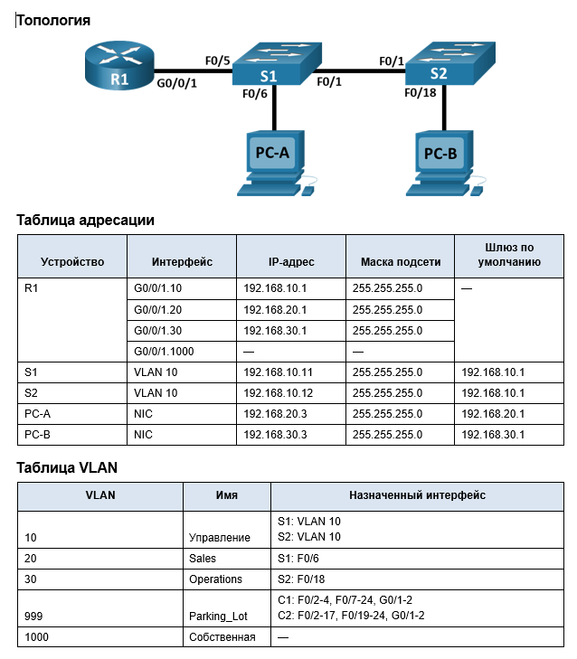
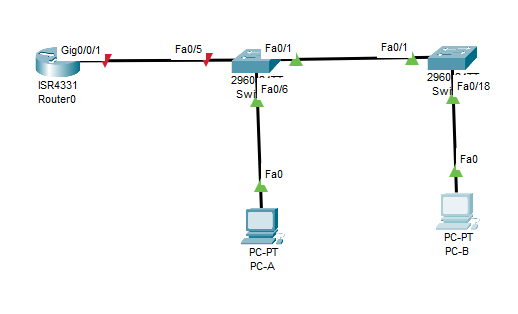
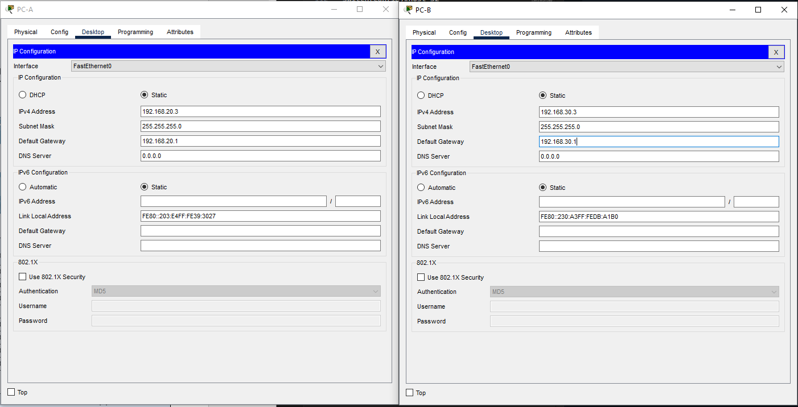

# Лабораторная работа - Внедрение маршрутизации между виртуальными локальными сетями 


## Задачи
Часть 1. Создание сети и настройка основных параметров устройства       
Часть 2. Создание сетей VLAN и назначение портов коммутатора        
Часть 3. Настройка транка 802.1Q между коммутаторами.       
Часть 4. Настройка маршрутизации между сетями VLAN      
Часть 5. Проверка, что маршрутизация между VLAN работает        

# Часть 1. Создание сети и настройка основных параметров устройства

## Шаг 1. Создайте сеть согласно топологии.



## Шаг 2. Настройте базовые параметры для маршрутизатора.

a.	Подключитесь к маршрутизатору с помощью консоли и активируйте привилегированный режим EXEC.
Откройте окно конфигурации      
b.	Войдите в режим конфигурации.       
c.	Назначьте маршрутизатору имя устройства.        
d.	Отключите поиск DNS, чтобы предотвратить попытки маршрутизатора неверно преобразовывать введенные команды таким образом, как будто они являются именами узлов.      
e.	Назначьте class в качестве зашифрованного пароля привилегированного режима EXEC.        
f.	Назначьте cisco в качестве пароля консоли и включите вход в систему по паролю.      
g.	Установите cisco в качестве пароля виртуального терминала и активируйте вход.       
h.	Зашифруйте открытые пароли.
i.	Создайте баннер с предупреждением о запрете несанкционированного доступа к устройству.      
j.	Сохраните текущую конфигурацию в файл загрузочной конфигурации.     
k.	Настройте на маршрутизаторе время.      
```
Router>
Router>en
Router#conf t
Enter configuration commands, one per line.  End with CNTL/Z.
Router(config)#host R1
R1(config)#no ip domain lookup
R1(config)#service password-encryption
R1(config)#enable secret class
R1(config)#banner motd #Unauthorized access is strictly prohibited. #
R1(config)#line con 0
R1(config-line)#password cisco
R1(config-line)#login
R1(config-line)#logging synchronous
R1(config-line)#exit
R1(config)#line vty 0 4
R1(config-line)#password cisco
R1(config-line)#login
R1(config-line)#exit
R1(config)#exit
R1#
%SYS-5-CONFIG_I: Configured from console by console
R1#copy running-config startup-config 
Destination filename [startup-config]? 
Building configuration...
[OK]
R1# clock set 15:50:00 23 May 2025
R1#sh clock
15:50:8.332 UTC Fri May 23 2025
```

## Шаг 3. Настройте базовые параметры каждого коммутатора.

a.	Присвойте коммутатору имя устройства.   
b.	Отключите поиск DNS, чтобы предотвратить попытки маршрутизатора неверно преобразовывать введенные команды таким образом, как будто они являются именами узлов.      
c.	Назначьте class в качестве зашифрованного пароля привилегированного режима EXEC.        
d.	Назначьте cisco в качестве пароля консоли и включите вход в систему по паролю.      
e.	Установите cisco в качестве пароля виртуального терминала и активируйте вход.       
f.	Зашифруйте открытые пароли.     
g.	Создайте баннер с предупреждением о запрете несанкционированного доступа к устройству.      
h.	Настройте на коммутаторах время.    
i.	Сохранение текущей конфигурации в качестве начальной.   


S1
```
Switch>
Switch>en
Switch#conf t
Enter configuration commands, one per line.  End with CNTL/Z.
Switch(config)#host S1
S1(config)#no ip domain lookup
S1(config)#service password-encryption
S1(config)#enable secret class
S1(config)#banner motd #Unauthorized access is strictly prohibited. #
S1(config)#line con 0
S1(config-line)#password cisco
S1(config-line)#login
S1(config-line)#logging synchronous
S1(config-line)#exit
S1(config)#line vty 0 4
S1(config-line)#password cisco
S1(config-line)#login
S1(config-line)#exit
S1(config)#exit
S1#clock set 15:53:00 23 May 2025
S1#copy running-config startup-config
Destination filename [startup-config]? 
%SYS-5-CONFIG_I: Configured from console by console

Destination filename [startup-config]? 
Building configuration...
[OK]
```

S2
```
Switch>
Switch>en
Switch#conf t
Enter configuration commands, one per line.  End with CNTL/Z.
Switch(config)#host S2
S2(config)#no ip domain lookup
S2(config)#service password-encryption
S2(config)#enable secret class
S2(config)#banner motd #Unauthorized access is strictly prohibited. #
S2(config)#line con 0
S2(config-line)#password cisco
S2(config-line)#login
S2(config-line)#logging synchronous
S2(config-line)#exit
S2(config)#line vty 0 4
S2(config-line)#password cisco
S2(config-line)#login
S2(config-line)#exit
S2(config)#exit
S2#clock set 15:54:00 23 May 2025
S2#copy running-config startup-config
Destination filename [startup-config]? 
%SYS-5-CONFIG_I: Configured from console by console

Destination filename [startup-config]? 
Building configuration...
[OK]
S2#
```

## Шаг 4. Настройте узлы ПК.



# Часть 2. Создание сетей VLAN и назначение портов коммутатора

## Шаг 1. Создайте сети VLAN на коммутаторах.

### a.	Создайте и назовите необходимые VLAN на каждом коммутаторе из таблицы выше. 
S1
```
S1(config)#vlan 10
S1(config-vlan)#name MGM
S1(config-vlan)#ex
S1(config)#vlan 20
S1(config-vlan)#name Sales
S1(config-vlan)#ex
S1(config)#vlan 30
S1(config-vlan)#name Operations
S1(config-vlan)#ex
S1(config)#vlan 999
S1(config-vlan)#name Parking_Lot
S1(config-vlan)#ex
S1(config)#vlan 1000
S1(config-vlan)#name Native
S1(config-vlan)#ex
S1(config)#
```
S2
```
S2(config)#vlan 10
S2(config-vlan)#name MGM
S2(config-vlan)#ex
S2(config)#vlan 20
S2(config-vlan)#name Sales
S2(config-vlan)#ex
S2(config)#vlan 30
S2(config-vlan)#name Operations
S2(config-vlan)#ex
S2(config)#vlan 999
S2(config-vlan)#name Parking_Lot
S2(config-vlan)#ex
S2(config)#vlan 1000
S2(config-vlan)#name Native
S2(config-vlan)#ex
S2(config)#
```

### b.	Настройте интерфейс управления и шлюз по умолчанию на каждом коммутаторе, используя информацию об IP-адресе в таблице адресации. 
S1
```
S1(config)#int vlan 10
S1(config-if)#
%LINK-5-CHANGED: Interface Vlan10, changed state to up

S1(config-if)#ip addres
S1(config-if)#ip address 192.168.10.11 255.255.255.0
S1(config-if)#no sh
S1(config-if)#ex
S1(config)#ip de
S1(config)#ip default-gateway 192.168.10.1
```

S2
```
S2(config)#int vlan 10
S2(config-if)#
%LINK-5-CHANGED: Interface Vlan10, changed state to up

S2(config-if)#ip add
S2(config-if)#ip address 192.168.10.12 255.255.255.0
S2(config-if)#ex
S2(config)#ip def
S2(config)#ip default-gateway 192.168.10.1
S2(config)#
```

### c.	Назначьте все неиспользуемые порты коммутатора VLAN Parking_Lot, настройте их для статического режима доступа и административно деактивируйте их.
S1
```
S1(config)#int range F0/2-4, F0/7-24, G0/1-2
S1(config-if-range)#sw m a
S1(config-if-range)#sw a v 999
S1(config-if-range)#shu
S1(config-if-range)#shutdown 

%LINK-5-CHANGED: Interface FastEthernet0/2, changed state to administratively down

%LINK-5-CHANGED: Interface FastEthernet0/3, changed state to administratively down

%LINK-5-CHANGED: Interface FastEthernet0/4, changed state to administratively down

%LINK-5-CHANGED: Interface FastEthernet0/7, changed state to administratively down

%LINK-5-CHANGED: Interface FastEthernet0/8, changed state to administratively down

%LINK-5-CHANGED: Interface FastEthernet0/9, changed state to administratively down

%LINK-5-CHANGED: Interface FastEthernet0/10, changed state to administratively down

%LINK-5-CHANGED: Interface FastEthernet0/11, changed state to administratively down

%LINK-5-CHANGED: Interface FastEthernet0/12, changed state to administratively down

%LINK-5-CHANGED: Interface FastEthernet0/13, changed state to administratively down

%LINK-5-CHANGED: Interface FastEthernet0/14, changed state to administratively down

%LINK-5-CHANGED: Interface FastEthernet0/15, changed state to administratively down

%LINK-5-CHANGED: Interface FastEthernet0/16, changed state to administratively down

%LINK-5-CHANGED: Interface FastEthernet0/17, changed state to administratively down

%LINK-5-CHANGED: Interface FastEthernet0/18, changed state to administratively down

%LINK-5-CHANGED: Interface FastEthernet0/19, changed state to administratively down

%LINK-5-CHANGED: Interface FastEthernet0/20, changed state to administratively down

%LINK-5-CHANGED: Interface FastEthernet0/21, changed state to administratively down

%LINK-5-CHANGED: Interface FastEthernet0/22, changed state to administratively down

%LINK-5-CHANGED: Interface FastEthernet0/23, changed state to administratively down

%LINK-5-CHANGED: Interface FastEthernet0/24, changed state to administratively down

%LINK-5-CHANGED: Interface GigabitEthernet0/1, changed state to administratively down

%LINK-5-CHANGED: Interface GigabitEthernet0/2, changed state to administratively down
S1(config-if-range)#ex
S1(config)#ex
S1#
%SYS-5-CONFIG_I: Configured from console by console

S1#sh vlan

VLAN Name                             Status    Ports
---- -------------------------------- --------- -------------------------------
1    default                          active    Fa0/1, Fa0/5, Fa0/6
10   MGM                              active    
20   Sales                            active    
30   Operations                       active    
999  Parking_Lot                      active    Fa0/2, Fa0/3, Fa0/4, Fa0/7
                                                Fa0/8, Fa0/9, Fa0/10, Fa0/11
                                                Fa0/12, Fa0/13, Fa0/14, Fa0/15
                                                Fa0/16, Fa0/17, Fa0/18, Fa0/19
                                                Fa0/20, Fa0/21, Fa0/22, Fa0/23
                                                Fa0/24, Gig0/1, Gig0/2
1000 Native                           active    
1002 fddi-default                     active    
1003 token-ring-default               active    
1004 fddinet-default                  active    
1005 trnet-default                    active    

VLAN Type  SAID       MTU   Parent RingNo BridgeNo Stp  BrdgMode Trans1 Trans2
---- ----- ---------- ----- ------ ------ -------- ---- -------- ------ ------
1    enet  100001     1500  -      -      -        -    -        0      0
10   enet  100010     1500  -      -      -        -    -        0      0
20   enet  100020     1500  -      -      -        -    -        0      0
30   enet  100030     1500  -      -      -        -    -        0      0
999  enet  100999     1500  -      -      -        -    -        0      0
1000 enet  101000     1500  -      -      -        -    -        0      0
1002 fddi  101002     1500  -      -      -        -    -        0      0   
1003 tr    101003     1500  -      -      -        -    -        0      0   
1004 fdnet 101004     1500  -      -      -        ieee -        0      0   
1005 trnet 101005     1500  -      -      -        ibm  -        0      0   

VLAN Type  SAID       MTU   Parent RingNo BridgeNo Stp  BrdgMode Trans1 Trans2
---- ----- ---------- ----- ------ ------ -------- ---- -------- ------ ------

Remote SPAN VLANs
------------------------------------------------------------------------------

Primary Secondary Type              Ports
------- --------- ----------------- ------------------------------------------
S1#
```

S2
```
S2(config)#int range F0/2-17, F0/19-24, G0/1-2
S2(config-if-range)#sw m a
S2(config-if-range)#sw a v 999
S2(config-if-range)#sh

%LINK-5-CHANGED: Interface FastEthernet0/2, changed state to administratively down

%LINK-5-CHANGED: Interface FastEthernet0/3, changed state to administratively down

%LINK-5-CHANGED: Interface FastEthernet0/4, changed state to administratively down

%LINK-5-CHANGED: Interface FastEthernet0/5, changed state to administratively down

%LINK-5-CHANGED: Interface FastEthernet0/6, changed state to administratively down

%LINK-5-CHANGED: Interface FastEthernet0/7, changed state to administratively down

%LINK-5-CHANGED: Interface FastEthernet0/8, changed state to administratively down

%LINK-5-CHANGED: Interface FastEthernet0/9, changed state to administratively down

%LINK-5-CHANGED: Interface FastEthernet0/10, changed state to administratively down

%LINK-5-CHANGED: Interface FastEthernet0/11, changed state to administratively down

%LINK-5-CHANGED: Interface FastEthernet0/12, changed state to administratively down

%LINK-5-CHANGED: Interface FastEthernet0/13, changed state to administratively down

%LINK-5-CHANGED: Interface FastEthernet0/14, changed state to administratively down

%LINK-5-CHANGED: Interface FastEthernet0/15, changed state to administratively down

%LINK-5-CHANGED: Interface FastEthernet0/16, changed state to administratively down

%LINK-5-CHANGED: Interface FastEthernet0/17, changed state to administratively down

%LINK-5-CHANGED: Interface FastEthernet0/19, changed state to administratively down

%LINK-5-CHANGED: Interface FastEthernet0/20, changed state to administratively down

%LINK-5-CHANGED: Interface FastEthernet0/21, changed state to administratively down

%LINK-5-CHANGED: Interface FastEthernet0/22, changed state to administratively down

%LINK-5-CHANGED: Interface FastEthernet0/23, changed state to administratively down

%LINK-5-CHANGED: Interface FastEthernet0/24, changed state to administratively down

%LINK-5-CHANGED: Interface GigabitEthernet0/1, changed state to administratively down

%LINK-5-CHANGED: Interface GigabitEthernet0/2, changed state to administratively down
S2(config-if-range)#ex
S2(config)#ex
S2#
%SYS-5-CONFIG_I: Configured from console by console

S2#sh vlan

VLAN Name                             Status    Ports
---- -------------------------------- --------- -------------------------------
1    default                          active    Fa0/1, Fa0/18
10   MGM                              active    
20   Sales                            active    
30   Operations                       active    
999  Parking_Lot                      active    Fa0/2, Fa0/3, Fa0/4, Fa0/5
                                                Fa0/6, Fa0/7, Fa0/8, Fa0/9
                                                Fa0/10, Fa0/11, Fa0/12, Fa0/13
                                                Fa0/14, Fa0/15, Fa0/16, Fa0/17
                                                Fa0/19, Fa0/20, Fa0/21, Fa0/22
                                                Fa0/23, Fa0/24, Gig0/1, Gig0/2
1000 Native                           active    
1002 fddi-default                     active    
1003 token-ring-default               active    
1004 fddinet-default                  active    
1005 trnet-default                    active    

VLAN Type  SAID       MTU   Parent RingNo BridgeNo Stp  BrdgMode Trans1 Trans2
---- ----- ---------- ----- ------ ------ -------- ---- -------- ------ ------
1    enet  100001     1500  -      -      -        -    -        0      0
10   enet  100010     1500  -      -      -        -    -        0      0
20   enet  100020     1500  -      -      -        -    -        0      0
30   enet  100030     1500  -      -      -        -    -        0      0
999  enet  100999     1500  -      -      -        -    -        0      0
1000 enet  101000     1500  -      -      -        -    -        0      0
1002 fddi  101002     1500  -      -      -        -    -        0      0   
1003 tr    101003     1500  -      -      -        -    -        0      0   
1004 fdnet 101004     1500  -      -      -        ieee -        0      0   
1005 trnet 101005     1500  -      -      -        ibm  -        0      0   

VLAN Type  SAID       MTU   Parent RingNo BridgeNo Stp  BrdgMode Trans1 Trans2
---- ----- ---------- ----- ------ ------ -------- ---- -------- ------ ------

Remote SPAN VLANs
------------------------------------------------------------------------------

Primary Secondary Type              Ports
------- --------- ----------------- ------------------------------------------
S2#
```
## Шаг 2. Назначьте сети VLAN соответствующим интерфейсам коммутатора.

### a.	Назначьте используемые порты соответствующей VLAN (указанной в таблице VLAN выше) и настройте их для режима статического доступа.

S1
```
S1(config)# int f0/6
S1(config-if)#sw m a
S1(config-if)#sw a v 20
S1(config-if)#ex
```

S2
```
S2(config)#int f0/18
S2(config-if)#sw m a
S2(config-if)#sw a vlan 30
S2(config-if)#ex
```

### b.	Убедитесь, что VLAN назначены на правильные интерфейсы.

S1
```
S1#sh vlan

VLAN Name                             Status    Ports
---- -------------------------------- --------- -------------------------------
1    default                          active    Fa0/1, Fa0/5
10   MGM                              active    
20   Sales                            active    Fa0/6
30   Operations                       active    
999  Parking_Lot                      active    Fa0/2, Fa0/3, Fa0/4, Fa0/7
                                                Fa0/8, Fa0/9, Fa0/10, Fa0/11
                                                Fa0/12, Fa0/13, Fa0/14, Fa0/15
                                                Fa0/16, Fa0/17, Fa0/18, Fa0/19
                                                Fa0/20, Fa0/21, Fa0/22, Fa0/23
                                                Fa0/24, Gig0/1, Gig0/2
1000 Native                           active    
1002 fddi-default                     active    
1003 token-ring-default               active    
1004 fddinet-default                  active    
1005 trnet-default                    active    

VLAN Type  SAID       MTU   Parent RingNo BridgeNo Stp  BrdgMode Trans1 Trans2
---- ----- ---------- ----- ------ ------ -------- ---- -------- ------ ------
1    enet  100001     1500  -      -      -        -    -        0      0
10   enet  100010     1500  -      -      -        -    -        0      0
20   enet  100020     1500  -      -      -        -    -        0      0
30   enet  100030     1500  -      -      -        -    -        0      0
999  enet  100999     1500  -      -      -        -    -        0      0
1000 enet  101000     1500  -      -      -        -    -        0      0
1002 fddi  101002     1500  -      -      -        -    -        0      0   
1003 tr    101003     1500  -      -      -        -    -        0      0   
1004 fdnet 101004     1500  -      -      -        ieee -        0      0   
1005 trnet 101005     1500  -      -      -        ibm  -        0      0   

VLAN Type  SAID       MTU   Parent RingNo BridgeNo Stp  BrdgMode Trans1 Trans2
---- ----- ---------- ----- ------ ------ -------- ---- -------- ------ ------

Remote SPAN VLANs
------------------------------------------------------------------------------

Primary Secondary Type              Ports
------- --------- ----------------- ------------------------------------------
S1#
```


S2
```
S2#sh vlan

VLAN Name                             Status    Ports
---- -------------------------------- --------- -------------------------------
1    default                          active    Fa0/1
10   MGM                              active    
20   Sales                            active    
30   Operations                       active    Fa0/18
999  Parking_Lot                      active    Fa0/2, Fa0/3, Fa0/4, Fa0/5
                                                Fa0/6, Fa0/7, Fa0/8, Fa0/9
                                                Fa0/10, Fa0/11, Fa0/12, Fa0/13
                                                Fa0/14, Fa0/15, Fa0/16, Fa0/17
                                                Fa0/19, Fa0/20, Fa0/21, Fa0/22
                                                Fa0/23, Fa0/24, Gig0/1, Gig0/2
1000 Native                           active    
1002 fddi-default                     active    
1003 token-ring-default               active    
1004 fddinet-default                  active    
1005 trnet-default                    active    

VLAN Type  SAID       MTU   Parent RingNo BridgeNo Stp  BrdgMode Trans1 Trans2
---- ----- ---------- ----- ------ ------ -------- ---- -------- ------ ------
1    enet  100001     1500  -      -      -        -    -        0      0
10   enet  100010     1500  -      -      -        -    -        0      0
20   enet  100020     1500  -      -      -        -    -        0      0
30   enet  100030     1500  -      -      -        -    -        0      0
999  enet  100999     1500  -      -      -        -    -        0      0
1000 enet  101000     1500  -      -      -        -    -        0      0
1002 fddi  101002     1500  -      -      -        -    -        0      0   
1003 tr    101003     1500  -      -      -        -    -        0      0   
1004 fdnet 101004     1500  -      -      -        ieee -        0      0   
1005 trnet 101005     1500  -      -      -        ibm  -        0      0   

VLAN Type  SAID       MTU   Parent RingNo BridgeNo Stp  BrdgMode Trans1 Trans2
---- ----- ---------- ----- ------ ------ -------- ---- -------- ------ ------

Remote SPAN VLANs
------------------------------------------------------------------------------

Primary Secondary Type              Ports
------- --------- ----------------- ------------------------------------------
S2#
```
# Часть 3. Конфигурация магистрального канала стандарта 802.1Q между коммутаторами

## Шаг 1. Вручную настройте магистральный интерфейс F0/1 на коммутаторах S1 и S2.

### a.	Настройка статического транкинга на интерфейсе F0/1 для обоих коммутаторов.
 S1
 ```
S1(config)#int f0/1
S1(config-if)#sw m t

S1(config-if)#
%LINEPROTO-5-UPDOWN: Line protocol on Interface FastEthernet0/1, changed state to down

%LINEPROTO-5-UPDOWN: Line protocol on Interface FastEthernet0/1, changed state to up

%LINEPROTO-5-UPDOWN: Line protocol on Interface Vlan10, changed state to up

S1(config-if)#
 ```
 Аналогично повторяем для S2

 ### b.	Установите native VLAN 1000 на обоих коммутаторах.
 S1
 ```
S1(config-if)#switchport trunk native vlan 1000
S1(config-if)#%SPANTREE-2-RECV_PVID_ERR: Received BPDU with inconsistent peer vlan id 1 on FastEthernet0/1 VLAN1000.

%SPANTREE-2-BLOCK_PVID_LOCAL: Blocking FastEthernet0/1 on VLAN1000. Inconsistent local vlan.
 ```
 Аналогично повторяем для S2
### c.	Укажите, что VLAN 10, 20, 30 и 1000 могут проходить по транку.
S1
```
S1(config-if)#switchport trunk allowed vlan 10,20,30,1000
S1(config-if)#%SPANTREE-2-RECV_PVID_ERR: Received BPDU with inconsistent peer vlan id 1 on FastEthernet0/1 VLAN1000.

%SPANTREE-2-BLOCK_PVID_LOCAL: Blocking FastEthernet0/1 on VLAN1000. Inconsistent local vlan.

```
Аналогично повторяем для S2

### d.	Проверьте транки, native VLAN и разрешенные VLAN через транк.
S1
```
S1#sh int t
Port        Mode         Encapsulation  Status        Native vlan
Fa0/1       on           802.1q         trunking      1000

Port        Vlans allowed on trunk
Fa0/1       10,20,30,1000

Port        Vlans allowed and active in management domain
Fa0/1       10,20,30,1000

Port        Vlans in spanning tree forwarding state and not pruned
Fa0/1       10,20,30,1000

S1#
```

S2
```
S2#sh int tr
S2#sh int trunk 
Port        Mode         Encapsulation  Status        Native vlan
Fa0/1       on           802.1q         trunking      1000

Port        Vlans allowed on trunk
Fa0/1       10,20,30,1000

Port        Vlans allowed and active in management domain
Fa0/1       10,20,30,1000

Port        Vlans in spanning tree forwarding state and not pruned
Fa0/1       10,20,30,1000

```

## Шаг 2. Вручную настройте магистральный интерфейс F0/5 на коммутаторе S1

### a.	Настройте интерфейс S1 F0/5 с теми же параметрами транка, что и F0/1. Это транк до маршрутизатора.

```
S1(config)#int f0/5
S1(config-if)#sw m t
S1(config-if)#sw t na
S1(config-if)#sw t native vlan 1000
S1(config-if)#sw t al
S1(config-if)#sw t allowed vlan 10,20,30,1000
S1(config-if)#
```

### b.	Сохраните текущую конфигурацию в файл загрузочной конфигурации.
```
S1#copy ru
S1#copy running-config st
Destination filename [startup-config]? 
Building configuration...
[OK]
S1#
```

### c.	Проверка транкинга.
```
S1#sh int tr
S1#sh int trunk 
Port        Mode         Encapsulation  Status        Native vlan
Fa0/1       on           802.1q         trunking      1000

Port        Vlans allowed on trunk
Fa0/1       10,20,30,1000

Port        Vlans allowed and active in management domain
Fa0/1       10,20,30,1000

Port        Vlans in spanning tree forwarding state and not pruned
Fa0/1       10,20,30,1000
```

- Что произойдет, если G0/0/1 на R1 будет отключен?

Если G0/0/1 на R1 то транк в таблице не отображается. После включения порта на R1
```
R1(config)#int g0/0/1
R1(config-if)#no sh

R1(config-if)#
%LINK-5-CHANGED: Interface GigabitEthernet0/0/1, changed state to up

%LINEPROTO-5-UPDOWN: Line protocol on Interface GigabitEthernet0/0/1, changed state to up

R1(config-if)#
```

вывод sh int trunk На S1 принимает вид:
```

S1#sh int trunk 
Port        Mode         Encapsulation  Status        Native vlan
Fa0/1       on           802.1q         trunking      1000
Fa0/5       on           802.1q         trunking      1000

Port        Vlans allowed on trunk
Fa0/1       10,20,30,1000
Fa0/5       10,20,30,1000

Port        Vlans allowed and active in management domain
Fa0/1       10,20,30,1000
Fa0/5       10,20,30,1000

Port        Vlans in spanning tree forwarding state and not pruned
Fa0/1       10,20,30,1000
Fa0/5       none

S1#
```

# Часть 4. Настройка маршрутизации между сетями VLAN

## Шаг 1. Настройте маршрутизатор.

### a.	При необходимости активируйте интерфейс G0/0/1 на маршрутизаторе.
```
R1(config)#int g0/0/1
R1(config-if)#no sh

R1(config-if)#
%LINK-5-CHANGED: Interface GigabitEthernet0/0/1, changed state to up

%LINEPROTO-5-UPDOWN: Line protocol on Interface GigabitEthernet0/0/1, changed state to up

R1(config-if)#
```
### b.	Настройте подинтерфейсы для каждой VLAN, как указано в таблице IP-адресации. Все подинтерфейсы используют инкапсуляцию 802.1Q. Убедитесь, что подинтерфейсу для native VLAN не назначен IP-адрес. Включите описание для каждого подинтерфейса.
```

R1(config-if)#int g0/0/1.10
R1(config-subif)#
%LINK-5-CHANGED: Interface GigabitEthernet0/0/1.10, changed state to up

%LINEPROTO-5-UPDOWN: Line protocol on Interface GigabitEthernet0/0/1.10, changed state to up

R1(config-subif)#enq
R1(config-subif)#enca
R1(config-subif)#encapsulation dot1Q 10
R1(config-subif)#desc
R1(config-subif)#description MAnagement
R1(config-subif)#ip add
R1(config-subif)#ip address 192.168.10.1 255.255.255.0
R1(config-subif)#ex
R1(config)#int g0/0/1.20
R1(config-subif)#
%LINK-5-CHANGED: Interface GigabitEthernet0/0/1.20, changed state to up

%LINEPROTO-5-UPDOWN: Line protocol on Interface GigabitEthernet0/0/1.20, changed state to up

R1(config-subif)#encap
R1(config-subif)#encapsulation dot1Q 20
R1(config-subif)#descr
R1(config-subif)#description Sales
R1(config-subif)#ip add
R1(config-subif)#ip address 192.168.20.1 255.255.255.0
R1(config-subif)#ex
R1(config)#int g0/0/1.30
R1(config-subif)#
%LINK-5-CHANGED: Interface GigabitEthernet0/0/1.30, changed state to up

%LINEPROTO-5-UPDOWN: Line protocol on Interface GigabitEthernet0/0/1.30, changed state to up

R1(config-subif)#enc
R1(config-subif)#encapsulation dot1Q 30
R1(config-subif)#ip ad
R1(config-subif)#ip address 192.168.30.1 255.255.255.0
R1(config-subif)#ex
R1(config)#int g0/0/1.1000
R1(config-subif)#
%LINK-5-CHANGED: Interface GigabitEthernet0/0/1.1000, changed state to up

%LINEPROTO-5-UPDOWN: Line protocol on Interface GigabitEthernet0/0/1.1000, changed state to up

R1(config-subif)#enc
R1(config-subif)#encapsulation dot1Q 1000 
R1(config-subif)#encapsulation dot1Q 1000 native 
R1(config-subif)#desc
R1(config-subif)#description Native vlan
R1(config-subif)#
```

### c.	Убедитесь, что вспомогательные интерфейсы работают
```
R1#sh ip int brief
Interface              IP-Address      OK? Method Status                Protocol 
GigabitEthernet0/0/0   unassigned      YES unset  administratively down down 
GigabitEthernet0/0/1   unassigned      YES unset  up                    up 
GigabitEthernet0/0/1.10192.168.10.1    YES manual up                    up 
GigabitEthernet0/0/1.20192.168.20.1    YES manual up                    up 
GigabitEthernet0/0/1.30192.168.30.1    YES manual up                    up 
GigabitEthernet0/0/1.1000unassigned      YES unset  up                    up 
GigabitEthernet0/0/2   unassigned      YES unset  administratively down down 
Vlan1                  unassigned      YES unset  administratively down down
R1#
```

# Часть 5. Проверьте, работает ли маршрутизация между VLAN

## Шаг 1. Выполните следующие тесты с PC-A. Все должно быть успешно.

### a.	Отправьте эхо-запрос с PC-A на шлюз по умолчанию.
```
C:\>ping 192.168.20.1

Pinging 192.168.20.1 with 32 bytes of data:

Reply from 192.168.20.1: bytes=32 time<1ms TTL=255
Reply from 192.168.20.1: bytes=32 time<1ms TTL=255
Reply from 192.168.20.1: bytes=32 time<1ms TTL=255
Reply from 192.168.20.1: bytes=32 time<1ms TTL=255
```

### b.	Отправьте эхо-запрос с PC-A на PC-B.
```
C:\>ping 192.168.30.3

Pinging 192.168.30.3 with 32 bytes of data:

Reply from 192.168.30.3: bytes=32 time<1ms TTL=127
Reply from 192.168.30.3: bytes=32 time<1ms TTL=127
Reply from 192.168.30.3: bytes=32 time<1ms TTL=127
Reply from 192.168.30.3: bytes=32 time<1ms TTL=127
```

### c.	Отправьте команду ping с компьютера PC-A на коммутатор S2.

```
C:\>ping 192.168.10.12

Pinging 192.168.10.12 with 32 bytes of data:

Request timed out.
Request timed out.
Reply from 192.168.10.12: bytes=32 time<1ms TTL=254
Reply from 192.168.10.12: bytes=32 time<1ms TTL=254

Ping statistics for 192.168.10.12:
    Packets: Sent = 4, Received = 2, Lost = 2 (50% loss),
Approximate round trip times in milli-seconds:
    Minimum = 0ms, Maximum = 0ms, Average = 0ms
```
* потерял 2 первых пакета, а не один... интересно

## Шаг 2. Пройдите следующий тест с PC-B
### В окне командной строки на PC-B выполните команду tracert на адрес PC-A.
```

Cisco Packet Tracer PC Command Line 1.0
C:\>tracert 192.168.20.3

Tracing route to 192.168.20.3 over a maximum of 30 hops: 

  1   0 ms      0 ms      0 ms      192.168.30.1
  2   0 ms      0 ms      0 ms      192.168.20.3

Trace complete.

C:\>
```

- Вопрос:
Какие промежуточные IP-адреса отображаются в результатах?

Мы видим IP 192.168.30.1, который назначен сабинтерфейсу G0/0/1 в VLAN30, который в свою очередь является шлюзом для PC-B.