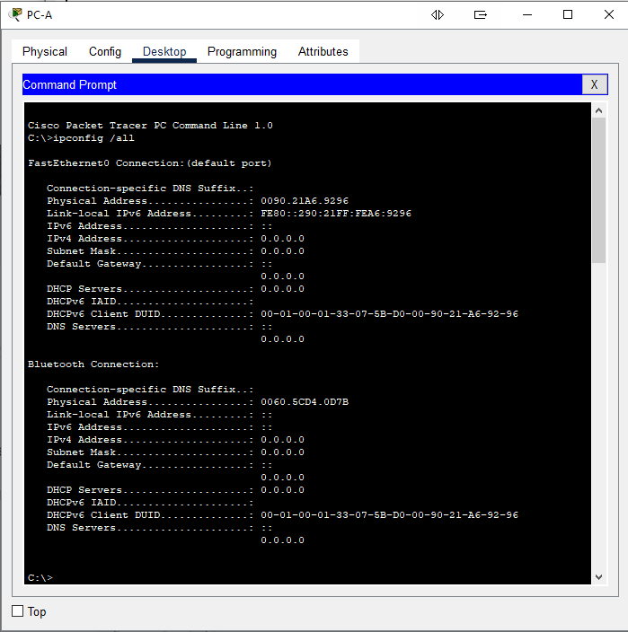
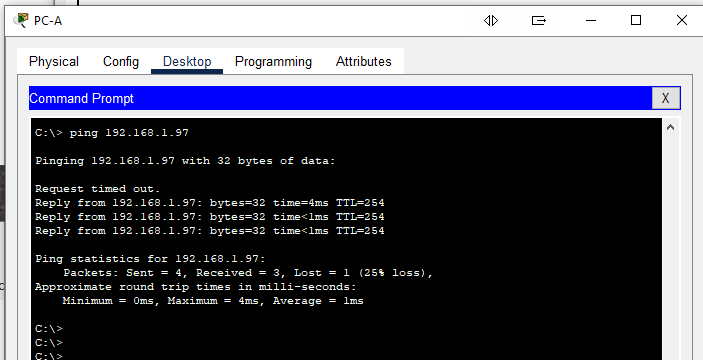
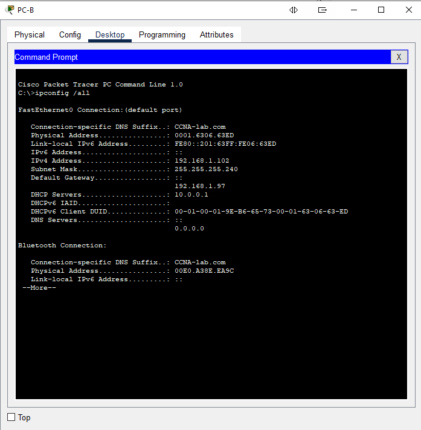
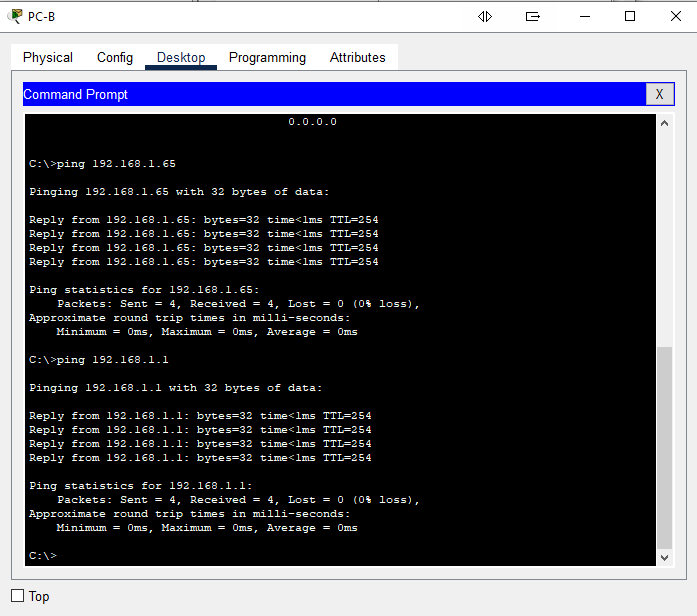

# Лабораторная работа - Реализация DHCPv4 


# Задачи

- Часть 1. Создание сети и настройка основных параметров устройства
- Часть 2. Настройка и проверка двух серверов DHCPv4 на R1
- Часть 3. Настройка и проверка DHCP-ретрансляции на R2


# Часть 1.	Создание сети и настройка основных параметров устройства

## Шаг 1.	Создание схемы адресации
Подсеть сети 192.168.1.0/24 в соответствии со следующими требованиями:  

### a.	Одна подсеть «Подсеть A», поддерживающая 58 хостов (клиентская VLAN на R1).     
Подсеть A - 192.168.1.0/26  
Маска - 255.255.255.192     
Первый адрес - 192.168.1.1  
Последний адрес - 192.168.1.62  
Широковещательный адрес - 192.168.1.63  
Поддерживается 62 хоста 

Запишите первый IP-адрес в таблице адресации для R1 G0/0/1.100 .    


### b.	Одна подсеть «Подсеть B», поддерживающая 28 хостов (управляющая VLAN на R1). 
Подсеть B: - 192.168.1.64/27  
Маска - 255.255.255.224     
Первый адрес - 192.168.1.65  
Последний адрес - 192.168.1.94  
Широковещательный адрес - 192.168.1.95  
Поддерживается 30 хостов 


Запишите первый IP-адрес в таблице адресации для R1 G0/0/1.200. Запишите второй 

IP-адрес в таблице адресов для S1 VLAN 200 и введите соответствующий шлюз по умолчанию.     


### c.	Одна подсеть «Подсеть C», поддерживающая 12 узлов (клиентская сеть на R2).
Подсеть C: - 192.168.1.96/28  
Маска - 255.255.255.240    
Первый адрес - 192.168.1.97  
Последний адрес - 192.168.1.110  
Широковещательный адрес - 192.168.1.111  
Поддерживается 14 хостов 

Запишите первый IP-адрес в таблице адресации для R2 G0/0/1.

## Шаг 2.	Создайте сеть согласно топологии.


## Шаг 3.	Произведите базовую настройку маршрутизаторов.
a.	Назначьте маршрутизатору имя устройства.    
Откройте окно конфигурации      
b.	Отключите поиск DNS, чтобы предотвратить попытки маршрутизатора неверно     преобразовывать введенные команды таким образом, как будто они являются именами узлов.  
c.	Назначьте class в качестве зашифрованного пароля привилегированного режима EXEC.    
d.	Назначьте cisco в качестве пароля консоли и включите вход в систему по паролю.  
e.	Назначьте cisco в качестве пароля VTY и включите вход в систему по паролю.  
f.	Зашифруйте открытые пароли.     
g.	Создайте баннер с предупреждением о запрете несанкционированного доступа к  устройству.     
h.	Сохраните текущую конфигурацию в файл загрузочной конфигурации.     
i.	Установите часы на маршрутизаторе на сегодняшнее время и дату.  

```
Router>en 
Router#conf t
Enter configuration commands, one per line.  End with CNTL/Z.
Router(config)#hostname R1
R1(config)#no ip domain-lookup
R1(config)#enable secret class
R1(config)#line con 0
R1(config-line)#password cisco
R1(config-line)#login
R1(config-line)#logging  synchronous 
R1(config-line)#line vty 0 15
R1(config-line)#password cisco
R1(config-line)#login
R1(config-line)#service password-encryption
R1(config)#banner motd # Unauthorized access is strictly prohibited.#
R1(config)#^Z
R1#
%SYS-5-CONFIG_I: Configured from console by console

R1#wr
Building configuration...
[OK]
R1#clo
R1#clock set 19:54:00 25 jun 2025
R1#
```


Аналогично повторяем для R2

## Шаг 4.	Настройка маршрутизации между сетями VLAN на маршрутизаторе R1

### a.	Активируйте интерфейс G0/0/1 на маршрутизаторе.

```
R1(config)#int g0/0/1
R1(config-if)#no sh

R1(config-if)#
%LINK-5-CHANGED: Interface GigabitEthernet0/0/1, changed state to up

%LINEPROTO-5-UPDOWN: Line protocol on Interface GigabitEthernet0/0/1, changed state to up
```

### b.	Настройте подинтерфейсы для каждой VLAN в соответствии с требованиями таблицы IP-адресации. Все субинтерфейсы используют инкапсуляцию 802.1Q и назначаются первый полезный адрес из вычисленного пула IP-адресов. Убедитесь, что подинтерфейсу для native VLAN не назначен IP-адрес. Включите описание для каждого подинтерфейса.

```
R1(config)#int g0/0/1.100
R1(config-subif)#
%LINK-5-CHANGED: Interface GigabitEthernet0/0/1.100, changed state to up

%LINEPROTO-5-UPDOWN: Line protocol on Interface GigabitEthernet0/0/1.100, changed state to up

R1(config-subif)#enc dot1q 100
R1(config-subif)#ip add 192.168.1.1 255.255.255.192
R1(config-subif)#desc
R1(config-subif)#description Clients
R1(config-subif)#int g0/0/1.200
R1(config-subif)#
%LINK-5-CHANGED: Interface GigabitEthernet0/0/1.200, changed state to up

%LINEPROTO-5-UPDOWN: Line protocol on Interface GigabitEthernet0/0/1.200, changed state to up

R1(config-subif)#enc dot1q 200
R1(config-subif)#ip add 192.168.1.65 255.255.255.224
R1(config-subif)#desc MGM
R1(config-subif)#int g0/0/1.1000
R1(config-subif)#
%LINK-5-CHANGED: Interface GigabitEthernet0/0/1.1000, changed state to up

%LINEPROTO-5-UPDOWN: Line protocol on Interface GigabitEthernet0/0/1.1000, changed state to up
	
R1(config-subif)#enc dot1q 1000 nat
R1(config-subif)#desc Native
```

### c.	Убедитесь, что вспомогательные интерфейсы работают
```
R1# show ip interface brief
Interface              IP-Address      OK? Method Status                Protocol 
GigabitEthernet0/0/0   unassigned      YES unset  administratively down down 
GigabitEthernet0/0/1   unassigned      YES unset  up                    up 
GigabitEthernet0/0/1.100192.168.1.1     YES manual up                    up 
GigabitEthernet0/0/1.200192.168.1.65    YES manual up                    up 
GigabitEthernet0/0/1.1000unassigned      YES unset  up                    up 
GigabitEthernet0/0/2   unassigned      YES unset  administratively down down 
Vlan1                  unassigned      YES unset  administratively down down
```

## Шаг 5.	Настройте G0/1 на R2, затем G0/0/0 и статическую маршрутизацию для обоих маршрутизаторов

### a.	Настройте G0/0/1 на R2 с первым IP-адресом подсети C, рассчитанным ранее.
```
R2(config)#int g0/0/1
R2(config-if)#ip add 192.168.1.97 255.255.255.240
R2(config-if)#no sh

R2(config-if)#
%LINK-5-CHANGED: Interface GigabitEthernet0/0/1, changed state to up

%LINEPROTO-5-UPDOWN: Line protocol on Interface GigabitEthernet0/0/1, changed state to up
```

### b.	Настройте интерфейс G0/0/0 для каждого маршрутизатора на основе приведенной выше таблицы IP-адресации.
```
R1(config)#int g0/0/0
R1(config-if)#ip add 10.0.0.1 255.255.255.252
R1(config-if)#no sh

R1(config-if)#
%LINK-5-CHANGED: Interface GigabitEthernet0/0/0, changed state to up

%LINEPROTO-5-UPDOWN: Line protocol on Interface GigabitEthernet0/0/0, changed state to up

```
```
R2(config)#int g0/0/0
R2(config-if)#ip add 10.0.0.2 255.255.255.252
R2(config-if)#no sh

R2(config-if)#
%LINK-5-CHANGED: Interface GigabitEthernet0/0/0, changed state to up

%LINEPROTO-5-UPDOWN: Line protocol on Interface GigabitEthernet0/0/0, changed state to up
```

### c.	Настройте маршрут по умолчанию на каждом маршрутизаторе, указываемом на IP-адрес G0/0/0 на другом маршрутизаторе.
```
R1(config)#ip route 0.0.0.0 0.0.0.0 10.0.0.2
```

```
R2(config)#ip route 0.0.0.0 0.0.0.0 10.0.0.1
```

### d.	Убедитесь, что статическая маршрутизация работает с помощью пинга до адреса G0/0/1 R2 от R1.
```
R1#ping 192.168.1.97

Type escape sequence to abort.
Sending 5, 100-byte ICMP Echos to 192.168.1.97, timeout is 2 seconds:
.!!!!
Success rate is 80 percent (4/5), round-trip min/avg/max = 0/3/13 ms
```
### e.	Сохраните текущую конфигурацию в файл загрузочной конфигурации.
```
R1# copy run st
Destination filename [startup-config]? 
Building configuration...
[OK]
```


## Шаг 6.	Настройте базовые параметры каждого коммутатора.
a.	Присвойте коммутатору имя устройства.   
b.	Отключите поиск DNS, чтобы предотвратить попытки маршрутизатора неверно преобразовывать введенные команды таким образом, как будто они являются именами узлов.  
c.	Назначьте class в качестве зашифрованного пароля привилегированного режима EXEC.    
d.	Назначьте cisco в качестве пароля консоли и включите вход в систему по паролю.  
e.	Назначьте cisco в качестве пароля VTY и включите вход в систему по паролю.  
f.	Зашифруйте открытые пароли.     
g.	Создайте баннер с предупреждением о запрете несанкционированного доступа к устройству.  
h.	Сохраните текущую конфигурацию в файл загрузочной конфигурации.     
i.	Установите часы на маршрутизаторе на сегодняшнее время и дату.     
j.	Скопируйте текущую конфигурацию в файл загрузочной конфигурации.

```
Switch>en 
Switch#conf t
Enter configuration commands, one per line.  End with CNTL/Z.
Switch(config)#hostname S1
S1(config)#no ip domain-lookup
S1(config)#enable secret class
S1(config)#line con 0
S1(config-line)#password cisco
S1(config-line)#login
S1(config-line)#logging  synchronous 
S1(config-line)#line vty 0 15
S1(config-line)#password cisco
S1(config-line)#login
S1(config-line)#service password-encryption
S1(config)#banner motd # Unauthorized access is strictly prohibited.#
S1(config)#
S1#
S1#wr
Building configuration...
[OK]
S1#
%SYS-5-CONFIG_I: Configured from console by console

S1#clock set 21:49:00 25 jun 2025
S1#copy run st
Destination filename [startup-config]? 
Building configuration...
[OK]
```
Повторяем для S2


## Шаг 7.	Создайте сети VLAN на коммутаторе S1.

### a.	Создайте необходимые VLAN на коммутаторе 1 и присвойте им имена из приведенной выше таблицы.

```
S1(config)#vlan 100
S1(config-vlan)#name Clients
S1(config-vlan)#vlan 200 MGM
S1(config-vlan)#ex
S1(config)#vlan 200
S1(config-vlan)#name MGM
S1(config-vlan)#ex
S1(config)#vlan 999
S1(config-vlan)#Name Parking_lot
S1(config-vlan)#ex
S1(config)#vlan 1000
S1(config-vlan)#name NAtive
```

### b.	Настройте и активируйте интерфейс управления на S1 (VLAN 200), используя второй IP-адрес из подсети, рассчитанный ранее. Кроме того установите шлюз по умолчанию на S1.
```
S1(config)#int vlan 200
S1(config-if)#
%LINK-5-CHANGED: Interface Vlan200, changed state to up

S1(config-if)#ip add 192.168.1.66 255.255.255.224
S1(config-if)#no sh
S1(config-if)#
S1#
%SYS-5-CONFIG_I: Configured from console by console

S1#conf t
Enter configuration commands, one per line.  End with CNTL/Z.
S1(config)#ip def
S1(config)#ip default-gateway 192.168.1.65
S1(config)#
```

### c.	Настройте и активируйте интерфейс управления на S2 (VLAN 1), используя второй IP-адрес из подсети, рассчитанный ранее. Кроме того, установите шлюз по умолчанию на S2
```
S2(config)#int vlan 1
S2(config-if)#ip add 192.168.1.98 255.255.255.240
S2(config-if)#no sh

S2(config-if)#
%LINK-5-CHANGED: Interface Vlan1, changed state to up

%LINEPROTO-5-UPDOWN: Line protocol on Interface Vlan1, changed state to up

S2(config-if)#ex
S2(config)#ip def
S2(config)#ip default-gateway 192.168.1.97
```

### d.	Назначьте все неиспользуемые порты S1 VLAN Parking_Lot, настройте их для статического режима доступа и административно деактивируйте их. На S2 административно деактивируйте все неиспользуемые порты.

```
S1(config)#int ra fa0/1-4, fa0/7-24, g0/1-2
S1(config-if-range)#sw m ac
S1(config-if-range)#sw ac vlan 999
S1(config-if-range)#sh

%LINK-5-CHANGED: Interface FastEthernet0/1, changed state to administratively down

%LINK-5-CHANGED: Interface FastEthernet0/2, changed state to administratively down

%LINK-5-CHANGED: Interface FastEthernet0/3, changed state to administratively down

%LINK-5-CHANGED: Interface FastEthernet0/4, changed state to administratively down

%LINK-5-CHANGED: Interface FastEthernet0/7, changed state to administratively down

%LINK-5-CHANGED: Interface FastEthernet0/8, changed state to administratively down

%LINK-5-CHANGED: Interface FastEthernet0/9, changed state to administratively down

%LINK-5-CHANGED: Interface FastEthernet0/10, changed state to administratively down

%LINK-5-CHANGED: Interface FastEthernet0/11, changed state to administratively down

%LINK-5-CHANGED: Interface FastEthernet0/12, changed state to administratively down

%LINK-5-CHANGED: Interface FastEthernet0/13, changed state to administratively down

%LINK-5-CHANGED: Interface FastEthernet0/14, changed state to administratively down

%LINK-5-CHANGED: Interface FastEthernet0/15, changed state to administratively down

%LINK-5-CHANGED: Interface FastEthernet0/16, changed state to administratively down

%LINK-5-CHANGED: Interface FastEthernet0/17, changed state to administratively down

%LINK-5-CHANGED: Interface FastEthernet0/18, changed state to administratively down

%LINK-5-CHANGED: Interface FastEthernet0/19, changed state to administratively down

%LINK-5-CHANGED: Interface FastEthernet0/20, changed state to administratively down

%LINK-5-CHANGED: Interface FastEthernet0/21, changed state to administratively down

%LINK-5-CHANGED: Interface FastEthernet0/22, changed state to administratively down

%LINK-5-CHANGED: Interface FastEthernet0/23, changed state to administratively down

%LINK-5-CHANGED: Interface FastEthernet0/24, changed state to administratively down

%LINK-5-CHANGED: Interface GigabitEthernet0/1, changed state to administratively down

%LINK-5-CHANGED: Interface GigabitEthernet0/2, changed state to administratively down
S1(config-if-range)#
```
```

S2(config)#int ra  fa0/1-4, fa0/6-17, fa0/19-24, g0/1-2
S2(config-if-range)#sh

%LINK-5-CHANGED: Interface FastEthernet0/1, changed state to administratively down

%LINK-5-CHANGED: Interface FastEthernet0/2, changed state to administratively down

%LINK-5-CHANGED: Interface FastEthernet0/3, changed state to administratively down

%LINK-5-CHANGED: Interface FastEthernet0/4, changed state to administratively down

%LINK-5-CHANGED: Interface FastEthernet0/6, changed state to administratively down

%LINK-5-CHANGED: Interface FastEthernet0/7, changed state to administratively down

%LINK-5-CHANGED: Interface FastEthernet0/8, changed state to administratively down

%LINK-5-CHANGED: Interface FastEthernet0/9, changed state to administratively down

%LINK-5-CHANGED: Interface FastEthernet0/10, changed state to administratively down

%LINK-5-CHANGED: Interface FastEthernet0/11, changed state to administratively down

%LINK-5-CHANGED: Interface FastEthernet0/12, changed state to administratively down

%LINK-5-CHANGED: Interface FastEthernet0/13, changed state to administratively down

%LINK-5-CHANGED: Interface FastEthernet0/14, changed state to administratively down

%LINK-5-CHANGED: Interface FastEthernet0/15, changed state to administratively down

%LINK-5-CHANGED: Interface FastEthernet0/16, changed state to administratively down

%LINK-5-CHANGED: Interface FastEthernet0/17, changed state to administratively down

%LINK-5-CHANGED: Interface FastEthernet0/19, changed state to administratively down

%LINK-5-CHANGED: Interface FastEthernet0/20, changed state to administratively down

%LINK-5-CHANGED: Interface FastEthernet0/21, changed state to administratively down

%LINK-5-CHANGED: Interface FastEthernet0/22, changed state to administratively down

%LINK-5-CHANGED: Interface FastEthernet0/23, changed state to administratively down

%LINK-5-CHANGED: Interface FastEthernet0/24, changed state to administratively down

%LINK-5-CHANGED: Interface GigabitEthernet0/1, changed state to administratively down

%LINK-5-CHANGED: Interface GigabitEthernet0/2, changed state to administratively down
S2(config-if-range)#
```

## Шаг 8.	Назначьте сети VLAN соответствующим интерфейсам коммутатора.
### a.	Назначьте используемые порты соответствующей VLAN (указанной в таблице VLAN выше) и настройте их для режима статического доступа.
```
S1(config-if-range)#int fa0/6
S1(config-if)#sw m ac
S1(config-if)#sw ac vlan 100
```
### b.	Убедитесь, что VLAN назначены на правильные интерфейсы
```
S1#sh vlan brief

VLAN Name                             Status    Ports
---- -------------------------------- --------- -------------------------------
1    default                          active    Fa0/5
100  Clients                          active    Fa0/6
200  MGM                              active    
999  Parking_lot                      active    Fa0/1, Fa0/2, Fa0/3, Fa0/4
                                                Fa0/7, Fa0/8, Fa0/9, Fa0/10
                                                Fa0/11, Fa0/12, Fa0/13, Fa0/14
                                                Fa0/15, Fa0/16, Fa0/17, Fa0/18
                                                Fa0/19, Fa0/20, Fa0/21, Fa0/22
                                                Fa0/23, Fa0/24, Gig0/1, Gig0/2
1000 NAtive                           active    
1002 fddi-default                     active    
1003 token-ring-default               active    
1004 fddinet-default                  active    
1005 trnet-default                    active    
S1#
```

- Почему интерфейс F0/5 указан в VLAN 1?  

Потому что vlan 1 является по умолчанию нативным и мы не конфигурировали порт f0/5

## Шаг 9.	Вручную настройте интерфейс S1 F0/5 в качестве транка 802.1Q.

### a.	Измените режим порта коммутатора, чтобы принудительно создать магистральный канал.
```
S1(config)#int fa0/5
S1(config-if)#sw m tr

S1(config-if)#
%LINEPROTO-5-UPDOWN: Line protocol on Interface FastEthernet0/5, changed state to down

%LINEPROTO-5-UPDOWN: Line protocol on Interface FastEthernet0/5, changed state to up

%LINEPROTO-5-UPDOWN: Line protocol on Interface Vlan200, changed state to up

```

### b.	В рамках конфигурации транка  установите для native  VLAN значение 1000.
```
S1(config-if)#sw tr native vlan 1000
```

### c.	В качестве другой части конфигурации магистрали укажите, что VLAN 100, 200 и 1000 могут проходить по транку.
```
S1(config-if)#sw tr allow vlan 100,200,1000
```

### d.	Сохраните текущую конфигурацию в файл загрузочной конфигурации.
```
S1#copy run st
Destination filename [startup-config]? 
Building configuration...
[OK]
S1#
```

### e.	Проверьте состояние транка.
```
S1#sh int tr
Port        Mode         Encapsulation  Status        Native vlan
Fa0/5       on           802.1q         trunking      1000

Port        Vlans allowed on trunk
Fa0/5       100,200,1000

Port        Vlans allowed and active in management domain
Fa0/5       100,200,1000

Port        Vlans in spanning tree forwarding state and not pruned
Fa0/5       100,200,1000
```

- Какой IP-адрес был бы у ПК, если бы он был подключен к сети с помощью DHCP?   
Так как в сети еще нет DHCP сервера, то был бы получен адрес по APIPA, то есть 169.254.X.Y/16

# Часть 2.	Настройка и проверка двух серверов DHCPv4 на R1
## Шаг 1.	Настройте R1 с пулами DHCPv4 для двух поддерживаемых подсетей. Ниже приведен только пул DHCP для подсети A
### a.	Исключите первые пять используемых адресов из каждого пула адресов.
```
R1(config)#ip dhcp excluded-address 192.168.1.1 192.168.1.5
```

### b.	Создайте пул DHCP (используйте уникальное имя для каждого пула).
```
R1(config)#ip dhcp pool R1_Clients_LAN
```
### c.	Укажите сеть, поддерживающую этот DHCP-сервер.
```
R1(dhcp-config)#network 192.168.1.0 255.255.255.192
```
### d.	В качестве имени домена укажите CCNA-lab.com.
```
R1(dhcp-config)#domain-name CCNA-lab.com
```

### e.	Настройте соответствующий шлюз по умолчанию для каждого пула DHCP.
```
R1(dhcp-config)#default-router 192.168.1.1
```

### f.	Настройте время аренды на 2 дня 12 часов и 30 минут.
```
R1(dhcp-config)#lease 2 12 30
                ^
% Invalid input detected at '^' marker.
	
R1(dhcp-config)#lease ?
% Unrecognized command
```
Из-за "ограничений" Cisco Packet Tracer выполнить не удается.


### g.	Затем настройте второй пул DHCPv4, используя имя пула R2_Client_LAN и вычислите сеть, маршрутизатор по умолчанию, и используйте то же имя домена и время аренды, что и предыдущий пул DHCP.
```
R1(config)#ip dhcp  ex
R1(config)#ip dhcp  excluded-address 192.168.1.97 192.168.1.101
R1(config)#ip dh
R1(config)#ip dhcp pool R2_Client_LAN
R1(dhcp-config)#net
R1(dhcp-config)#network 192.168.1.96 255.255.255.240
R1(dhcp-config)#def
R1(dhcp-config)#default-router 192.168.1.97
R1(dhcp-config)#domain-name CCNA-lab.com
```
## Шаг 2.	Сохраните конфигурацию.
```
R1#copy run st
Destination filename [startup-config]? 
Building configuration...
[OK]
```

## Шаг 3.	Проверка конфигурации сервера DHCPv4
### a.	Чтобы просмотреть сведения о пуле, выполните команду show ip dhcp pool .
```
Pool R1_Clients_LAN :
 Utilization mark (high/low)    : 100 / 0
 Subnet size (first/next)       : 0 / 0 
 Total addresses                : 62
 Leased addresses               : 1
 Excluded addresses             : 2
 Pending event                  : none

 1 subnet is currently in the pool
 Current index        IP address range                    Leased/Excluded/Total
 192.168.1.1          192.168.1.1      - 192.168.1.62      1    / 2     / 62

Pool R2_Client_LAN :
 Utilization mark (high/low)    : 100 / 0
 Subnet size (first/next)       : 0 / 0 
 Total addresses                : 14
 Leased addresses               : 0
 Excluded addresses             : 2
 Pending event                  : none

 1 subnet is currently in the pool
 Current index        IP address range                    Leased/Excluded/Total
 192.168.1.97         192.168.1.97     - 192.168.1.110     0    / 2     / 14
```

### b.	Выполните команду show ip dhcp bindings для проверки установленных назначений адресов DHCP.
```
R1#show ip dhcp binding
IP address       Client-ID/              Lease expiration        Type
                 Hardware address
192.168.1.6      0090.21A6.9296           --                     Automatic
```

### c.	Выполните команду show ip dhcp server statistics для проверки сообщений DHCP.
```
R1#sh ip dhcp server statistics
              ^
% Invalid input detected at '^' marker.
	
R1#sh ip dhcp ?
  binding   DHCP address bindings
  conflict  DHCP address conflicts
  pool      DHCP pools information
  relay     Miscellaneous DHCP relay information
```
Из-за "ограничений" Cisco Packet Tracer выполнить не удается.

## Шаг 4.	Попытка получить IP-адрес от DHCP на PC-A
### a.	Из командной строки компьютера PC-A выполните команду ipconfig /all.

Так как на PC установлены статические настройки IP

### b.	После завершения процесса обновления выполните команду ipconfig для просмотра новой информации об IP-адресе.

После получения настроек по DHCP

### c.	Проверьте подключение с помощью пинга IP-адреса интерфейса R0 G0/0/1.



# Часть 3.	Настройка и проверка DHCP-ретрансляции на R2

## Шаг 1.	Настройка R2 в качестве агента DHCP-ретрансляции для локальной сети на G0/0/1
### a.	Настройте команду ip helper-address на G0/0/1, указав IP-адрес G0/0/0 R1.
```
R2(config)#int g0/0/1
R2(config-if)#ip hel
R2(config-if)#ip helper-add
R2(config-if)#ip helper-address 10.0.0.1
```
### b.	Сохраните конфигурацию.
```
R2#copy run st
Destination filename [startup-config]? 
Building configuration...
[OK]
```
## Шаг 2.	Попытка получить IP-адрес от DHCP на PC-B

### a.	Из командной строки компьютера PC-B выполните команду ipconfig /all.


### b.	После завершения процесса обновления выполните команду ipconfig для просмотра новой информации об IP-адресе.


### c.	Проверьте подключение с помощью пинга IP-адреса интерфейса R1 G0/0/1.

