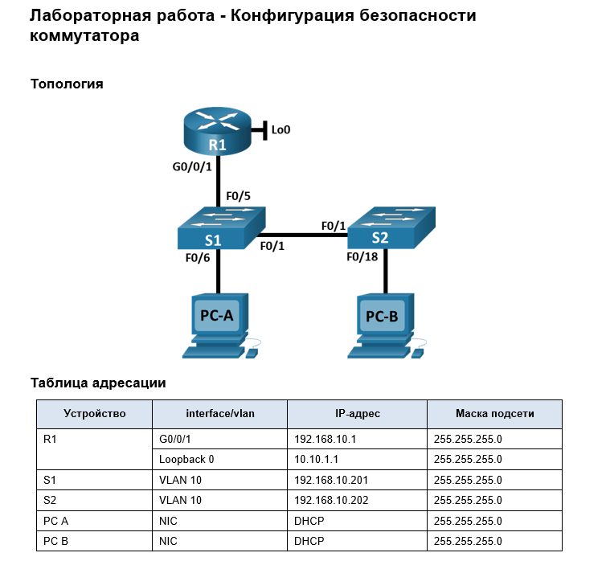
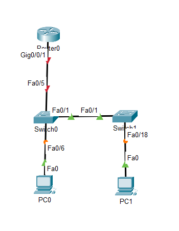
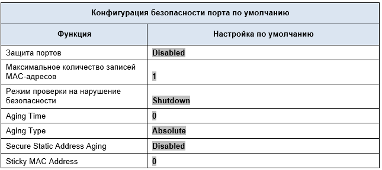
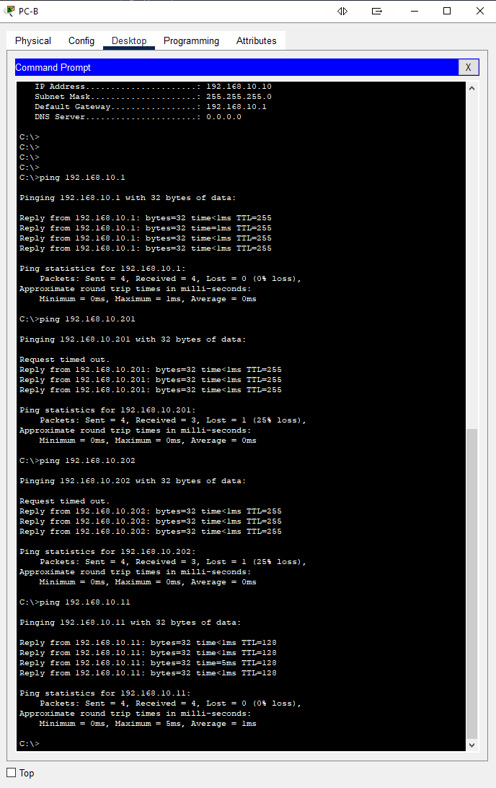

# Лабораторная работа - Конфигурация безопасности коммутатора 


# Цели
- Часть 1. Настройка основного сетевого устройства    
•	Создайте сеть.      
•	Настройте маршрутизатор R1.     
•	Настройка и проверка основных параметров коммутатора        
- Часть 2. Настройка сетей VLAN       
•	Сконфигруриуйте VLAN 10.        
•	Сконфигруриуйте SVI для VLAN 10.        
•	Настройте VLAN 333 с именем Native на S1 и S2.      
•	Настройте VLAN 999 с именем ParkingLot на S1 и S2.      
- Часть 3: Настройки безопасности коммутатора.        
•	Реализация магистральных соединений 802.1Q.     
•	Настройка портов доступа        
•	Безопасность неиспользуемых портов коммутатора      
•	Документирование и реализация функций безопасности порта.       
•	Реализовать безопасность DHCP snooping .        
•	Реализация PortFast и BPDU Guard        
•	Проверка сквозной связанности.      

# Часть 1. Настройка основного сетевого устройства
## Шаг 1. Создайте сеть.
### a.	Создайте сеть согласно топологии.

### b.	Инициализация устройств
```
Switch>en
Switch#dir fla
Switch#dir flash: 
Directory of flash:/

    1  -rw-     4670455          <no date>  2960-lanbasek9-mz.150-2.SE4.bin

64016384 bytes total (59345929 bytes free)
Switch#erase st
Switch#erase startup-config 
Erasing the nvram filesystem will remove all configuration files! Continue? [confirm]
[OK]
Erase of nvram: complete
%SYS-7-NV_BLOCK_INIT: Initialized the geometry of nvram
Switch#reload
```
Если есть файл vlan.dat - удаляем

## Шаг 2. Настройте маршрутизатор R1.
```
Router(config)#hostname R1
R1(config)#no ip domain lookup
R1(config)#ip dhcp excluded-address 192.168.10.1 192.168.10.9
R1(config)#ip dhcp excluded-address 192.168.10.201 192.168.10.202
R1(config)#!
R1(config)#ip dhcp pool Students
R1(dhcp-config)# network 192.168.10.0 255.255.255.0
R1(dhcp-config)# default-router 192.168.10.1
R1(dhcp-config)# domain-name CCNA2.Lab-11.6.1
R1(dhcp-config)#!
R1(dhcp-config)#interface Loopback0

R1(config-if)# ip address 10.10.1.1 255.255.255.0
R1(config-if)#!
R1(config-if)#interface GigabitEthernet0/0/1
R1(config-if)# description Link to S1
R1(config-if)# ip dhcp relay information trusted
                  ^
% Invalid input detected at '^' marker.
	
R1(config-if)# ip address 192.168.10.1 255.255.255.0
R1(config-if)# no shutdown

R1(config-if)#!
R1(config-if)#line con 0
R1(config-line)# logging synchronous
R1(config-line)# exec-timeout 0 0

```
Опять у CPT что то пошло не так с DHCP Relay 

## b.	Проверьте текущую конфигурацию на R1, используя следующую команду:
```
R1#sh ip int brief
Interface              IP-Address      OK? Method Status                Protocol 
GigabitEthernet0/0/0   unassigned      YES unset  administratively down down 
GigabitEthernet0/0/1   192.168.10.1    YES manual up                    up 
GigabitEthernet0/0/2   unassigned      YES unset  administratively down down 
Loopback0              10.10.1.1       YES manual up                    up 
Vlan1                  unassigned      YES unset  administratively down down
```
### c.	Убедитесь, что IP-адресация и интерфейсы находятся в состоянии up / up (при необходимости устраните неполадки).

## Шаг 3. Настройка и проверка основных параметров коммутатора
a.	Настройте имя хоста для коммутаторов S1 и S2.       
b.	Запретите нежелательный поиск в DNS.        
c.	Настройте описания интерфейса для портов, которые используются в S1 и S2.       
d.	Установите для шлюза по умолчанию для VLAN управления значение 192.168.10.1 на обоих коммутаторах.      

S1
```
Switch(config)#host S1
S1(config)#no ip domain-lookup 
S1(config)#int fa0/1
S1(config-if)#desc To_S2
S1(config-if)#int fa0/5
S1(config-if)#desc To_R1
S1(config-if)#int fa0/6
S1(config-if)#desc To_PC-A
S1(config-if)#ex
S1(config)#ip de
S1(config)#ip default-gateway 192.168.10.1
S1(config)#
```

S2
```
Switch(config)#int fa0/1
Switch(config-if)#desc To_S1
Switch(config-if)#int fa0/18
Switch(config-if)#desc To_PC-B
Switch(config-if)#ex
Switch(config)#ip def
Switch(config)#ip default-gateway 192.168.10.1
```

# Часть 2. Настройка сетей VLAN на коммутаторах.
## Шаг 1. Сконфигруриуйте VLAN 10.
Добавьте VLAN 10 на S1 и S2 и назовите VLAN - Management

S1
```
S1(config)#vlan 10
S1(config-vlan)#
%LINK-5-CHANGED: Interface Vlan10, changed state to up

S1(config-vlan)#name Management
```
Повторяем для S2
## Шаг 2. Сконфигруриуйте SVI для VLAN 10.
Настройте IP-адрес в соответствии с таблицей адресации для SVI для VLAN 10 на S1 и S2. Включите интерфейсы SVI и предоставьте описание для интерфейса.

S1
```
S1(config-vlan)#int vlan 10
S1(config-if)#ip add 192.168.10.201 255.255.255.0
S1(config-if)#desc Management
S1(config-if)#no sh
```
S2
```
S1(config-vlan)#int vlan 10
S1(config-if)#ip add 192.168.10.201 255.255.255.0
S1(config-if)#desc Management
S1(config-if)#no sh
```


## Шаг 3. Настройте VLAN 333 с именем Native на S1 и S2.
S1
```
S1(config)#vlan 333
S1(config-vlan)#name Native
```

S2
```
S2(config)#vlan 333
S2(config-vlan)#name Native
```

## Шаг 4. Настройте VLAN 999 с именем ParkingLot на S1 и S2.

S1
```
S1(config)#vlan 999
S1(config-vlan)#name ParkingLot
```
S2
```
S2(config-vlan)#vlan 999
S2(config-vlan)#name ParkingLot
```

# Часть 3. Настройки безопасности коммутатора.
## Шаг 1. Релизация магистральных соединений 802.1Q.
### a.	Настройте все магистральные порты Fa0/1 на обоих коммутаторах для использования VLAN 333 в качестве native VLAN.

S1
```
S1(config-vlan)#int fa0/1
S1(config-if)#sw m tr
S1(config-if)#
%LINEPROTO-5-UPDOWN: Line protocol on Interface FastEthernet0/1, changed state to down

%LINEPROTO-5-UPDOWN: Line protocol on Interface FastEthernet0/1, changed state to up

%LINEPROTO-5-UPDOWN: Line protocol on Interface Vlan10, changed state to up
S1(config-if)#sw tru native vlan 333
```
То же самое для S2

### b.	Убедитесь, что режим транкинга успешно настроен на всех коммутаторах.

S1
```
S1#sh in trunk
Port        Mode         Encapsulation  Status        Native vlan
Fa0/1       on           802.1q         trunking      333

Port        Vlans allowed on trunk
Fa0/1       1-1005

Port        Vlans allowed and active in management domain
Fa0/1       1,10,333,999

Port        Vlans in spanning tree forwarding state and not pruned
Fa0/1       1,10,333,999
```
S2 
```
S2#sh int trunk
Port        Mode         Encapsulation  Status        Native vlan
Fa0/1       on           802.1q         trunking      333

Port        Vlans allowed on trunk
Fa0/1       1-1005

Port        Vlans allowed and active in management domain
Fa0/1       1,10,333,999

Port        Vlans in spanning tree forwarding state and not pruned
Fa0/1       1,10,333,999

S2#
```
### c.	Отключить согласование DTP F0/1 на S1 и S2. 
S1
```
S1(config)#int fa0/1
S1(config-if)#sw nonegotiate 
```
Повторяем для S2

### d.	Проверьте с помощью команды show interfaces.
S1
```
S1#show interfaces f0/1 switchport | include Negotiation
Negotiation of Trunking: Off
S1#
```
S2
```
S2#show interfaces f0/1 switchport | include Negotiation
Negotiation of Trunking: Off
S2#
```

## Шаг 2. Настройка портов доступа
### a.	На S1 настройте F0/5 и F0/6 в качестве портов доступа и свяжите их с VLAN 10.
S1
```
S1(config)#int ra fa0/5-6
S1(config-if-range)#sw m ac
S1(config-if-range)#sw ac vlan 10
```
### b.	На S2 настройте порт доступа Fa0/18 и свяжите его с VLAN 10.
S2
```
S2(config)#int fa0/18
S2(config-if)#sw m ac
S2(config-if)#sw ac vlan 10
```

## Шаг 3. Безопасность неиспользуемых портов коммутатора
### a.	На S1 и S2 переместите неиспользуемые порты из VLAN 1 в VLAN 999 и отключите неиспользуемые порты.
S1
```
S1(config-if-range)#int ra fa0/2-4, fa0/7-24, g0/1-2
S1(config-if-range)#sw m ac
S1(config-if-range)#sw ac vlan 999
S1(config-if-range)#sh
```

S2
```
S2(config-if)#int ra fa0/2-17, fa0/19-24, g0/1-2
S2(config-if-range)#sw m ac
S2(config-if-range)#sw ac vlan 999
S2(config-if-range)#sh
```
### b.	Убедитесь, что неиспользуемые порты отключены и связаны с VLAN 999, введя команду  show
S1
```
S1#sh int st
Port      Name               Status       Vlan       Duplex  Speed Type
Fa0/1     To_S2              connected    trunk      auto    auto  10/100BaseTX
Fa0/2                        disabled 999        auto    auto  10/100BaseTX
Fa0/3                        disabled 999        auto    auto  10/100BaseTX
Fa0/4                        disabled 999        auto    auto  10/100BaseTX
Fa0/5     To_R1              connected    10         auto    auto  10/100BaseTX
Fa0/6     To_PC-A            connected    10         auto    auto  10/100BaseTX
Fa0/7                        disabled 999        auto    auto  10/100BaseTX
Fa0/8                        disabled 999        auto    auto  10/100BaseTX
Fa0/9                        disabled 999        auto    auto  10/100BaseTX
Fa0/10                       disabled 999        auto    auto  10/100BaseTX
Fa0/11                       disabled 999        auto    auto  10/100BaseTX
Fa0/12                       disabled 999        auto    auto  10/100BaseTX
Fa0/13                       disabled 999        auto    auto  10/100BaseTX
Fa0/14                       disabled 999        auto    auto  10/100BaseTX
Fa0/15                       disabled 999        auto    auto  10/100BaseTX
Fa0/16                       disabled 999        auto    auto  10/100BaseTX
Fa0/17                       disabled 999        auto    auto  10/100BaseTX
Fa0/18                       disabled 999        auto    auto  10/100BaseTX
Fa0/19                       disabled 999        auto    auto  10/100BaseTX
Fa0/20                       disabled 999        auto    auto  10/100BaseTX
Fa0/21                       disabled 999        auto    auto  10/100BaseTX
Fa0/22                       disabled 999        auto    auto  10/100BaseTX
Fa0/23                       disabled 999        auto    auto  10/100BaseTX
Fa0/24                       disabled 999        auto    auto  10/100BaseTX
Gig0/1                       disabled 999        auto    auto  10/100BaseTX
Gig0/2                       disabled 999        auto    auto  10/100BaseTX

S1#
```

S2
```
S2#sh int st
Port      Name               Status       Vlan       Duplex  Speed Type
Fa0/1     To_S1              connected    trunk      auto    auto  10/100BaseTX
Fa0/2                        disabled 999        auto    auto  10/100BaseTX
Fa0/3                        disabled 999        auto    auto  10/100BaseTX
Fa0/4                        disabled 999        auto    auto  10/100BaseTX
Fa0/5                        disabled 999        auto    auto  10/100BaseTX
Fa0/6                        disabled 999        auto    auto  10/100BaseTX
Fa0/7                        disabled 999        auto    auto  10/100BaseTX
Fa0/8                        disabled 999        auto    auto  10/100BaseTX
Fa0/9                        disabled 999        auto    auto  10/100BaseTX
Fa0/10                       disabled 999        auto    auto  10/100BaseTX
Fa0/11                       disabled 999        auto    auto  10/100BaseTX
Fa0/12                       disabled 999        auto    auto  10/100BaseTX
Fa0/13                       disabled 999        auto    auto  10/100BaseTX
Fa0/14                       disabled 999        auto    auto  10/100BaseTX
Fa0/15                       disabled 999        auto    auto  10/100BaseTX
Fa0/16                       disabled 999        auto    auto  10/100BaseTX
Fa0/17                       disabled 999        auto    auto  10/100BaseTX
Fa0/18    To_PC-B            connected    10         auto    auto  10/100BaseTX
Fa0/19                       disabled 999        auto    auto  10/100BaseTX
Fa0/20                       disabled 999        auto    auto  10/100BaseTX
Fa0/21                       disabled 999        auto    auto  10/100BaseTX
Fa0/22                       disabled 999        auto    auto  10/100BaseTX
Fa0/23                       disabled 999        auto    auto  10/100BaseTX
Fa0/24                       disabled 999        auto    auto  10/100BaseTX
Gig0/1                       disabled 999        auto    auto  10/100BaseTX
Gig0/2                       disabled 999        auto    auto  10/100BaseTX

```


## Шаг 4. Документирование и реализация функций безопасности порта.
### a.	На S1, введите команду show port-security interface f0/6  для отображения настроек по умолчанию безопасности порта для интерфейса F0/6. Запишите свои ответы ниже.
S1
```
S1#show port-security interface f0/6
Port Security              : Disabled
Port Status                : Secure-down
Violation Mode             : Shutdown
Aging Time                 : 0 mins
Aging Type                 : Absolute
SecureStatic Address Aging : Disabled
Maximum MAC Addresses      : 1
Total MAC Addresses        : 0
Configured MAC Addresses   : 0
Sticky MAC Addresses       : 0
Last Source Address:Vlan   : 0000.0000.0000:0
Security Violation Count   : 0
```


### b.	На S1 включите защиту порта на F0 / 6 со следующими настройками:
o	Максимальное количество записей MAC-адресов: 3      
o	Режим безопасности: restrict        
o	Aging time: 60 мин.     
o	Aging type: неактивный      

```
S1(config)#int fa0/6
S1(config-if)#switchport port-security
S1(config-if)#switchport port-security maximum 3
S1(config-if)#sw port-security violation restrict 
S1(config-if)#sw po aging time 60
S1(config-if)#sw po ag
S1(config-if)#sw po aging ty
S1(config-if)#sw po aging type
S1(config-if)#sw po aging typ
S1(config-if)#sw po aging ?
  time  Port-security aging time
```
С таймером у CPT тоже не получается

### c.	Verify port security on S1 F0/6.

```
S1#show port-security interface f0/6
Port Security              : Enabled
Port Status                : Secure-up
Violation Mode             : Restrict
Aging Time                 : 60 mins
Aging Type                 : Absolute
SecureStatic Address Aging : Disabled
Maximum MAC Addresses      : 3
Total MAC Addresses        : 0
Configured MAC Addresses   : 0
Sticky MAC Addresses       : 0
Last Source Address:Vlan   : 0000.0000.0000:0
Security Violation Count   : 0

S1#show port-security address
               Secure Mac Address Table
-----------------------------------------------------------------------------
Vlan    Mac Address       Type                          Ports   Remaining Age
                                                                   (mins)
----    -----------       ----                          -----   -------------
10	0001.C957.A5B3	DynamicConfigured	FastEthernet0/6		-
-----------------------------------------------------------------------------
Total Addresses in System (excluding one mac per port)     : 0
Max Addresses limit in System (excluding one mac per port) : 1024
```

### d.	Включите безопасность порта для F0 / 18 на S2. Настройте каждый активный порт доступа таким образом, чтобы он автоматически добавлял адреса МАС, изученные на этом порту, в текущую конфигурацию.
```
S2(config)#int fa0/18
S2(config-if)#sw por
S2(config-if)#sw port-security 
S2(config-if)#sw port-security mac-add
S2(config-if)#sw port-security mac-address sti
S2(config-if)#sw port-security mac-address sticky 
```
### e.	Настройте следующие параметры безопасности порта на S2 F / 18:
o	Максимальное количество записей MAC-адресов: 2      
o	Тип безопасности: Protect       
o	Aging time: 60 мин.     
```
S2(config-if)#sw port-security max 2
S2(config-if)#sw port-security violation protect 
S2(config-if)#sw port-security aging time 60
S2(config-if)#
```
### f.	Проверка функции безопасности портов на S2 F0/18.
```
S2#show port-security interface f0/18
Port Security              : Enabled
Port Status                : Secure-up
Violation Mode             : Protect
Aging Time                 : 60 mins
Aging Type                 : Absolute
SecureStatic Address Aging : Disabled
Maximum MAC Addresses      : 2
Total MAC Addresses        : 1
Configured MAC Addresses   : 0
Sticky MAC Addresses       : 1
Last Source Address:Vlan   : 000C.852C.BEE6:10
Security Violation Count   : 0


S2#show port-security address
               Secure Mac Address Table
-----------------------------------------------------------------------------
Vlan    Mac Address       Type                          Ports   Remaining Age
                                                                   (mins)
----    -----------       ----                          -----   -------------
  10    000C.852C.BEE6    SecureSticky                  Fa0/18       -
-----------------------------------------------------------------------------
Total Addresses in System (excluding one mac per port)     : 0
Max Addresses limit in System (excluding one mac per port) : 1024
```


## Шаг 5. Реализовать безопасность DHCP snooping.
### a.	На S2 включите DHCP snooping и настройте DHCP snooping во VLAN 10.

```
S2(config)#ip dhcp snooping
S2(config)#ip dhcp snooping vlan 10
```

### b.	Настройте магистральные порты на S2 как доверенные порты.
```
S2(config)#int fa0/1
S2(config-if)#ip dhcp snooping trust
```

### c.	Ограничьте ненадежный порт Fa0/18 на S2 пятью DHCP-пакетами в секунду.
```
S2(config-if)#int fa0/18
S2(config-if)#ip dhcp snooping limit rate 5
```


### d.	Проверка DHCP Snooping на S2.
```
S2#show ip dhcp snooping 
Switch DHCP snooping is enabled
DHCP snooping is configured on following VLANs:
10
Insertion of option 82 is enabled
Option 82 on untrusted port is not allowed
Verification of hwaddr field is enabled
Interface                  Trusted    Rate limit (pps)
-----------------------    -------    ----------------
FastEthernet0/18           no         5               
FastEthernet0/1            yes        unlimited 
```

### e.	В командной строке на PC-B освободите, а затем обновите IP-адрес
```
C:\>ipconfig /release

   IP Address......................: 0.0.0.0
   Subnet Mask.....................: 0.0.0.0
   Default Gateway.................: 0.0.0.0
   DNS Server......................: 0.0.0.0

C:\>ipconfig /renew
DHCP request failed. 
```
А почему? а потому что 82 опция DHCP?
```
S2(config)#no ip dhcp snooping information option 
```
и
```
C:\>ipconfig /release

   IP Address......................: 0.0.0.0
   Subnet Mask.....................: 0.0.0.0
   Default Gateway.................: 0.0.0.0
   DNS Server......................: 0.0.0.0

C:\>ipconfig /renew

   IP Address......................: 192.168.10.10
   Subnet Mask.....................: 255.255.255.0
   Default Gateway.................: 192.168.10.1
   DNS Server......................: 0.0.0.0

C:\>
```

### f.	Проверьте привязку отслеживания DHCP с помощью команды show ip dhcp snooping binding.
```
S2#sh ip dhcp snooping binding 
MacAddress          IpAddress        Lease(sec)  Type           VLAN  Interface
------------------  ---------------  ----------  -------------  ----  -----------------
00:0C:85:2C:BE:E6   192.168.10.10    0           dhcp-snooping  10    FastEthernet0/18
Total number of bindings: 1
```

## Шаг 6. Реализация PortFast и BPDU Guard
### a.	Настройте PortFast на всех портах доступа, которые используются на обоих коммутаторах.
S1
```
S1(config)#int ra fa0/5-6
S1(config-if-range)#spa
S1(config-if-range)#spanning-tree por
S1(config-if-range)#spanning-tree portfast 
%Warning: portfast should only be enabled on ports connected to a single
host. Connecting hubs, concentrators, switches, bridges, etc... to this
interface  when portfast is enabled, can cause temporary bridging loops.
Use with CAUTION

%Portfast has been configured on FastEthernet0/5 but will only
have effect when the interface is in a non-trunking mode.
%Warning: portfast should only be enabled on ports connected to a single
host. Connecting hubs, concentrators, switches, bridges, etc... to this
interface  when portfast is enabled, can cause temporary bridging loops.
Use with CAUTION

%Portfast has been configured on FastEthernet0/6 but will only
have effect when the interface is in a non-trunking mode.
S1(config-if-range)#
```

S2
```
S2(config)#int fa0/18
S2(config-if)#spanning-tree portfast 
%Warning: portfast should only be enabled on ports connected to a single
host. Connecting hubs, concentrators, switches, bridges, etc... to this
interface  when portfast is enabled, can cause temporary bridging loops.
Use with CAUTION

%Portfast has been configured on FastEthernet0/18 but will only
have effect when the interface is in a non-trunking mode.
S2(config-if)#
```
### b.	Включите защиту BPDU на портах доступа VLAN 10 S1 и S2, подключенных к PC-A и PC-B.
```
S1(config)#spanning-tree portfast bpduguard default 
S1(config)#
```
Для S2 аналогично

### c.	Убедитесь, что защита BPDU и PortFast включены на соответствующих портах.
S1
```
S1#sh spanning-tree int f0/6 detail 


Port 6 (FastEthernet0/6) of VLAN0010 is designated forwarding
  Port path cost 19, Port priority 128, Port Identifier 128.6
  Designated root has priority 32778, address 0090.0CA6.93C9
  Designated bridge has priority 32778, address 0090.0CA6.93C9
  Designated port id is 128.6, designated path cost 19
  Timers: message age 16, forward delay 0, hold 0
  Number of transitions to forwarding state: 1
  The port is in the portfast mode
  Link type is point-to-point by default


S1#sh spanning-tree int f0/5 detail 


Port 5 (FastEthernet0/5) of VLAN0010 is designated forwarding
  Port path cost 19, Port priority 128, Port Identifier 128.5
  Designated root has priority 32778, address 0090.0CA6.93C9
  Designated bridge has priority 32778, address 0090.0CA6.93C9
  Designated port id is 128.5, designated path cost 19
  Timers: message age 16, forward delay 0, hold 0
  Number of transitions to forwarding state: 1
  The port is in the portfast mode
  Link type is point-to-point by default
```

S2
```
S2#sh spanning-tree int fa0/18 detail 


Port 18 (FastEthernet0/18) of VLAN0010 is designated forwarding
  Port path cost 19, Port priority 128, Port Identifier 128.18
  Designated root has priority 32778, address 0090.0CA6.93C9
  Designated bridge has priority 32778, address 0090.2BD1.BAC2
  Designated port id is 128.18, designated path cost 19
  Timers: message age 16, forward delay 0, hold 0
  Number of transitions to forwarding state: 1
  The port is in the portfast mode
  Link type is point-to-point by default


S2#

```
## Шаг 7. Проверьте наличие сквозного подключения.
Проверьте PING свзяь между всеми устройствами в таблице IP-адресации. В случае сбоя проверки связи может потребоваться отключить брандмауэр на хостах.



# Вопросы для повторения

1.	С точки зрения безопасности порта на S2, почему нет значения таймера для оставшегося возраста в минутах, когда было сконфигурировано динамическое обучение - sticky?        
Изученные адреса записываются в NVRAM и при выключении и последующем включении адреса остаются в таблице, а не изучаются снова. Хотя на S1 F0/6 его тоже нет. Может быть CPT не показывает?

2.	Что касается безопасности порта на S2, если вы загружаете скрипт текущей конфигурации на S2, почему порту 18 на PC-B никогда не получит IP-адрес через DHCP?


3.	Что касается безопасности порта, в чем разница между типом абсолютного устаревания и типом устаревание по неактивности?     
- При аболютном устаревании адреса будут удаляться независимо, от их активности, по истечении указанного времени. При устаревании по таймеру неактивности, соответственно учитывается именно время неактивности.