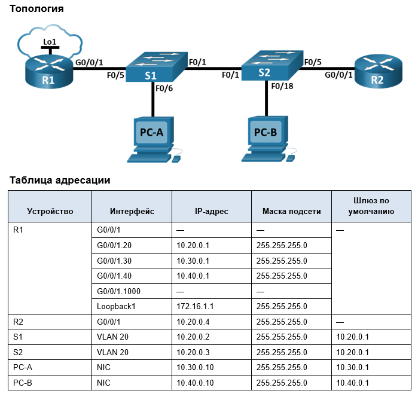
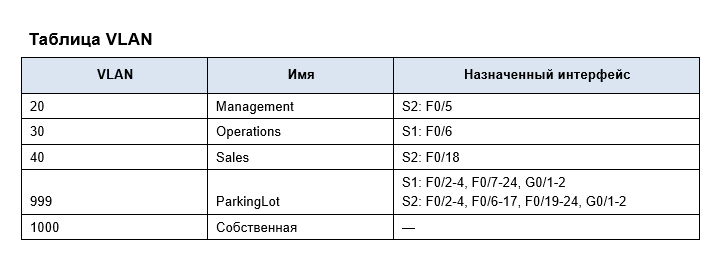
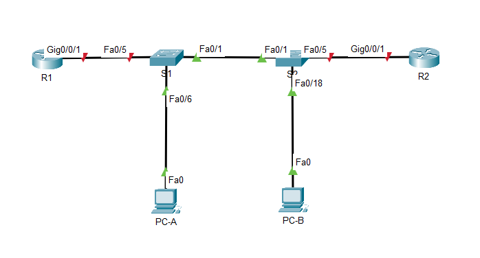
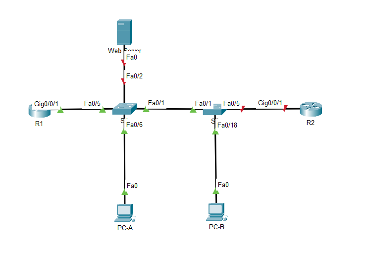
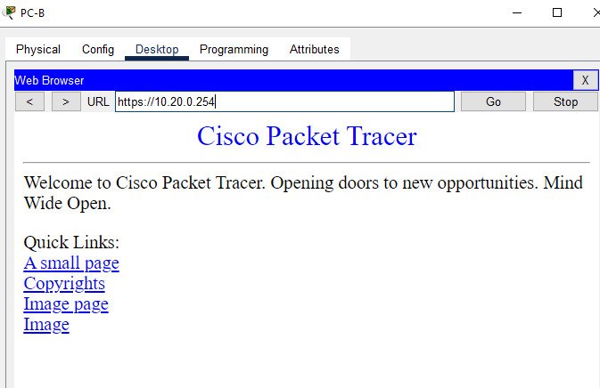

# Лабораторная работа. Настройка и проверка расширенных списков контроля доступа.



## Задачи
- Часть 1. Создание сети и настройка основных параметров устройства
- Часть 2. Настройка и проверка списков расширенного контроля доступа


# Часть 1. Создание сети и настройка основных параметров устройства
## Шаг 1. Создайте сеть согласно топологии.


## Шаг 2. Произведите базовую настройку маршрутизаторов.

a.	Назначьте маршрутизатору имя устройства.        
b.	Отключите поиск DNS, чтобы предотвратить попытки маршрутизатора неверно преобразовывать введенные команды таким образом, как будто они являются именами узлов.      
c.	Назначьте class в качестве зашифрованного пароля привилегированного режима EXEC.    
d.	Назначьте cisco в качестве пароля консоли и включите вход в систему по паролю.      
e.	Назначьте cisco в качестве пароля VTY и включите вход в систему по паролю.      
f.	Зашифруйте открытые пароли.     
g.	Создайте баннер с предупреждением о запрете несанкционированного доступа к устройству.      
h.	Сохраните текущую конфигурацию в файл загрузочной конфигурации.
R1
```
Router>en
Router#conf t
Enter configuration commands, one per line.  End with CNTL/Z.
Router(config)#host R1
R1(config)#no ip domain-lookup
R1(config)#banner motd # Unauthorized access is strictly prohibited.#
R1(config)#service password-encryption
R1(config)#enable secret class
R1(config)#line con 0
R1(config-line)#password cisco
R1(config-line)#login
R1(config-line)#line vty 0 15
R1(config-line)#password cisco
R1(config-line)#login
R1(config-line)#
R1(config-line)#
R1#
%SYS-5-CONFIG_I: Configured from console by console

R1#copy run st
Destination filename [startup-config]? 
Building configuration...
[OK]
R1#

```       
Аналогично для R2


## Шаг 3. Настройте базовые параметры каждого коммутатора.

a.	Присвойте коммутатору имя устройства.       
b.	Отключите поиск DNS, чтобы предотвратить попытки маршрутизатора неверно преобразовывать введенные команды таким образом, как будто они являются именами узлов.      
c.	Назначьте class в качестве зашифрованного пароля привилегированного режима EXEC.        
d.	Назначьте cisco в качестве пароля консоли и включите вход в систему по паролю.      
e.	Назначьте cisco в качестве пароля VTY и включите вход в систему по паролю.      
f.	Зашифруйте открытые пароли.     
g.	Создайте баннер с предупреждением о запрете несанкционированного доступа к устройству.      
h.	Сохраните текущую конфигурацию в файл загрузочной конфигурации.

S1
```
Switch>en
Switch#conf t
Enter configuration commands, one per line.  End with CNTL/Z.
Switch(config)#host S1
S1(config)#no ip domain-lookup
S1(config)#banner motd # Unauthorized access is strictly prohibited.#
S1(config)#service password-encryption
S1(config)#enable secret class
S1(config)#line con 0
S1(config-line)#password cisco
S1(config-line)#login
S1(config-line)#line vty 0 15
S1(config-line)#password cisco
S1(config-line)#login
S1(config-line)#
S1#
%SYS-5-CONFIG_I: Configured from console by console
copy run st
Destination filename [startup-config]? 
Building configuration...
[OK]
S1#
```
Аналогично для S2
# Часть 2. Настройка сетей VLAN на коммутаторах.
## Шаг 1. Создайте сети VLAN на коммутаторах.

a.	Создайте необходимые VLAN и назовите их на каждом коммутаторе из приведенной выше таблицы.      
b.	Настройте интерфейс управления и шлюз по умолчанию на каждом коммутаторе, используя информацию об IP-адресе в таблице адресации.        
c.	Назначьте все неиспользуемые порты коммутатора VLAN Parking Lot, настройте их для статического режима доступа и административно деактивируйте их.       

S1
```
S1(config)#
S1(config)#vlan 20
S1(config-vlan)#name Management
S1(config-vlan)#vlan 30
S1(config-vlan)#name Operations
S1(config-vlan)#vlan 40
S1(config-vlan)#name Sales
S1(config-vlan)#vlan 999
S1(config-vlan)#name ParkingLot
S1(config-vlan)#vlan 1000
S1(config-vlan)#name Native
S1(config-vlan)#int vlan 20
S1(config-if)#
%LINK-5-CHANGED: Interface Vlan20, changed state to up
ip add 10.20.0.2 255.255.255.0
S1(config-if)#no sh
S1(config-if)#ex
S1(config)#ip def
S1(config)#ip default-gateway 10.20.0.1
S1(config)#
S1(config)#
S1(config)#int ra f0/2-4, f0/7-24, G0/1-2
S1(config-if-range)#sw m a
S1(config-if-range)#sw acc vlan 999
S1(config-if-range)#sh

```


S2

```
S2(config)#
S2(config)#vlan 20
S2(config-vlan)#name Management
S2(config-vlan)#vlan 30
S2(config-vlan)#name Operations
S2(config-vlan)#vlan 40
S2(config-vlan)#name Sales
S2(config-vlan)#vlan 999
S2(config-vlan)#name ParkingLot
S2(config-vlan)#vlan 1000
S2(config-vlan)#name Native
S2(config-vlan)#int vlan 20
S2(config-if)#
%LINK-5-CHANGED: Interface Vlan20, changed state to up
ip add 10.20.0.3 255.255.255.0
S2(config-if)#no sh
S2(config-if)#ex
S2(config)#ip def
S2(config)#ip default-gateway 10.20.0.1
S2(config)#int ra f0/2-17, f0/19-24, G0/1-2
S2(config-if-range)#sw m acc
S2(config-if-range)#sw ac vlan 999
S2(config-if-range)#sh

```

## Шаг 2. Назначьте сети VLAN соответствующим интерфейсам коммутатора.
a.	Назначьте используемые порты соответствующей VLAN (указанной в таблице VLAN выше) и настройте их для режима статического доступа.       
b.	Выполните команду show vlan brief, чтобы убедиться, что сети VLAN назначены правильным интерфейсам.     
S1
```
S1(config-if-range)#int f0/6
S1(config-if)#sw m a
S1(config-if)#sw acc vlan 30
S1(config-if)#do sh vlan brief

VLAN Name                             Status    Ports
---- -------------------------------- --------- -------------------------------
1    default                          active    Fa0/1, Fa0/5
20   Management                       active    
30   Operations                       active    Fa0/6
40   Sales                            active    
999  ParkingLot                       active    Fa0/2, Fa0/3, Fa0/4, Fa0/7
                                                Fa0/8, Fa0/9, Fa0/10, Fa0/11
                                                Fa0/12, Fa0/13, Fa0/14, Fa0/15
                                                Fa0/16, Fa0/17, Fa0/18, Fa0/19
                                                Fa0/20, Fa0/21, Fa0/22, Fa0/23
                                                Fa0/24, Gig0/1, Gig0/2
1000 Native                           active    
1002 fddi-default                     active    
1003 token-ring-default               active    
1004 fddinet-default                  active    
1005 trnet-default                    active    
S1(config-if)#

```
S2
```
S2(config-if-range)#int f0/18
S2(config-if)#sw m a
S2(config-if)#sw acc vlan 40
S2(config-if)#do sh vlan brief

VLAN Name                             Status    Ports
---- -------------------------------- --------- -------------------------------
1    default                          active    Fa0/1
20   Management                       active    
30   Operations                       active    
40   Sales                            active    Fa0/18
999  ParkingLot                       active    Fa0/2, Fa0/3, Fa0/4, Fa0/5
                                                Fa0/6, Fa0/7, Fa0/8, Fa0/9
                                                Fa0/10, Fa0/11, Fa0/12, Fa0/13
                                                Fa0/14, Fa0/15, Fa0/16, Fa0/17
                                                Fa0/19, Fa0/20, Fa0/21, Fa0/22
                                                Fa0/23, Fa0/24, Gig0/1, Gig0/2
1000 Native                           active    
1002 fddi-default                     active    
1003 token-ring-default               active    
1004 fddinet-default                  active    
1005 trnet-default                    active    
S2(config-if)#
```
# Часть 3. ·Настройте транки (магистральные каналы).
## Шаг 1. Вручную настройте магистральный интерфейс F0/1.

a.	Измените режим порта коммутатора на интерфейсе F0/1, чтобы принудительно создать магистральную связь. Не забудьте сделать это на обоих коммутаторах.        
b.	В рамках конфигурации транка установите для native vlan значение 1000 на обоих коммутаторах. При настройке двух интерфейсов для разных собственных VLAN сообщения об ошибках могут отображаться временно.       
c.	В качестве другой части конфигурации транка укажите, что VLAN 10, 20, 30 и 1000 разрешены в транке.     
d.	Выполните команду show interfaces trunk для проверки портов магистрали, собственной VLAN и разрешенных VLAN через магистраль.


- Вероятно, опечатка в задании, согласно таблице vlan у нас нет vlan 10.

S1
```
S1(config-if)#int f0/1
S1(config-if)#sw m tr

S1(config-if)#
%LINEPROTO-5-UPDOWN: Line protocol on Interface FastEthernet0/1, changed state to down

%LINEPROTO-5-UPDOWN: Line protocol on Interface FastEthernet0/1, changed state to up

%LINEPROTO-5-UPDOWN: Line protocol on Interface Vlan20, changed state to up

S1(config-if)#sw tr nat
S1(config-if)#sw tr native vlan 1000
S1(config-if)#sw tr all vlan 20,30,40,1000
S1(config-if)#do sh int trunk
Port        Mode         Encapsulation  Status        Native vlan
Fa0/1       on           802.1q         trunking      1000

Port        Vlans allowed on trunk
Fa0/1       20,30,40,1000

Port        Vlans allowed and active in management domain
Fa0/1       20,30,40,1000

Port        Vlans in spanning tree forwarding state and not pruned
Fa0/1       20,30,40,1000

S1(config-if)#
```

S2
```
S2(config-if)#int f0/1
S2(config-if)#sw m tr
S2(config-if)#sw tr nat
S2(config-if)#sw tr native vlan 1000
S2(config-if)#%SPANTREE-2-UNBLOCK_CONSIST_PORT: Unblocking FastEthernet0/1 on VLAN1000. Port consistency restored.

%SPANTREE-2-UNBLOCK_CONSIST_PORT: Unblocking FastEthernet0/1 on VLAN0001. Port consistency restored.

sw tr all
S2(config-if)#sw tr allowed vlan 20,30,40,1000
S2(config-if)#
S2(config-if)#do sh int trunk
Port        Mode         Encapsulation  Status        Native vlan
Fa0/1       on           802.1q         trunking      1000

Port        Vlans allowed on trunk
Fa0/1       20,30,40,1000

Port        Vlans allowed and active in management domain
Fa0/1       20,30,40,1000

Port        Vlans in spanning tree forwarding state and not pruned
Fa0/1       none

S2(config-if)#
S2(config-if)#
```


## Шаг 2. Вручную настройте магистральный интерфейс F0/5 на коммутаторе S1.
a.	Настройте интерфейс S1 F0/5 с теми же параметрами транка, что и F0/1. Это транк до маршрутизатора.      
b.	Сохраните текущую конфигурацию в файл загрузочной конфигурации.     
c.	Используйте команду show interfaces trunk для проверки настроек транка.     

```
S1(config-if)#int f0/5
S1(config-if)#sw m tr
S1(config-if)#sw tr nat
S1(config-if)#sw tr native vlan 1000
S1(config-if)#sw tr all vlan 20,30,40,1000
S1(config-if)#do copy run st
Destination filename [startup-config]? 
Building configuration...
[OK]
S1(config-if)#do sh int trunk
Port        Mode         Encapsulation  Status        Native vlan
Fa0/1       on           802.1q         trunking      1000

Port        Vlans allowed on trunk
Fa0/1       10,20,30,1000

Port        Vlans allowed and active in management domain
Fa0/1       20,30,1000

Port        Vlans in spanning tree forwarding state and not pruned
Fa0/1       20,30,1000

S1(config-if)#
```
f0/5 не отображается, так как порт G0/0/1 на R1 в состоянии down

# Часть 4. Настройте маршрутизацию.
## Шаг 1. Настройка маршрутизации между сетями VLAN на R1.

a.	Активируйте интерфейс G0/0/1 на маршрутизаторе. 

b.	Настройте подинтерфейсы для каждой VLAN, как указано в таблице IP-адресации. Все подинтерфейсы используют инкапсуляцию 802.1Q. Убедитесь, что подинтерфейс для собственной VLAN не имеет назначенного IP-адреса. Включите описание для каждого подинтерфейса.       
c.	Настройте интерфейс Loopback 1 на R1 с адресацией из приведенной выше таблицы.      
d.	С помощью команды show ip interface brief проверьте конфигурацию подынтерфейса.     
```
R1(config)#int G0/0/1
R1(config-if)#no sh

R1(config-if)#
%LINK-5-CHANGED: Interface GigabitEthernet0/0/1, changed state to up

%LINEPROTO-5-UPDOWN: Line protocol on Interface GigabitEthernet0/0/1, changed state to up

R1(config-if)#int g0/0/1.20
R1(config-subif)#
%LINK-5-CHANGED: Interface GigabitEthernet0/0/1.20, changed state to up

%LINEPROTO-5-UPDOWN: Line protocol on Interface GigabitEthernet0/0/1.20, changed state to up

R1(config-subif)#description Management
R1(config-subif)#enc dot 20
R1(config-subif)#ip add 10.20.0.1 255.255.255.0
R1(config-subif)#int g0/0/1.30
R1(config-subif)#
%LINK-5-CHANGED: Interface GigabitEthernet0/0/1.30, changed state to up

%LINEPROTO-5-UPDOWN: Line protocol on Interface GigabitEthernet0/0/1.30, changed state to up

R1(config-subif)#desc Operations
R1(config-subif)#enc dot 30
R1(config-subif)#ip add 10.30.0.1 255.255.255.0
R1(config-subif)#int g0/0/1.40
R1(config-subif)#
%LINK-5-CHANGED: Interface GigabitEthernet0/0/1.40, changed state to up

%LINEPROTO-5-UPDOWN: Line protocol on Interface GigabitEthernet0/0/1.40, changed state to up

R1(config-subif)#desc Sales
R1(config-subif)#enc dot 40
R1(config-subif)#ip add 10.40.0.1 255.255.255.0
R1(config-subif)#int g0/0/1.1000
R1(config-subif)#
%LINK-5-CHANGED: Interface GigabitEthernet0/0/1.1000, changed state to up

%LINEPROTO-5-UPDOWN: Line protocol on Interface GigabitEthernet0/0/1.1000, changed state to up

R1(config-subif)#enc don 1000 nat
R1(config-subif)#enc
R1(config-subif)#encapsulation dot 1000 nat
R1(config-subif)#encapsulation dot 1000 native 
R1(config-subif)#desc Native
R1(config-subif)#
R1(config-subif)#
R1(config-subif)#int Lo1

R1(config-if)#
%LINK-5-CHANGED: Interface Loopback1, changed state to up

%LINEPROTO-5-UPDOWN: Line protocol on Interface Loopback1, changed state to up

R1(config-if)#ip add 172.16.1.1 255.255.255.0
R1(config-if)#do sh ip int brief
Interface              IP-Address      OK? Method Status                Protocol 
GigabitEthernet0/0/0   unassigned      YES unset  administratively down down 
GigabitEthernet0/0/1   unassigned      YES unset  up                    up 
GigabitEthernet0/0/1.2010.20.0.1       YES manual up                    up 
GigabitEthernet0/0/1.3010.30.0.1       YES manual up                    up 
GigabitEthernet0/0/1.4010.40.0.1       YES manual up                    up 
GigabitEthernet0/0/1.1000unassigned      YES unset  up                    up 
GigabitEthernet0/0/2   unassigned      YES unset  administratively down down 
Loopback1              172.16.1.1      YES manual up                    up 
Vlan1                  unassigned      YES unset  administratively down down
R1(config-if)#
```

## Шаг 2. Настройка интерфейса R2 g0/0/1 с использованием адреса из таблицы и маршрута по умолчанию с адресом следующего перехода 10.20.0.1

```
R2(config)#int G0/0/1
R2(config-if)#ip add 10.20.0.4 255.255.255.0
R2(config-if)#no sh

R2(config-if)#
%LINK-5-CHANGED: Interface GigabitEthernet0/0/1, changed state to up
c
R2#	
R2#conf t
Enter configuration commands, one per line.  End with CNTL/Z.
R2(config)#ip route 0.0.0.0 0.0.0.0 10.20.0.1
R2(config)#
```
# Часть 5. Настройте удаленный доступ
## Шаг 1. Настройте все сетевые устройства для базовой поддержки SSH.

a.	Создайте локального пользователя с именем пользователя SSHadmin и зашифрованным паролем $cisco123!      
b.	Используйте ccna-lab.com в качестве доменного имени.        
c.	Генерируйте криптоключи с помощью 1024 битного модуля.      
d.	Настройте первые пять линий VTY на каждом устройстве, чтобы поддерживать только SSH-соединения и с локальной аутентификацией.      
S1 
```
S1#conf t
Enter configuration commands, one per line.  End with CNTL/Z.
S1(config)#username SSHadmin secret $cisco123!
S1(config)#ip domain name ccna-lab.com
S1(config)#crypto key generate rsa general-keys modulus 1024
The name for the keys will be: S1.ccna-lab.com

% The key modulus size is 1024 bits
% Generating 1024 bit RSA keys, keys will be non-exportable...[OK]
*Mar 1 0:0:17.462: %SSH-5-ENABLED: SSH 1.99 has been enabled
S1(config)#line vty 0 4
S1(config-line)#transport input ssh
S1(config-line)#login local
S1(config-line)#
```
Повторяем для S2, R1 и R2

# Шаг 2. Включите защищенные веб-службы с проверкой подлинности на R1.
a.	Включите сервер HTTPS на R1.
R1(config)# ip http secure-server     

```
R1(config)#ip http secure-server
               ^
% Invalid input detected at '^' marker.
	
```

CPT снова против, поэтому добавим сервер с ролью Web в схему


Дадим ему IP 10.20.0.254 в 20 vlan

# Часть 6. Проверка подключения
## Шаг 1. Настройте узлы ПК.
Адреса ПК можно посмотреть в таблице адресации.
## Шаг 2. Выполните следующие тесты. Эхозапрос должен пройти успешно.
Примечание. Возможно, вам придется отключить брандмауэр ПК для работы ping
От	Протокол	Назначение
- PC-A	Ping	10.40.0.10
```
C:\>ping 10.40.0.10

Pinging 10.40.0.10 with 32 bytes of data:

Reply from 10.40.0.10: bytes=32 time<1ms TTL=127
Reply from 10.40.0.10: bytes=32 time=10ms TTL=127
Reply from 10.40.0.10: bytes=32 time<1ms TTL=127
Reply from 10.40.0.10: bytes=32 time<1ms TTL=127
```
- PC-A	Ping	10.20.0.1
```
C:\>ping 10.20.0.1

Pinging 10.20.0.1 with 32 bytes of data:

Reply from 10.20.0.1: bytes=32 time=13ms TTL=255
Reply from 10.20.0.1: bytes=32 time<1ms TTL=255
Reply from 10.20.0.1: bytes=32 time<1ms TTL=255
Reply from 10.20.0.1: bytes=32 time<1ms TTL=255
```
- PC-B	Ping	10.30.0.10
```
C:\>ping 10.30.0.10

Pinging 10.30.0.10 with 32 bytes of data:

Reply from 10.30.0.10: bytes=32 time<1ms TTL=127
Reply from 10.30.0.10: bytes=32 time<1ms TTL=127
Reply from 10.30.0.10: bytes=32 time<1ms TTL=127
Reply from 10.30.0.10: bytes=32 time<1ms TTL=127
```

- PC-B	Ping	10.20.0.1
```
C:\>ping 10.20.0.1

Pinging 10.20.0.1 with 32 bytes of data:

Reply from 10.20.0.1: bytes=32 time<1ms TTL=255
Reply from 10.20.0.1: bytes=32 time<1ms TTL=255
Reply from 10.20.0.1: bytes=32 time<1ms TTL=255

```
- PC-B	Ping	172.16.1.1
```
C:\>ping 172.16.1.1

Pinging 172.16.1.1 with 32 bytes of data:

Reply from 172.16.1.1: bytes=32 time<1ms TTL=255
Reply from 172.16.1.1: bytes=32 time<1ms TTL=255
Reply from 172.16.1.1: bytes=32 time<1ms TTL=255
```

- PC-B	HTTPS	10.20.0.1
У нас поднята служба на сервере 10.20.0.254

```
C:\>ping 10.20.0.254

Pinging 10.20.0.254 with 32 bytes of data:

Reply from 10.20.0.254: bytes=32 time<1ms TTL=127
Reply from 10.20.0.254: bytes=32 time<1ms TTL=127
Reply from 10.20.0.254: bytes=32 time<1ms TTL=127
Reply from 10.20.0.254: bytes=32 time<1ms TTL=127


```


- PC-B	HTTPS	172.16.1.1 

Лупбэк пингуется, будем считать, что тест пройден

- PC-B	SSH	10.20.0.1
```
C:\>ssh -l admin 10.20.0.1

Password: 
```

- PC-B	SSH	172.16.1.1
```
C:\>ssh -l admin 172.16.1.1

Password: 
```
# Часть 7. Настройка и проверка списков контроля доступа (ACL)
При проверке базового подключения компания требует реализации следующих политик безопасности:       
- Политика 1. Сеть Sales не может использовать SSH в сети Management (но в  другие сети SSH разрешен).         
- Политика 2. Сеть Sales не имеет доступа к IP-адресам в сети Management с помощью любого веб-протокола (HTTP/HTTPS). 
Сеть Sales также не имеет доступа к интерфейсам R1 с помощью любого веб-протокола. Разрешён весь другой веб-трафик (обратите внимание — Сеть Sales  может получить доступ к интерфейсу Loopback 1 на R1).       
- Политика 3. Сеть Sales не может отправлять эхо-запросы ICMP в сети Operations или Management. Разрешены эхо-запросы ICMP к другим адресатам.         
- Политика 4: Cеть Operations  не может отправлять ICMP эхозапросы в сеть Sales. Разрешены эхо-запросы ICMP к другим адресатам.       
## Шаг 1. Проанализируйте требования к сети и политике безопасности для планирования реализации ACL.
 Подходов может быть множество : можно делать ACL на сабинтерфейсы на R1, можно вешать их на интерфейсы vlan. Пойдем по пути ACL на сабинтерфейсах R1 с фильтрацией на входе. Всего придется сделать 2 листа - один для Sales и один для Operations.
## Шаг 2. Разработка и применение расширенных списков доступа, которые будут соответствовать требованиям политики безопасности.
Sales
Ограничиваем доступы по SSH и HTTP/HTTPS из сети Sales в Management
```
R1(config)#ip access-list ext SALES
R1(config-ext-nacl)#deny tcp 10.40.0.0 0.0.0.255 10.20.0.0 0.0.0.255 eq 22
R1(config-ext-nacl)#deny tcp 10.40.0.0 0.0.0.255 10.20.0.0 0.0.0.255 eq 80
R1(config-ext-nacl)#deny tcp 10.40.0.0 0.0.0.255 10.20.0.0 0.0.0.255 eq 443
```
Так как у нас нет возможности поднять web сервер на R1, а нам надо ограничить доступ по вэб ко всем интерфейсам, для примера поднимем еще один сервер в другом vlan

```
R1(config-ext-nacl)#deny tcp 10.40.0.0 0.0.0.255 host 10.30.0.254 eq www
R1(config-ext-nacl)#deny tcp 10.40.0.0 0.0.0.255 host 10.30.0.254 eq 443
```
далее запрещаем пинги и не забываем разрешающее правило
```
R1(config-ext-nacl)#deny tcp 10.40.0.0 0.0.0.255 10.30.0.254 0.0.0.255 eq 80
R1(config-ext-nacl)#deny tcp 10.40.0.0 0.0.0.255 10.30.0.254 0.0.0.255 eq 443
R1(config-ext-nacl)#deny icmp 10.40.0.0 0.0.0.255 10.20.0.0 0.0.0.255 echo
R1(config-ext-nacl)#deny icmp 10.40.0.0 0.0.0.255 10.30.0.0 0.0.0.255 echo
R1(config-ext-nacl)#permit any any
                            ^
% Invalid input detected at '^' marker.
	
R1(config-ext-nacl)#permit ip any any
```
Вешаем на сабинтерфейс
```
R1(config)#int g0/0/1.40
R1(config-subif)#ip a
R1(config-subif)#ip access
R1(config-subif)#ip access-group SALES in
```


Opearations
```
R1(config)#ip access-list ext OPER
R1(config-ext-nacl)#deny icmp 10.30.0.0 0.0.0.255 10.40.0.0 0.0.0.255 echo
R1(config-ext-nacl)#permit ip any any
R1(config-ext-nacl)#ex
R1(config)#int g0/0/1.30
R1(config-subif)#ip access-group OPER in

```

## Шаг 3. Убедитесь, что политики безопасности применяются развернутыми списками доступа.
Выполните следующие тесты. Ожидаемые результаты показаны в таблице:
От	Протокол	Назначение	Результат
PC-A	Ping	10.40.0.10	Сбой
PC-A	Ping	10.20.0.1	Успех
PC-B	Ping	10.30.0.10	Сбой
PC-B	Ping	10.20.0.1	Сбой
PC-B	Ping	172.16.1.1	Успех
PC-B	HTTPS	10.20.0.1	Сбой
PC-B	HTTPS	172.16.1.1	Успех
PC-B	SSH	10.20.0.4	Сбой
PC-B	SSH	172.16.1.1	Успех


В целом все работает с поправкой на изменения в работе.

PS. Отдельная благодарность Евгению за проведение практической работы =)

