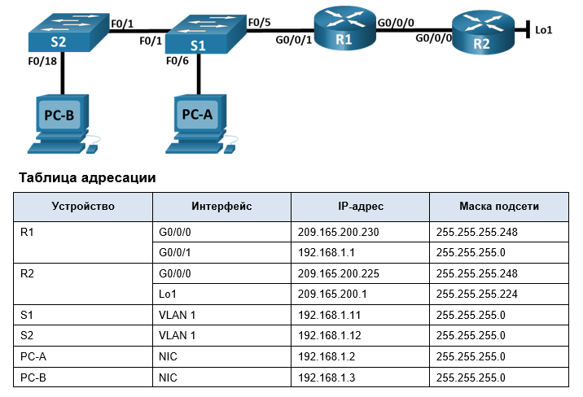
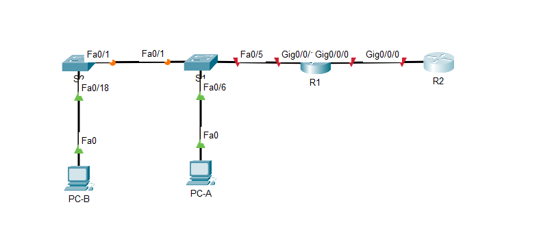

# Лабораторная работа - Настройка NAT для IPv4
## Топология



# Часть 1. Создание сети и настройка основных параметров устройства

## Шаг 1. Подключите кабели сети согласно приведенной топологии.

## Шаг 2. Произведите базовую настройку маршрутизаторов.

- a.	Назначьте маршрутизатору имя устройства.
- b.	Отключите поиск DNS, чтобы предотвратить попытки маршрутизатора неверно преобразовывать введенные команды таким образом, как будто они являются именами узлов.
- c.	Назначьте class в качестве зашифрованного пароля привилегированного режима EXEC.
- d.	Назначьте cisco в качестве пароля консоли и включите вход в систему по паролю.
- e.	Назначьте cisco в качестве пароля VTY и включите вход в систему по паролю.
- f.	Зашифруйте открытые пароли.
- g.	Создайте баннер с предупреждением о запрете несанкционированного доступа к устройству.
- h.	Настройте IP-адресации интерфейса, как указано в таблице выше.
- i.	Настройте маршрут по умолчанию. от R2 до  R1.
- j.	Сохраните текущую конфигурацию в файл загрузочной конфигурации.


R1
```
Router>en
Router#conf t
Enter configuration commands, one per line.  End with CNTL/Z.
Router(config)#host R1
R1(config)#no ip domain-lookup
R1(config)#enable secret class
R1(config)#banner motd # Unauthorized access is strictly prohibited.#
R1(config)#service password-encryption
R1(config)#line con 0
R1(config-line)#password cisco
R1(config-line)#login
R1(config-line)#line vty 0 15
R1(config-line)#password cisco
R1(config-line)#login
R1(config-line)#ex
% Ambiguous command: "ex"
R1(config-line)#int g0/0/0
R1(config-if)#ip add 209.165.200.230 255.255.255.248
R1(config-if)#no sh

R1(config-if)#
%LINK-5-CHANGED: Interface GigabitEthernet0/0/0, changed state to up

R1(config-if)#int g0/0/1
R1(config-if)#ip add 192.168.1.1 255.255.255.0
R1(config-if)#no sh

R1(config-if)#
%LINK-5-CHANGED: Interface GigabitEthernet0/0/1, changed state to up

%LINEPROTO-5-UPDOWN: Line protocol on Interface GigabitEthernet0/0/1, changed state to up

R1(config-if)#ex
R1(config)#ip route 0.0.0.0 0.0.0.0 209.165.200.225
R1(config)#do copy run st
Destination filename [startup-config]? 
Building configuration...
[OK]
R1(config)#
```

R2
```
Router>en
Router#conf t
Enter configuration commands, one per line.  End with CNTL/Z.
Router(config)#host R2
R2(config)#no ip domain-lookup
R2(config)#enable secret class
R2(config)#banner motd # Unauthorized access is strictly prohibited.#
R2(config)#service password-encryption
R2(config)#line con 0
R2(config-line)#password cisco
R2(config-line)#login
R2(config-line)#line vty 0 15
R2(config-line)#password cisco
R2(config-line)#login
R2(config-line)#int g0/0/0
R2(config-if)#ip add 209.165.200.225 255.255.255.248
R2(config-if)#no sh

R2(config-if)#
%LINK-5-CHANGED: Interface GigabitEthernet0/0/0, changed state to up

%LINEPROTO-5-UPDOWN: Line protocol on Interface GigabitEthernet0/0/0, changed state to up
int Lo1

R2(config-if)#
%LINK-5-CHANGED: Interface Loopback1, changed state to up

%LINEPROTO-5-UPDOWN: Line protocol on Interface Loopback1, changed state to up

R2(config-if)#ip add 209.165.200.1 255.255.255.224
R2(config-if)# do copy run st
Destination filename [startup-config]? 
Building configuration...
[OK]
R2(config-if)#
```
## Шаг 3. Настройте базовые параметры каждого коммутатора.

- a.	Присвойте коммутатору имя устройства.
- b.	Отключите поиск DNS, чтобы предотвратить попытки маршрутизатора неверно преобразовывать введенные команды таким образом, как будто они являются именами узлов.
- c.	Назначьте class в качестве зашифрованного пароля привилегированного режима EXEC.
- d.	Назначьте cisco в качестве пароля консоли и включите вход в систему по паролю.
- e.	Назначьте cisco в качестве пароля VTY и включите вход в систему по паролю.
- f.	Зашифруйте открытые пароли.
- g.	Создайте баннер с предупреждением о запрете несанкционированного доступа к устройству.
- h.	Выключите все интерфейсы, которые не будут использоваться.
- i.	Настройте IP-адресации интерфейса, как указано в таблице выше.
- j.	Сохраните текущую конфигурацию в файл загрузочной конфигурации.


S1
```
Switch>en
Switch#conf t
Enter configuration commands, one per line.  End with CNTL/Z.
Switch(config)#host S1
S1(config)#no ip domain-lookup
S1(config)#enable secret class
S1(config)#banner motd # Unauthorized access is strictly prohibited.#
S1(config)#service password-encryption
S1(config)#line con 0
S1(config-line)#password cisco
S1(config-line)#login
S1(config-line)#line vty 0 15
S1(config-line)#password cisco
S1(config-line)#login
S1(config-line)#int ra f0/2-4, f0/7-24, g0/1-2
S1(config-if-range)#sh

%LINK-5-CHANGED: Interface FastEthernet0/2, changed state to administratively down

%LINK-5-CHANGED: Interface FastEthernet0/3, changed state to administratively down


//////


%LINK-5-CHANGED: Interface GigabitEthernet0/1, changed state to administratively down

%LINK-5-CHANGED: Interface GigabitEthernet0/2, changed state to administratively down
S1(config-if-range)#int vlan 1
S1(config-if)#ip add 192.168.1.11 255.255.255.0
S1(config-if)#no sh

S1(config-if)#
%LINK-5-CHANGED: Interface Vlan1, changed state to up

%LINEPROTO-5-UPDOWN: Line protocol on Interface Vlan1, changed state to up

S1(config-if)#do copy run st
Destination filename [startup-config]? 
Building configuration...
[OK]
S1(config-if)#
```

S2
```
Switch>en
Switch#conf t
Enter configuration commands, one per line.  End with CNTL/Z.
Switch(config)#host S2
S2(config)#no ip domain-lookup
S2(config)#enable secret class
S2(config)#banner motd # Unauthorized access is strictly prohibited.#
S2(config)#service password-encryption
S2(config)#line con 0
S2(config-line)#password cisco
S2(config-line)#login
S2(config-line)#line vty 0 15
S2(config-line)#password cisco
S2(config-line)#login
S2(config-line)#int ra f0/2-17, f0/19-24, g0/1-2
S2(config-if-range)#sh

%LINK-5-CHANGED: Interface FastEthernet0/2, changed state to administratively down

%LINK-5-CHANGED: Interface FastEthernet0/3, changed state to administratively down

\\\\\\\\\

%LINK-5-CHANGED: Interface GigabitEthernet0/1, changed state to administratively down

%LINK-5-CHANGED: Interface GigabitEthernet0/2, changed state to administratively down
S2(config-if-range)#int vlan 1
S2(config-if)#ip add 192.168.1.12 255.255.255.0
S2(config-if)#no sh

S2(config-if)#
%LINK-5-CHANGED: Interface Vlan1, changed state to up

%LINEPROTO-5-UPDOWN: Line protocol on Interface Vlan1, changed state to up

S2(config-if)#do copy run st
Destination filename [startup-config]? 
Building configuration...
[OK]
S2(config-if)#
```
# Часть 2. Настройка и проверка NAT для IPv4.

## Шаг 1. Настройте NAT на R1, используя пул из трех адресов 209.165.200.226-209.165.200.228. 
Откройте окно конфигурации
- a.	Настройте простой список доступа, который определяет, какие хосты будут разрешены для трансляции. В этом случае все устройства в локальной сети R1 имеют право на трансляцию.

```
R1(config)#access-list 1 permit 192.168.1.0 0.0.0.255 
```

- b.	Создайте пул NAT и укажите ему имя и диапазон используемых адресов.
```
R1(config)#ip nat pool PUBLIC_ACCESS 209.165.200.226 209.165.200.228 netmask 255.255.255.248 
```

- c.	Настройте перевод, связывая ACL и пул с процессом преобразования.
```
R1(config)#ip nat inside source list 1 pool PUBLIC_ACCESS
```

- d.	Задайте внутренний (inside) интерфейс. 
```
R1(config)#int g0/0/1
R1(config-if)#ip nat inside
```
- e.	Определите внешний (outside) интерфейс.
```
R1(config-if)#int g0/0/0
R1(config-if)#ip nat outside
```
## Шаг 2. Проверьте и проверьте конфигурацию. 
- a.	С PC-B,  запустите эхо-запрос интерфейса Lo1 (209.165.200.1) на R2. Если эхо-запрос не прошел, выполните процес поиска и устранения неполадок. На R1 отобразите таблицу NAT на R1 с помощью команды show ip nat translations.

```
C:\>ping 209.165.200.1

Pinging 209.165.200.1 with 32 bytes of data:

Request timed out.
Reply from 209.165.200.1: bytes=32 time<1ms TTL=254
Reply from 209.165.200.1: bytes=32 time<1ms TTL=254
Reply from 209.165.200.1: bytes=32 time<1ms TTL=254

Ping statistics for 209.165.200.1:
    Packets: Sent = 4, Received = 3, Lost = 1 (25% loss),
Approximate round trip times in milli-seconds:
    Minimum = 0ms, Maximum = 0ms, Average = 0ms
```

```
R1#sh ip nat translations 
Pro  Inside global     Inside local       Outside local      Outside global
icmp 209.165.200.226:10192.168.1.3:10     209.165.200.1:10   209.165.200.1:10
icmp 209.165.200.226:11192.168.1.3:11     209.165.200.1:11   209.165.200.1:11
icmp 209.165.200.226:12192.168.1.3:12     209.165.200.1:12   209.165.200.1:12
icmp 209.165.200.226:9 192.168.1.3:9      209.165.200.1:9    209.165.200.1:9
```

### Вопросы:
Во что был транслирован внутренний локальный адрес PC-B?  
в первый адрес из заданного пула - 209.165.200.226
 
Какой тип адреса NAT является переведенным адресом?   
 Внутренний глобальный

- b.	С PC-A, запустите  эхо-запрос интерфейса Lo1 (209.165.200.1) на R2. Если эхо-запрос не прошел, выполните отладку. На R1 отобразите таблицу NAT на R1 с помощью команды show ip nat translations.

```
C:\> ping 209.165.200.1

Pinging 209.165.200.1 with 32 bytes of data:

Reply from 209.165.200.1: bytes=32 time<1ms TTL=254
Reply from 209.165.200.1: bytes=32 time<1ms TTL=254
Reply from 209.165.200.1: bytes=32 time<1ms TTL=254
Reply from 209.165.200.1: bytes=32 time<1ms TTL=254

Ping statistics for 209.165.200.1:
    Packets: Sent = 4, Received = 4, Lost = 0 (0% loss),
Approximate round trip times in milli-seconds:
    Minimum = 0ms, Maximum = 0ms, Average = 0ms
```
```
R1#sh ip nat translations 
Pro  Inside global     Inside local       Outside local      Outside global
icmp 209.165.200.226:11192.168.1.2:11     209.165.200.1:11   209.165.200.1:11
icmp 209.165.200.226:12192.168.1.2:12     209.165.200.1:12   209.165.200.1:12
icmp 209.165.200.226:13192.168.1.2:13     209.165.200.1:13   209.165.200.1:13
icmp 209.165.200.226:14192.168.1.2:14     209.165.200.1:14   209.165.200.1:14

R1#
```
- c.	Обратите внимание, что предыдущая трансляция для PC-B все еще находится в таблице. Из S1, эхо-запрос интерфейса Lo1 (209.165.200.1) на R2. Если эхо-запрос не прошел, выполните отладку. На R1 отобразите таблицу NAT на R1 с помощью команды show ip nat translations.
```
S1#ping 209.165.200.1

Type escape sequence to abort.
Sending 5, 100-byte ICMP Echos to 209.165.200.1, timeout is 2 seconds:
.....
Success rate is 0 percent (0/5)

S1#conf t
Enter configuration commands, one per line.  End with CNTL/Z.
S1(config)#ip default-g
S1(config)#ip default-g
S1(config)#ip default-gateway 192.168.1.1
S1(config)#ex
S1#
%SYS-5-CONFIG_I: Configured from console by console
ping 209.165.200.1

Type escape sequence to abort.
Sending 5, 100-byte ICMP Echos to 209.165.200.1, timeout is 2 seconds:
!!!!!
Success rate is 100 percent (5/5), round-trip min/avg/max = 0/0/0 ms

```
```
R1#sh ip nat translations 
Pro  Inside global     Inside local       Outside local      Outside global
icmp 209.165.200.226:31192.168.1.11:31    209.165.200.1:31   209.165.200.1:31
icmp 209.165.200.226:32192.168.1.11:32    209.165.200.1:32   209.165.200.1:32
icmp 209.165.200.226:33192.168.1.11:33    209.165.200.1:33   209.165.200.1:33
icmp 209.165.200.226:34192.168.1.11:34    209.165.200.1:34   209.165.200.1:34
icmp 209.165.200.226:35192.168.1.11:35    209.165.200.1:35   209.165.200.1:35

R1#
```

- d.	Теперь запускаем пинг R2 Lo1 из S2. На этот раз перевод завершается неудачей, и вы получаете эти сообщения (или аналогичные) на консоли R1:
Sep 23 15:43:55.562: %IOSXE-6-PLATFORM: R0/0: cpp_cp: QFP:0.0 Thread:000 TS:00000001473688385900 %NAT-6-ADDR_ALLOC_FAILURE: Address allocation failed; pool 1 may be exhausted [2]
```
S2#
%SYS-5-CONFIG_I: Configured from console by console
ping 209.165.200.1

Type escape sequence to abort.
Sending 5, 100-byte ICMP Echos to 209.165.200.1, timeout is 2 seconds:
.!!!!
Success rate is 80 percent (4/5), round-trip min/avg/max = 0/2/11 ms

```
У меня пинги прошли. Вероятно? надо запустить их одновременно, чтобы выйти за рамки установленного пула. Проверим =)
Запустил одновременно пинг с S1, PC-A и PC-B и да, со свитча S2 пинги не прошли. На R1 сообщений не увидел, а таблица трансляций выглядит так:
```
R1#sh ip nat translations 
Pro  Inside global     Inside local       Outside local      Outside global
icmp 209.165.200.226:15192.168.1.2:15     209.165.200.1:15   209.165.200.1:15
icmp 209.165.200.226:16192.168.1.2:16     209.165.200.1:16   209.165.200.1:16
icmp 209.165.200.226:17192.168.1.2:17     209.165.200.1:17   209.165.200.1:17
icmp 209.165.200.226:18192.168.1.2:18     209.165.200.1:18   209.165.200.1:18
icmp 209.165.200.227:36192.168.1.11:36    209.165.200.1:36   209.165.200.1:36
icmp 209.165.200.227:37192.168.1.11:37    209.165.200.1:37   209.165.200.1:37
icmp 209.165.200.227:38192.168.1.11:38    209.165.200.1:38   209.165.200.1:38
icmp 209.165.200.227:39192.168.1.11:39    209.165.200.1:39   209.165.200.1:39
icmp 209.165.200.227:40192.168.1.11:40    209.165.200.1:40   209.165.200.1:40
icmp 209.165.200.228:13192.168.1.3:13     209.165.200.1:13   209.165.200.1:13
icmp 209.165.200.228:14192.168.1.3:14     209.165.200.1:14   209.165.200.1:14
icmp 209.165.200.228:15192.168.1.3:15     209.165.200.1:15   209.165.200.1:15
icmp 209.165.200.228:16192.168.1.3:16     209.165.200.1:16   209.165.200.1:16
```
Использован весь пул адресов.

- e.	Это ожидаемый результат, потому что выделено только 3 адреса, и мы попытались ping Lo1 с четырех устройств. Напомним, что NAT — это трансляция «один-в-один». Как много выделено трансляций? Введите команду show ip nat translations verbose , и вы увидите, что ответ будет 24 часа.
```
R1#show ip nat translations ?
  <cr>
```
CPT, судя по всему, опять не смог.

- f.	Учитывая, что пул ограничен тремя адресами, NAT для пула адресов недостаточно для нашего приложения. Очистите преобразование NAT и статистику, и мы перейдем к PAT.
```
R1#clear ip nat tr
R1#clear ip nat translation *
R1#clear ip nat sta

R1#clear ip nat ?
  translation  Clear dynamic translation
```

#  Часть 3. Настройка и проверка PAT для IPv4.
## Шаг 1. Удалите команду преобразования на R1.
Откройте окно конфигурации
Компоненты конфигурации преобразования адресов в основном одинаковы; что-то (список доступа) для идентификации адресов, пригодных для перевода, дополнительно настроенный пул адресов для их преобразования и команды, необходимые для идентификации внутреннего и внешнего интерфейсов. Из части 1 наш список доступа (список доступа 1) по-прежнему корректен для сетевого сценария, поэтому нет необходимости воссоздавать его. Мы будем использовать один и тот же пул адресов, поэтому нет необходимости воссоздавать эту конфигурацию. Кроме того, внутренний и внешний интерфейсы не меняются. Чтобы начать работу в части 3, удалите команду, связывающую ACL и пул вместе.
```
R1(config)# no ip nat inside source list 1 pool PUBLIC_ACCESS 
```
## Шаг 2. Добавьте команду PAT на R1.
Теперь настройте преобразование PAT в пул адресов (помните, что ACL и Pool уже настроены, так что это единственная команда, которую нам нужно изменить с NAT на PAT).
```
R1(config)# ip nat inside source list 1 pool PUBLIC_ACCESS overload 
```
## Шаг 3. Протестируйте и проверьте конфигурацию.
- a.	Давайте проверим, что PAT работает. С PC-B,  запустите эхо-запрос интерфейса Lo1 (209.165.200.1) на R2. Если эхо-запрос не прошел, выполните отладку. На R1 отобразите таблицу NAT на R1 с помощью команды show ip nat translations.
```
C:\>ping 209.165.200.1

Pinging 209.165.200.1 with 32 bytes of data:

Request timed out.
Request timed out.
Reply from 209.165.200.1: bytes=32 time<1ms TTL=254
Reply from 209.165.200.1: bytes=32 time<1ms TTL=254

Ping statistics for 209.165.200.1:
    Packets: Sent = 4, Received = 2, Lost = 2 (50% loss),
Approximate round trip times in milli-seconds:
    Minimum = 0ms, Maximum = 0ms, Average = 0ms
```
```
R1#sh ip nat trans
R1#sh ip nat translations 
Pro  Inside global     Inside local       Outside local      Outside global
icmp 209.165.200.226:1 192.168.1.3:1      209.165.200.1:1    209.165.200.1:1
icmp 209.165.200.226:2 192.168.1.3:2      209.165.200.1:2    209.165.200.1:2
icmp 209.165.200.226:3 192.168.1.3:3      209.165.200.1:3    209.165.200.1:3
icmp 209.165.200.226:4 192.168.1.3:4      209.165.200.1:4    209.165.200.1:4
```
Вопросы:
- Во что был транслирован внутренний локальный адрес PC-B?    
В адрес 209.165.200.226

- Какой тип адреса NAT является переведенным адресом?   
 Внутренний глобальный
- Чем отличаются выходные данные команды show ip nat translations из упражнения NAT?    
По сути только использованными портами.


 
- b.	С PC-A, запустите эхо-запрос интерфейса Lo1 (209.165.200.1) на R2. Если эхо-запрос не прошел, выполните отладку. На R1 отобразите таблицу NAT на R1 с помощью команды show ip nat translations.
```
C:\> ping 209.165.200.1

Pinging 209.165.200.1 with 32 bytes of data:

Reply from 209.165.200.1: bytes=32 time<1ms TTL=254
Reply from 209.165.200.1: bytes=32 time<1ms TTL=254
Reply from 209.165.200.1: bytes=32 time<1ms TTL=254
Reply from 209.165.200.1: bytes=32 time<1ms TTL=254

Ping statistics for 209.165.200.1:
    Packets: Sent = 4, Received = 4, Lost = 0 (0% loss),
Approximate round trip times in milli-seconds:
    Minimum = 0ms, Maximum = 0ms, Average = 0ms

```
```
R1#sh ip nat translations 
Pro  Inside global     Inside local       Outside local      Outside global
icmp 209.165.200.226:1 192.168.1.2:1      209.165.200.1:1    209.165.200.1:1
icmp 209.165.200.226:2 192.168.1.2:2      209.165.200.1:2    209.165.200.1:2
icmp 209.165.200.226:3 192.168.1.2:3      209.165.200.1:3    209.165.200.1:3
icmp 209.165.200.226:4 192.168.1.2:4      209.165.200.1:4    209.165.200.1:4
```
Обратите внимание, что есть только одна трансляция. Отправьте ping еще раз, и быстро вернитесь к маршрутизатору и введите команду show ip nat translations verbose , и вы увидите, что произошло.

```
R1#show ip nat translations verbose
                            ^
% Invalid input detected at '^' marker.
```
Как вы можете видеть, время ожидания перевода было отменено с 24 часов до 1 минуты.


- c.	Генерирует трафик с нескольких устройств для наблюдения PAT. На PC-A и PC-B используйте параметр -t с командой ping, чтобы отправить безостановочный ping на интерфейс Lo1 R2 (ping -t 209.165.200.1), затем вернитесь к R1 и выполните команду show ip nat translations:
```R1#sh ip nat translations 
Pro  Inside global     Inside local       Outside local      Outside global
icmp 209.165.200.226:1024192.168.1.2:5      209.165.200.1:5    209.165.200.1:1024
icmp 209.165.200.226:1025192.168.1.2:6      209.165.200.1:6    209.165.200.1:1025
icmp 209.165.200.226:1026192.168.1.2:7      209.165.200.1:7    209.165.200.1:1026
icmp 209.165.200.226:5 192.168.1.3:5      209.165.200.1:5    209.165.200.1:5
icmp 209.165.200.226:6 192.168.1.3:6      209.165.200.1:6    209.165.200.1:6
icmp 209.165.200.226:7 192.168.1.3:7      209.165.200.1:7    209.165.200.1:7
```

Обратите внимание, что внутренний глобальный адрес одинаков для обоих сеансов. 
Вопрос:
- Как маршрутизатор отслеживает, куда идут ответы?    
 По присваемым уникальным портам

- d.	PAT в пул является очень эффективным решением для малых и средних организаций. Тем не менее есть неиспользуемые адреса IPv4, задействованные в этом сценарии. Мы перейдем к PAT с перегрузкой интерфейса, чтобы устранить эту трату IPv4 адресов. Остановите ping на PC-A и PC-B с помощью комбинации клавиш Control-C, затем очистите трансляции и статистику:
```
R1#clear ip nat translation *
```
## Шаг 4. На R1 удалите команды преобразования nat pool.
Опять же, наш список доступа (список доступа 1) по-прежнему корректен для сетевого сценария, поэтому нет необходимости воссоздавать его. Кроме того, внутренний и внешний интерфейсы не меняются. Чтобы начать работу с PAT к интерфейсу, очистите конфигурацию, удалив пул NAT и команду, связывающую ACL и пул вместе.
```
R1(config)#no ip nat inside source list 1 pool PUBLIC_ACCESS overload 
R1(config)#no ip nat pool PUBLIC_ACCESS
R1(config)#
```
## Шаг 5. Добавьте команду PAT overload, указав внешний интерфейс.
Добавьте команду PAT, которая вызовет перегрузку внешнего интерфейса.
```
R1(config)#ip nat inside source list 1 interface g0/0/0 overload 
``` 
Шаг 6. Протестируйте и проверьте конфигурацию. 
- a.	Давайте проверим PAT, чтобы интерфейс работал. С PC-B,  запустите эхо-запрос интерфейса Lo1 (209.165.200.1) на R2. Если эхо-запрос не прошел, выполните отладку. На R1 отобразите таблицу NAT на R1 с помощью команды show ip nat translations.
```
R1#sh ip nat translations 
Pro  Inside global     Inside local       Outside local      Outside global
icmp 209.165.200.230:10192.168.1.3:10     209.165.200.1:10   209.165.200.1:10
icmp 209.165.200.230:11192.168.1.3:11     209.165.200.1:11   209.165.200.1:11
icmp 209.165.200.230:12192.168.1.3:12     209.165.200.1:12   209.165.200.1:12
icmp 209.165.200.230:9 192.168.1.3:9      209.165.200.1:9    209.165.200.1:9
``` 
- b.	Сделайте трафик с нескольких устройств для наблюдения PAT. На PC-A и PC-B используйте параметр -t с командой ping для отправки безостановочного ping на интерфейс Lo1 R2 (ping -t 209.165.200.1). На S1 и S2 выполните привилегированную команду exec ping 209.165.200.1 повторить 2000. Затем вернитесь к R1 и выполните команду show ip nat translations.
```
R1#sh ip nat translations 
Pro  Inside global     Inside local       Outside local      Outside global
icmp 209.165.200.230:100192.168.1.3:100    209.165.200.1:100  209.165.200.1:100
icmp 209.165.200.230:101192.168.1.3:101    209.165.200.1:101  209.165.200.1:101
icmp 209.165.200.230:1024192.168.1.2:133    209.165.200.1:133  209.165.200.1:1024
icmp 209.165.200.230:1025192.168.1.2:74     209.165.200.1:74   209.165.200.1:1025
icmp 209.165.200.230:1026192.168.1.2:75     209.165.200.1:75   209.165.200.1:1026
icmp 209.165.200.230:1027192.168.1.2:76     209.165.200.1:76   209.165.200.1:1027
icmp 209.165.200.230:1028192.168.1.2:77     209.165.200.1:77   209.165.200.1:1028
icmp 209.165.200.230:1029192.168.1.2:78     209.165.200.1:78   209.165.200.1:1029
icmp 209.165.200.230:102192.168.1.3:102    209.165.200.1:102  209.165.200.1:102
icmp 209.165.200.230:1030192.168.1.2:79     209.165.200.1:79   209.165.200.1:1030
icmp 209.165.200.230:1031192.168.1.2:80     209.165.200.1:80   209.165.200.1:1031
icmp 209.165.200.230:1032192.168.1.2:81     209.165.200.1:81   209.165.200.1:1032
icmp 209.165.200.230:1033192.168.1.2:82     209.165.200.1:82   209.165.200.1:1033
icmp 209.165.200.230:1034192.168.1.2:83     209.165.200.1:83   209.165.200.1:1034
icmp 209.165.200.230:1035192.168.1.2:84     209.165.200.1:84   209.165.200.1:1035
icmp 209.165.200.230:1036192.168.1.2:85     209.165.200.1:85   209.165.200.1:1036
icmp 209.165.200.230:1037192.168.1.2:86     209.165.200.1:86   209.165.200.1:1037
icmp 209.165.200.230:1038192.168.1.2:87     209.165.200.1:87   209.165.200.1:1038
icmp 209.165.200.230:1039192.168.1.2:88     209.165.200.1:88   209.165.200.1:1039
icmp 209.165.200.230:103192.168.1.3:103    209.165.200.1:103  209.165.200.1:103
icmp 209.165.200.230:1040192.168.1.2:89     209.165.200.1:89   209.165.200.1:1040
icmp 209.165.200.230:1041192.168.1.2:90     209.165.200.1:90   209.165.200.1:1041
icmp 209.165.200.230:1042192.168.1.2:91     209.165.200.1:91   209.165.200.1:1042
```
Теперь все внутренние глобальные адреса сопоставляются с IP-адресом интерфейса g0/0/0.
Остановите все пинги. На PC-A и PC-B, используя комбинацию клавиш CTRL-C.
Закройте окно настройки.
# Часть 4. Настройка и проверка статического NAT для IPv4.
В части 4 будет настроена статическая NAT таким образом, чтобы PC-A был доступен напрямую из Интернета. PC-A будет доступен из R2 по адресу 209.165.200.229.
Примечание. Конфигурация, которую вы собираетесь завершить, не соответствует рекомендуемым практикам для шлюзов, подключенных к Интернету. Эта лаборатория полностью опускает стандартные методы безопасности, чтобы сосредоточиться на успешной конфигурации статического NAT. В производственной среде решающее значение для удовлетворения этого требования будет иметь тщательная координация между сетевой инфраструктурой и группами безопасности. 
## Шаг 1. На R1 очистите текущие трансляции и статистику.
```
R1#clear ip nat translation * 
```
## Шаг 2. На R1 настройте команду NAT, необходимую для статического сопоставления внутреннего адреса с внешним адресом.
Для этого шага настройте статическое сопоставление между 192.168.1.11 и 209.165.200.1 
```
R1(config)#ip nat inside source static 192.168.1.2 209.165.200.229 
```

## Шаг 3. Протестируйте и проверьте конфигурацию.
- a.	Давайте проверим, что статический NAT работает. На R1 отобразите таблицу NAT на R1 с помощью команды show ip nat translations, и вы увидите статическое сопоставление.
```
R1#sh ip nat translations 
Pro  Inside global     Inside local       Outside local      Outside global
---  209.165.200.229   192.168.1.2        ---                ---

R1#
```
- b.	Таблица перевода показывает, что статическое преобразование действует. Проверьте это, запустив ping  с R2 на 209.165.200.229. Плинги должны работать.
Примечание. Возможно, вам придется отключить брандмауэр ПК для работы pings.
```
R2#ping 209.165.200.229

Type escape sequence to abort.
Sending 5, 100-byte ICMP Echos to 209.165.200.229, timeout is 2 seconds:
.!!!!
Success rate is 80 percent (4/5), round-trip min/avg/max = 0/1/6 ms

R2#
```

- c.	На R1 отобразите таблицу NAT на R1 с помощью команды show ip nat translations, и вы увидите статическое сопоставление и преобразование на уровне порта для входящих pings.
```
R1#sh ip nat translations 
Pro  Inside global     Inside local       Outside local      Outside global
icmp 209.165.200.229:2 192.168.1.2:2      209.165.200.225:2  209.165.200.225:2
icmp 209.165.200.229:3 192.168.1.2:3      209.165.200.225:3  209.165.200.225:3
icmp 209.165.200.229:4 192.168.1.2:4      209.165.200.225:4  209.165.200.225:4
icmp 209.165.200.229:5 192.168.1.2:5      209.165.200.225:5  209.165.200.225:5
---  209.165.200.229   192.168.1.2        ---                ---
```
Это подтверждает, что статический NAT работает.
