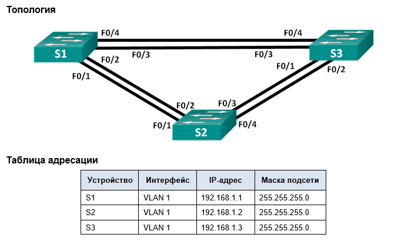
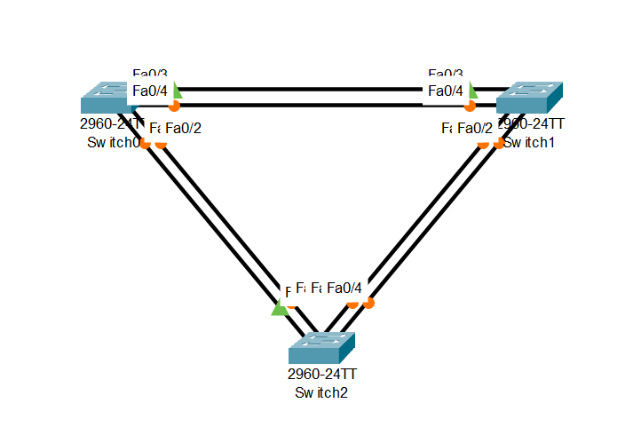
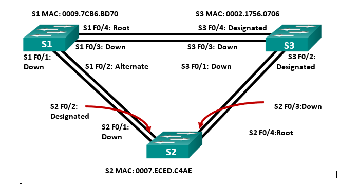

# Лабораторная работа. Развертывание коммутируемой сети с резервными каналами

## 	Цели
Часть 1. Создание сети и настройка основных параметров устройства   
Часть 2. Выбор корневого моста  
Часть 3. Наблюдение за процессом выбора протоколом STP порта, исходя из стоимости портов    
Часть 4. Наблюдение за процессом выбора протоколом STP порта, исходя из приоритета портов   

# Часть 1:	Создание сети и настройка основных параметров устройства

## Шаг 1:	Создайте сеть согласно топологии.


## Шаг 2:	Выполните инициализацию и перезагрузку коммутаторов.
S1
```
Switch>
Switch>en 
Switch#sh fl
Directory of flash:/

    1  -rw-     4670455          <no date>  2960-lanbasek9-mz.150-2.SE4.bin

64016384 bytes total (59345929 bytes free)
Switch#erase st
Switch#erase startup-config 
Erasing the nvram filesystem will remove all configuration files! Continue? [confirm]
[OK]
Erase of nvram: complete
%SYS-7-NV_BLOCK_INIT: Initialized the geometry of nvram
S1#reload
Proceed with reload? [confirm]
```
Аналогично проделываем для S2 и S3, если есть файл vlan.dat, то удаляем командой delete vlan.dat


## Шаг 3:	Настройте базовые параметры каждого коммутатора.
a.	Отключите поиск DNS.    
b.	Присвойте имена устройствам в соответствии с топологией.    
c.	Назначьте class в качестве зашифрованного пароля доступа к привилегированному режиму.   
d.	Назначьте cisco в качестве паролей консоли и VTY и активируйте вход для консоли и VTY каналов.  
e.	Настройте logging synchronous для консольного канала.   
f.	Настройте баннерное сообщение дня (MOTD) для предупреждения пользователей о запрете несанкционированного доступа.   
g.	Задайте IP-адрес, указанный в таблице адресации для VLAN 1 на всех коммутаторах.    
h.	Скопируйте текущую конфигурацию в файл загрузочной конфигурации.    

S1
```
Switch>enable
Switch#configure terminal
Enter configuration commands, one per line.  End with CNTL/Z.
Switch(config)#
Switch(config)#no ip domain-lookup
Switch(config)#hostname S1
S1(config)#service password-encryption
S1(config)#enable secret class
S1(config)#banner motd #
Enter TEXT message.  End with the character '#'.
Unauthorized access is strictly prohibited. #

S1(config)#
S1(config)#line con 0
S1(config-line)#password cisco
S1(config-line)#login
S1(config-line)#logging synchronous
S1(config-line)#exit
S1(config)#
S1(config)#line vty 0 4
S1(config-line)#password cisco
S1(config-line)#login
S1(config-line)#exit
S1(config)#
S1(config)#int vlan 1
S1(config-if)#ip add
S1(config-if)#ip address 192.168.1.1 255.255.255.0
S1(config-if)#
S1(config)#exit
S1#
S1#copy run st
Destination filename [startup-config]? 
Building configuration...
[OK]
S1#
```

Аналогично проделываем для S2 и S3

## Шаг 4:	Проверьте связь.
Проверьте способность компьютеров обмениваться эхо-запросами.
- Успешно ли выполняется эхо-запрос от коммутатора S1 на коммутатор S2?
```
S1#ping 192.168.1.2

Type escape sequence to abort.
Sending 5, 100-byte ICMP Echos to 192.168.1.2, timeout is 2 seconds:
..!!!
Success rate is 60 percent (3/5), round-trip min/avg/max = 0/0/0 ms

S1#
```
- Успешно ли выполняется эхо-запрос от коммутатора S1 на коммутатор S3?
```
S1#ping 192.168.1.3

Type escape sequence to abort.
Sending 5, 100-byte ICMP Echos to 192.168.1.3, timeout is 2 seconds:
..!!!
Success rate is 60 percent (3/5), round-trip min/avg/max = 0/0/0 ms
```
- Успешно ли выполняется эхо-запрос от коммутатора S2 на коммутатор S3?
```
S2#ping 192.168.1.3

Type escape sequence to abort.
Sending 5, 100-byte ICMP Echos to 192.168.1.3, timeout is 2 seconds:
..!!!
Success rate is 60 percent (3/5), round-trip min/avg/max = 0/0/0 ms

S2#
```

# Часть 2:	Определение корневого моста

## Шаг 1:	Отключите все порты на коммутаторах.

S1
```
S1(config)# int ra fa0/1-24, g0/1-2
S1(config-if-range)#sh
```
Аналогично для S2 и S3

## Шаг 2:	Настройте подключенные порты в качестве транковых.
S1
```
S1(config-if-range)#int ra fa0/1-4
S1(config-if-range)#sw m
S1(config-if-range)#sw mode trun
S1(config-if-range)#sw mode trunk 
S1(config-if-range)#
```
Аналогично для S2 и S3

## Шаг 3:	Включите порты F0/2 и F0/4 на всех коммутаторах.
S1
```
S1(config-if-range)#int ra fa0/2, fa0/4
S1(config-if-range)#no sh
```
Аналогично для S2 и S3

## Шаг 4:	Отобразите данные протокола spanning-tree.
S1
```
S1#sh spa
VLAN0001
  Spanning tree enabled protocol ieee
  Root ID    Priority    32769
             Address     0002.1756.0706
             Cost        19
             Port        4(FastEthernet0/4)
             Hello Time  2 sec  Max Age 20 sec  Forward Delay 15 sec

  Bridge ID  Priority    32769  (priority 32768 sys-id-ext 1)
             Address     0009.7CB6.BD70
             Hello Time  2 sec  Max Age 20 sec  Forward Delay 15 sec
             Aging Time  20

Interface        Role Sts Cost      Prio.Nbr Type
---------------- ---- --- --------- -------- --------------------------------
Fa0/2            Altn BLK 19        128.2    P2p
Fa0/4            Root FWD 19        128.4    P2p

S1#
```

S2
```
S2#sh spa
VLAN0001
  Spanning tree enabled protocol ieee
  Root ID    Priority    32769
             Address     0002.1756.0706
             Cost        19
             Port        4(FastEthernet0/4)
             Hello Time  2 sec  Max Age 20 sec  Forward Delay 15 sec

  Bridge ID  Priority    32769  (priority 32768 sys-id-ext 1)
             Address     0007.ECED.C4AE
             Hello Time  2 sec  Max Age 20 sec  Forward Delay 15 sec
             Aging Time  20

Interface        Role Sts Cost      Prio.Nbr Type
---------------- ---- --- --------- -------- --------------------------------
Fa0/4            Root FWD 19        128.4    P2p
Fa0/2            Desg FWD 19        128.2    P2p
```

S3
```
S3#sh spa
VLAN0001
  Spanning tree enabled protocol ieee
  Root ID    Priority    32769
             Address     0002.1756.0706
             This bridge is the root
             Hello Time  2 sec  Max Age 20 sec  Forward Delay 15 sec

  Bridge ID  Priority    32769  (priority 32768 sys-id-ext 1)
             Address     0002.1756.0706
             Hello Time  2 sec  Max Age 20 sec  Forward Delay 15 sec
             Aging Time  20

Interface        Role Sts Cost      Prio.Nbr Type
---------------- ---- --- --------- -------- --------------------------------
Fa0/2            Desg FWD 19        128.2    P2p
Fa0/4            Desg FWD 19        128.4    P2p
```




С учетом выходных данных, поступающих с коммутаторов, ответьте на следующие вопросы.

- Какой коммутатор является корневым мостом?    

S3     

- Почему этот коммутатор был выбран протоколом spanning-tree в качестве корневого моста?    

Корневым мостом выбирается коммутатор с наименьшим Bridge ID

- Какие порты на коммутаторе являются корневыми портами?    

На коммутаторах S1 и S2 это порты fa0/4, на коммутаторе S3 их нет, так как он является корневым.  

- Какие порты на коммутаторе являются назначенными портами?

На S2 - порт fa0/2, на S3 - Fa0/2 и Fa0/4

- Какой порт отображается в качестве альтернативного и в настоящее время заблокирован?

На S1 - fa0/2

- Почему протокол spanning-tree выбрал этот порт в качестве невыделенного (заблокированного) порта?     

Spanning Tree Algorithm основывается на выборе пути с наименьшей стоимостью пути до корневого коммутатора. Порт с меньшей стоимостью будет предпочтительным. В случаях, если стоимости будут одинаковы, то выбор будет сделан в  пользу меньшего Bridge ID.      

# Часть 3:	Наблюдение за процессом выбора протоколом STP порта, исходя из стоимости портов
## Шаг 1:	Определите коммутатор с заблокированным портом.
На коммутаторt S1 заблокирован порт fa0/2

## Шаг 2:	Измените стоимость порта.
```
S1(config)#int f0/4
S1(config-if)#spa vlan 1 cost 18
S1(config-if)#
```

## Шаг 3:	Просмотрите изменения протокола spanning-tree.
S1
```
S1#sh spa
VLAN0001
  Spanning tree enabled protocol ieee
  Root ID    Priority    32769
             Address     0002.1756.0706
             Cost        18
             Port        4(FastEthernet0/4)
             Hello Time  2 sec  Max Age 20 sec  Forward Delay 15 sec

  Bridge ID  Priority    32769  (priority 32768 sys-id-ext 1)
             Address     0009.7CB6.BD70
             Hello Time  2 sec  Max Age 20 sec  Forward Delay 15 sec
             Aging Time  20

Interface        Role Sts Cost      Prio.Nbr Type
---------------- ---- --- --------- -------- --------------------------------
Fa0/2            Desg FWD 19        128.2    P2p
Fa0/4            Root FWD 18        128.4    P2p
```

S2
```
S2#sh spa
VLAN0001
  Spanning tree enabled protocol ieee
  Root ID    Priority    32769
             Address     0002.1756.0706
             Cost        19
             Port        4(FastEthernet0/4)
             Hello Time  2 sec  Max Age 20 sec  Forward Delay 15 sec

  Bridge ID  Priority    32769  (priority 32768 sys-id-ext 1)
             Address     0007.ECED.C4AE
             Hello Time  2 sec  Max Age 20 sec  Forward Delay 15 sec
             Aging Time  20

Interface        Role Sts Cost      Prio.Nbr Type
---------------- ---- --- --------- -------- --------------------------------
Fa0/4            Root FWD 19        128.4    P2p
Fa0/2            Altn BLK 19        128.2    P2p
```
- Почему протокол spanning-tree заменяет ранее заблокированный порт на назначенный порт и блокирует порт, который был назначенным портом на другом коммутаторе?

Spanning Tree Algorithm основывается на выборе пути с наименьшей стоимостью пути до корневого коммутатора. Мы понизили стоимость и путь стал предпочтительным.

## Шаг 4:	Удалите изменения стоимости порта.
S1
```
S1(config)#int f0/4
S1(config-if)#no spa vlan 1 cost 18
S1(config-if)#ex
```

# Часть 4:	Наблюдение за процессом выбора протоколом STP порта, исходя из приоритета портов

### a.	Включите порты F0/1 и F0/3 на всех коммутаторах
S1
```
S1(config)#int ra f0/1, f0/3
S1(config-if-range)#no sh
```
Аналогично для S2 И S3

### b.	Подождите 30 секунд, чтобы протокол STP завершил процесс перевода порта, после чего выполните команду show spanning-tree на коммутаторах некорневого моста. Обратите внимание, что порт корневого моста переместился на порт с меньшим номером, связанный с коммутатором корневого моста, и заблокировал предыдущий порт корневого моста.
S1
```
S1#sh spa
VLAN0001
  Spanning tree enabled protocol ieee
  Root ID    Priority    32769
             Address     0002.1756.0706
             Cost        19
             Port        3(FastEthernet0/3)
             Hello Time  2 sec  Max Age 20 sec  Forward Delay 15 sec

  Bridge ID  Priority    32769  (priority 32768 sys-id-ext 1)
             Address     0009.7CB6.BD70
             Hello Time  2 sec  Max Age 20 sec  Forward Delay 15 sec
             Aging Time  20

Interface        Role Sts Cost      Prio.Nbr Type
---------------- ---- --- --------- -------- --------------------------------
Fa0/2            Altn BLK 19        128.2    P2p
Fa0/3            Root FWD 19        128.3    P2p
Fa0/4            Altn BLK 19        128.4    P2p
Fa0/1            Altn BLK 19        128.1    P2p
```

S2
```
S2#sh spa
VLAN0001
  Spanning tree enabled protocol ieee
  Root ID    Priority    32769
             Address     0002.1756.0706
             Cost        19
             Port        3(FastEthernet0/3)
             Hello Time  2 sec  Max Age 20 sec  Forward Delay 15 sec

  Bridge ID  Priority    32769  (priority 32768 sys-id-ext 1)
             Address     0007.ECED.C4AE
             Hello Time  2 sec  Max Age 20 sec  Forward Delay 15 sec
             Aging Time  20

Interface        Role Sts Cost      Prio.Nbr Type
---------------- ---- --- --------- -------- --------------------------------
Fa0/4            Altn BLK 19        128.4    P2p
Fa0/1            Desg FWD 19        128.1    P2p
Fa0/2            Desg FWD 19        128.2    P2p
Fa0/3            Root FWD 19        128.3    P2p
```


- Какой порт выбран протоколом STP в качестве порта корневого моста на каждом коммутаторе некорневого моста? 

Порт fa0/3 выбран на коммутаторах S1 и S2 в качестве корневого порта

- Почему протокол STP выбрал эти порты в качестве портов корневого моста на этих коммутаторах?  

В случаях, когда стоимость совпадает, выбирается порт с меньшим Port ID

# 	Вопросы для повторения
1.	Какое значение протокол STP использует первым после выбора корневого моста, чтобы определить выбор порта?

Стоимость всех линков до корневого моста (Root Path Cost), выбор происходит в пользу меньшего значения


2.	Если первое значение на двух портах одинаково, какое следующее значение будет использовать протокол STP при выборе порта?

Выбор происходит по Bridge ID коммутатора, выбор происходит в пользу меньшего значения

3.	Если оба значения на двух портах равны, каким будет следующее значение, которое использует протокол STP при выборе порта?

Port ID, выбор происходит в пользу меньшего значения

