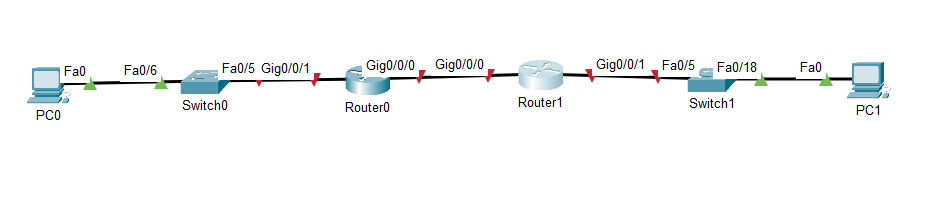
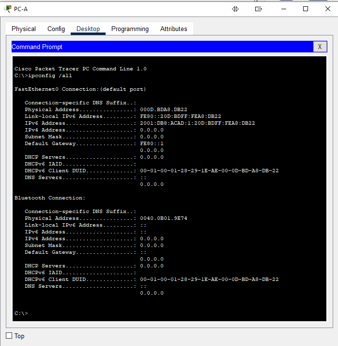

# Лабораторная работа - Реализация DHCPv4 


# Задачи
Часть 1. Создание сети и настройка основных параметров устройства       
Часть 2. Проверка назначения адреса SLAAC от R1     
Часть 3. Настройка и проверка сервера DHCPv6 без гражданства на R1      
Часть 4. Настройка и проверка состояния DHCPv6 сервера на R1        
Часть 5. Настройка и проверка DHCPv6 Relay на R2        

# Часть 1. Создание сети и настройка основных параметров устройства

## Шаг 1. Создайте сеть согласно топологии.


## Шаг 2. Настройте базовые параметры каждого коммутатора. (необязательно)
a.	Присвойте коммутатору имя устройства.       
b.	Отключите поиск DNS, чтобы предотвратить попытки маршрутизатора неверно преобразовывать введенные команды таким образом, как будто они являются именами узлов.      
c.	Назначьте class в качестве зашифрованного пароля привилегированного режима EXEC.    
d.	Назначьте cisco в качестве пароля консоли и включите вход в систему по паролю.  
e.	Назначьте cisco в качестве пароля VTY и включите вход в систему по паролю.  
f.	Зашифруйте открытые пароли.     
g.	Создайте баннер с предупреждением о запрете несанкционированного доступа к устройству.      
h.	Отключите все неиспользуемые порты.     
i.	Сохраните текущую конфигурацию в файл загрузочной конфигурации.     

S1
```
Switch>
Switch>en
Switch#conf t
Enter configuration commands, one per line.  End with CNTL/Z.
Switch(config)#hostname S1
S1(config)#no ip domain-lookup
S1(config)#enable secret class
S1(config)#line con 0
S1(config-line)#password cisco
S1(config-line)#login
S1(config-line)#logging  synchronous 
S1(config-line)#line vty 0 15
S1(config-line)#password cisco
S1(config-line)#login
S1(config-line)#service password-encryption
S1(config)#banner motd # Unauthorized access is strictly prohibited.#
S1(config)#interface range f0/1-4, f0/7-24, g0/1-2
S1(config-if-range)#sh
```
```
S1#copy run st
Destination filename [startup-config]? 
Building configuration...
[OK]
```
Для S2 аналогично

## Шаг 3. Произведите базовую настройку маршрутизаторов

a.	Назначьте маршрутизатору имя устройства.        
b.	Отключите поиск DNS, чтобы предотвратить попытки маршрутизатора неверно преобразовывать введенные команды таким образом, как будто они являются именами узлов.      
c.	Назначьте class в качестве зашифрованного пароля привилегированного режима EXEC.        
d.	Назначьте cisco в качестве пароля консоли и включите вход в систему по паролю.              
e.	Назначьте cisco в качестве пароля VTY и включите вход в систему по паролю.      
f.	Зашифруйте открытые пароли.     
g.	Создайте баннер с предупреждением о запрете несанкционированного доступа к устройству.      
h.	Активация IPv6-маршрутизации        
i.	Сохраните текущую конфигурацию в файл загрузочной конфигурации.     

R1
```
Router(config)#hostname R1
R1(config)#no ip domain-lookup
R1(config)#enable secret class
R1(config)#line con 0
R1(config-line)#password cisco
R1(config-line)#login
R1(config-line)#logging  synchronous 
R1(config-line)#line vty 0 15
R1(config-line)#password cisco
R1(config-line)#login
R1(config-line)#service password-encryption
R1(config)#banner motd # Unauthorized access is strictly prohibited.#
R1(config)#ipv6 unicast-routing
R1(config)#ex
R1#copy run st
Destination filename [startup-config]? 
Building configuration...
[OK]
R1#
```
Для R2 аналогично

## Шаг 4. Настройка интерфейсов и маршрутизации для обоих маршрутизаторов.

### a.	Настройте интерфейсы G0/0/0 и G0/1 на R1 и R2 с адресами IPv6, указанными в таблице выше.
R1
```
R1(config)#int g0/0/0
R1(config-if)#ipv6 add fe80::1 lin
R1(config-if)#ipv6 add fe80::1 link-local 
R1(config-if)#ipv6 add 2001:db8:acad:2::1/64
R1(config-if)#no sh

R1(config-if)#
%LINK-5-CHANGED: Interface GigabitEthernet0/0/0, changed state to up

%LINEPROTO-5-UPDOWN: Line protocol on Interface GigabitEthernet0/0/0, changed state to up

R1(config)#int g0/0/1
R1(config-if)#ipv6 add fe80::1 link-local
R1(config-if)#ipv6 add 2001:db8:acad:1::1/64
R1(config-if)#no sh

R1(config-if)#
%LINK-5-CHANGED: Interface GigabitEthernet0/0/1, changed state to up

%LINEPROTO-5-UPDOWN: Line protocol on Interface GigabitEthernet0/0/1, changed state to up

```

R2
```
R2(config)#int g0/0/0
R2(config-if)#ipv6 add fe80::2 link
R2(config-if)#ipv6 add fe80::2 link-local 
R2(config-if)#ipv6 add 2001:db8:acad:2::2/64
R2(config-if)#no sh

R2(config-if)#
%LINK-5-CHANGED: Interface GigabitEthernet0/0/0, changed state to up

R2(config-if)#int g0/0/1
R2(config-if)#ipv6 add fe80::1 link-local 
R2(config-if)#ipv6 add 2001:db8:acad:3::1/64
R2(config-if)#no sh

R2(config-if)#
%LINK-5-CHANGED: Interface GigabitEthernet0/0/1, changed state to up

%LINEPROTO-5-UPDOWN: Line protocol on Interface GigabitEthernet0/0/1, changed state to up

R2(config-if)#
```

## b.	Настройте маршрут по умолчанию на каждом маршрутизаторе, который указывает на IP-адрес G0/0/0 на другом маршрутизаторе.
R1
```
R1(config)#ipv6 route ::/0 2001:db8:acad:2::
```

R2
```
R2(config)#ipv6 route ::/0 2001:db8:acad:2::1
```


## c.	Убедитесь, что маршрутизация работает с помощью пинга адреса G0/0/1 R2 из R1
```
R1#ping 2001:db8:acad:3::1

Type escape sequence to abort.
Sending 5, 100-byte ICMP Echos to 2001:db8:acad:3::1, timeout is 2 seconds:
!!!!!
Success rate is 100 percent (5/5), round-trip min/avg/max = 0/0/0 ms

R1#
```

## d.	Сохраните текущую конфигурацию в файл загрузочной конфигурации.
```
R1#copy run st
Destination filename [startup-config]? 
Building configuration...
[OK]
R1#
```

```
R2#copy run st
Destination filename [startup-config]? 
Building configuration...
[OK]
R2#
```

# Часть 2. Проверка назначения адреса SLAAC от R1
Включите PC-A и убедитесь, что сетевой адаптер настроен для автоматической настройки IPv6.
Через несколько минут результаты команды ipconfig должны показать, что PC-A присвоил себе адрес из сети 2001:db8:1::/64.


- Откуда взялась часть адреса с идентификатором хоста?
Идентификатор генерируется по EUI-64 на основе MAC адреса, путем инверсии 7-го бита и добавлением FFFE для достижения длины идентификатора 64бита

# Часть 3. Настройка и проверка сервера DHCPv6 на R1
## Шаг 1. Более подробно изучите конфигурацию PC-A.
### a.	Выполните команду ipconfig /all на PC-A и посмотрите на результат.
```
Cisco Packet Tracer PC Command Line 1.0
C:\>ipconfig /all

FastEthernet0 Connection:(default port)

   Connection-specific DNS Suffix..: 
   Physical Address................: 000D.BDA8.DB22
   Link-local IPv6 Address.........: FE80::20D:BDFF:FEA8:DB22
   IPv6 Address....................: 2001:DB8:ACAD:1:20D:BDFF:FEA8:DB22
   IPv4 Address....................: 0.0.0.0
   Subnet Mask.....................: 0.0.0.0
   Default Gateway.................: FE80::1
                                     0.0.0.0
   DHCP Servers....................: 0.0.0.0
   DHCPv6 IAID.....................: 
   DHCPv6 Client DUID..............: 00-01-00-01-28-29-1E-AE-00-0D-BD-A8-DB-22
   DNS Servers.....................: ::
                                     0.0.0.0


```
### b.	Обратите внимание, что основной DNS-суффикс отсутствует. Также обратите внимание, что предоставленные адреса DNS-сервера являются адресами «локального сайта anycast», а не одноадресные адреса, как ожидалось.


## Шаг 2. Настройте R1 для предоставления DHCPv6 без состояния для PC-A.

### a.	Создайте пул DHCP IPv6 на R1 с именем R1-STATELESS. В составе этого пула назначьте адрес DNS-сервера как 2001:db8:acad: :1, а имя домена — как stateless.com.

```
R1(config)#ipv6 dhcp pool R1-STATELESS
R1(config-dhcpv6)#dns
R1(config-dhcpv6)#dns-server 2001:db8:acad::254
R1(config-dhcpv6)#dom
R1(config-dhcpv6)#domain-name stateless.com
R1(config-dhcpv6)#

```

### b.	Настройте интерфейс G0/0/1 на R1, чтобы предоставить флаг конфигурации OTHER для локальной сети R1 и укажите только что созданный пул DHCP в качестве ресурса DHCP для этого интерфейса.

```
R1(config)#int g0/0/1
R1(config-if)#ipv6 nd oth
R1(config-if)#ipv6 nd other-config-flag 
R1(config-if)#ipv6 dhcp ser
R1(config-if)#ipv6 dhcp server R1-STATELESS
R1(config-if)#
```
### c.	Сохраните текущую конфигурацию в файл загрузочной конфигурации.
```
R1#copy run st
Destination filename [startup-config]? 
Building configuration...
[OK]
R1#
```
### d.	Перезапустите PC-A.

### e.	Проверьте вывод ipconfig /all и обратите внимание на изменения.

```
C:\>ipconfig /all

FastEthernet0 Connection:(default port)

   Connection-specific DNS Suffix..: 
   Physical Address................: 000D.BDA8.DB22
   Link-local IPv6 Address.........: FE80::20D:BDFF:FEA8:DB22
   IPv6 Address....................: ::
   IPv4 Address....................: 0.0.0.0
   Subnet Mask.....................: 0.0.0.0
   Default Gateway.................: FE80::1
                                     0.0.0.0
   DHCP Servers....................: 0.0.0.0
   DHCPv6 IAID.....................: 
   DHCPv6 Client DUID..............: 00-01-00-01-28-29-1E-AE-00-0D-BD-A8-DB-22
   DNS Servers.....................: 2001:DB8:ACAD::254
                                     0.0.0.0
                                     
```

### f.	Тестирование подключения с помощью пинга IP-адреса интерфейса G0/1 R2.
```
C:\>ping 2001:db8:acad:1::1

Pinging 2001:db8:acad:1::1 with 32 bytes of data:

Reply from 2001:DB8:ACAD:1::1: bytes=32 time<1ms TTL=255
Reply from 2001:DB8:ACAD:1::1: bytes=32 time=4ms TTL=255
Reply from 2001:DB8:ACAD:1::1: bytes=32 time<1ms TTL=255
Reply from 2001:DB8:ACAD:1::1: bytes=32 time<1ms TTL=255

Ping statistics for 2001:DB8:ACAD:1::1:
    Packets: Sent = 4, Received = 4, Lost = 0 (0% loss),
Approximate round trip times in milli-seconds:
    Minimum = 0ms, Maximum = 4ms, Average = 1ms
```

# Часть 4. Настройка сервера DHCPv6 с сохранением состояния на R1
### a.	Создайте пул DHCPv6 на R1 для сети 2001:db8:acad:3:aaa::/80. Это предоставит адреса локальной сети, подключенной к интерфейсу G0/0/1 на R2. В составе пула задайте DNS-сервер 2001:db8:acad: :254 и задайте доменное имя STATEFUL.com.
```
R1(config)#ipv6 dhcp pool R2-STATEFUL
R1(config-dhcpv6)#address prefix 2001:db8:acad:3:aaa::/80
R1(config-dhcpv6)#dns-server 2001:db8:acad::254
R1(config-dhcpv6)#domain-name STATEFUL.com
R1(config-dhcpv6)#
```
### b.	Назначьте только что созданный пул DHCPv6 интерфейсу g0/0/0 на R1.
```
R1(config)#interface g0/0/0
R1(config-if)#ipv6 dhcp server R2-STATEFUL
```

# Часть 5. Настройка и проверка ретрансляции DHCPv6 на R2.

## Шаг 1. Включите PC-B и проверьте адрес SLAAC, который он генерирует.
```
Cisco Packet Tracer PC Command Line 1.0
C:\>ipconfig /all

FastEthernet0 Connection:(default port)

   Connection-specific DNS Suffix..: 
   Physical Address................: 0030.A3D0.C53C
   Link-local IPv6 Address.........: FE80::230:A3FF:FED0:C53C
   IPv6 Address....................: 2001:DB8:ACAD:3:230:A3FF:FED0:C53C
   IPv4 Address....................: 0.0.0.0
   Subnet Mask.....................: 0.0.0.0
   Default Gateway.................: FE80::1
                                     0.0.0.0
   DHCP Servers....................: 0.0.0.0
   DHCPv6 IAID.....................: 
   DHCPv6 Client DUID..............: 00-01-00-01-48-00-69-CA-00-30-A3-D0-C5-3C
   DNS Servers.....................: ::
                                     0.0.0.0
```
## Шаг 2. Настройте R2 в качестве агента DHCP-ретрансляции для локальной сети на G0/0/1.
### a.	Настройте команду ipv6 dhcp relay на интерфейсе R2 G0/0/1, указав адрес назначения интерфейса G0/0/0 на R1. Также настройте команду managed-config-flag .
```
R2(config)#int g0/0/1
R2(config-if)#ipv6 nd mana
R2(config-if)#ipv6 nd managed-config-flag 
R2(config-if)#ipv6 dhcp relay des 2001:db8:acad:2::1 g0/0/0
                        ^
% Invalid input detected at '^' marker.
	
R2(config-if)#ipv6 dhcp ?
  client  Act as an IPv6 DHCP client
  server  Act as an IPv6 DHCP server
```
Cудя по всему, ipv6 relay на Cisco packet tracer тоже не удастся поднять в виду его "урезанности"

## Шаг 3. Попытка получить адрес IPv6 из DHCPv6 на PC-B.

### a.	Перезапустите PC-B.
### b.	Откройте командную строку на PC-B и выполните команду ipconfig /all и проверьте выходные данные, чтобы увидеть результаты операции ретрансляции DHCPv6.
Имело бы смысл, если бы был поднят relay.
### c.	Проверьте подключение с помощью пинга IP-адреса интерфейса R1 G0/0/1.
```
C:\>ping 2001:db8:acad:1::1

Pinging 2001:db8:acad:1::1 with 32 bytes of data:

Reply from 2001:DB8:ACAD:1::1: bytes=32 time<1ms TTL=254
Reply from 2001:DB8:ACAD:1::1: bytes=32 time<1ms TTL=254
Reply from 2001:DB8:ACAD:1::1: bytes=32 time<1ms TTL=254
Reply from 2001:DB8:ACAD:1::1: bytes=32 time<1ms TTL=254

Ping statistics for 2001:DB8:ACAD:1::1:
    Packets: Sent = 4, Received = 4, Lost = 0 (0% loss),
Approximate round trip times in milli-seconds:
    Minimum = 0ms, Maximum = 0ms, Average = 0ms

```
Понятно, что, независимо от того, выдан IP по DHCP или SLAAC работать будет