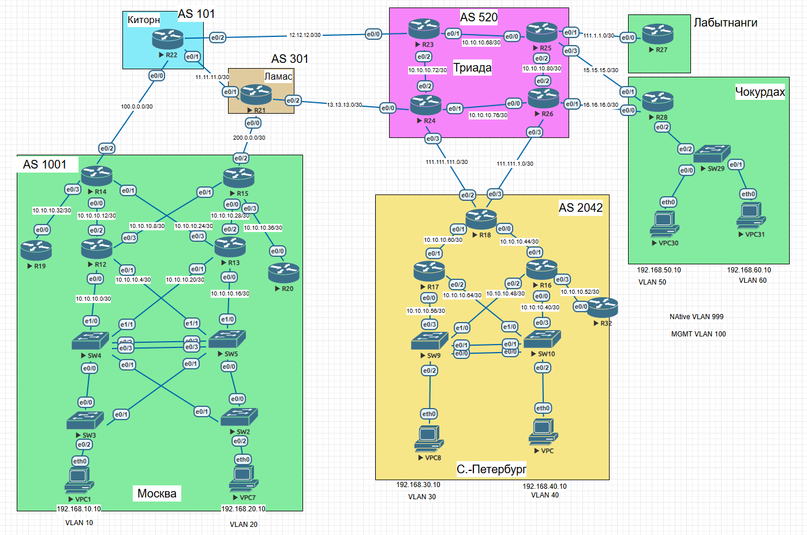

# Проектирование сети
## Цель
В данной самостоятельной работе необходимо распланировать адресное пространство
Настроить IP на всех активных портах для дальнейшей работы над проектом
Адресное пространство должно быть задокументировано

##
- Разработаете и задокументируете адресное пространство для лабораторного стенда.
- Настроите ip адреса на каждом активном порту
- Настроите каждый VPC в каждом офисе в своем VLAN.
- Настроите VLAN/Loopback interface управления для сетевых устройств
- Настроите сети офисов так, чтобы не возникало broadcast штормов, а использование линков было максимально оптимизировано
- Используете IPv4. IPv6 по желанию

# Топология 


# Адресное пространство

## Москва

| DeviceName | Int        | IP               | Description |
| ---------- | ---------- | ---------------- | ----------- |
| R12        | e0/0       | 10.10.10.1/30    | SW4         |
|            | e0/1       | 10.10.10.5/30    | SW5         |
|            | e0/2       | 10.10.10.9/30    | R14         |
|            | e0/3       | 10.10.10.13/30   | R15         |
|            | lo0        | 1.1.1.12         |             |
| R13        | e0/0       | 10.10.10.17/30   | SW5         |
|            | e0/1       | 10.10.10.21/30   | SW4         |
|            | e0/2       | 10.10.10.25/30   | R15         |
|            | e0/3       | 10.10.10.29/30   | R14         |
|            | lo0        | 1.1.1.13         |             |
| R14        | e0/0       | 10.10.10.10/30   | R12         |
|            | e0/1       | 10.10.10.30/30   | R13         |
|            | e0/2       | 100.0.0.2/30     | R22 Kitorn  |
|            | e0/3       | 10.10.10.33/30   | R19         |
|            | lo0        | 1.1.1.14         |             |
| R15        | e0/0       | 10.10.10.26/30   | R13         |
|            | e0/1       | 10.10.10.14/30   | R12         |
|            | e0/2       | 200.0.0.2/30     | R21 Lamas   |
|            | e0/3       | 10.10.10.37/30   | R20         |
|            | lo0        | 1.1.1.15         |             |
| R19        | e0/0       | 10.10.10.34/30   | R14         |
|            | lo0        | 1.1.1.19         |             |
| R20        | e0/0       | 10.10.10.38/30   | R15         |
|            | lo0        | 1.1.1.20         |             |
| SW4        | e1/0       | 10.10.10.2/30    | R12         |
|            | e1/1       | 10.10.10.22/30   | R13         |
|            | lo0        | 1.1.1.4          |             |
|            | SVI vlan10 | 192.168.10.2/24  | vlan 10     |
|            | SVI vlan20 | 192.168.20.2/24  | vlan 10     |
|            | VRRP VIP   | 192.168.10.1/24  | vlan 10     |
|            | VRRP VIP   | 192.168.20.1/24  | vlan 20     |
| SW5        | e1/0       | 10.10.10.18/30   | R13         |
|            | e1/1       | 10.10.10.6/30    | R12         |
|            | lo0        | 1.1.1.5          |             |
|            | SVI vlan10 | 192.168.10.3/24  | vlan 10     |
|            | SVI vlan20 | 192.168.20.3/24  | vlan 10     |
|            | VRRP VIP   | 192.168.10.1/24  | vlan 10     |
|            | VRRP VIP   | 192.168.20./24   | vlan 20     |
| SW3        | lo0        | 1.1.1.3          |             |
| SW2        | lo0        | 1.1.1.2          |             |
| VPC1       |            | 192.168.10.10/24 | vlan 10     |
| VPC7       |            | 192.168.20.10/24 | vlan 20     |

## Санкт-Петербург

| DeviceName | Int        | IP               | Description |
| ---------- | ---------- | ---------------- | ----------- |
| R16        | e0/0       | 10.10.10.41/30   | SW10        |
|            | e0/1       | 10.10.10.45/30   | R18         |
|            | e0/2       | 10.10.10.49/30   | SW9         |
|            | e0/3       | 10.10.10.53/30   | R32         |
|            | lo0        | 1.1.1.16         |             |
| R17        | e0/0       | 10.10.10.57/30   | SW9         |
|            | e0/1       | 10.10.10.61/30   | R18         |
|            | e0/2       | 10.10.10.65/30   | SW10        |
|            | lo0        | 1.1.1.17         |             |
| R18        | e0/0       | 10.10.10.46/30   | R16         |
|            | e0/1       | 10.10.10.62/30   | R17         |
|            | e0/2       | 111.111.111.2/30 | R24 Triada  |
|            | e0/3       | 111.111.1.2/30   | R26 Triada  |
|            | lo0        | 1.1.1.18         |             |
| R32        | e0/0       | 10.10.10.54/30   | R16         |
|            | lo0        | 1.1.1.32         |             |
| SW9        | e0/3       | 10.10.10.58/30   | R17         |
|            | e1/0       | 10.10.10.50/30   | R16         |
|            | lo0        | 1.1.1.9          |             |
|            | SVI vlan30 | 192.168.30.2/24  | vlan 30     |
|            | SVI vlan40 | 192.168.40.2/24  | vlan 40     |
|            | VRRP VIP   | 192.168.30.1/24  | vlan 30     |
|            | VRRP VIP   | 192.168.40.1/24  | vlan 40     |
| SW10       | e0/3       | 10.10.10.42/30   | R16         |
|            | e1/0       | 10.10.10.66/30   | R17         |
|            | lo0        | 1.1.1.10         |             |
|            | SVI vlan30 | 192.168.30.3/24  | vlan 30     |
|            | SVI vlan40 | 192.168.40.3/24  | vlan 40     |
|            | VRRP VIP   | 192.168.30.1/24  | vlan 30     |
|            | VRRP VIP   | 192.168.40.1/24  | vlan 40     |
| VPC8       |            | 192.168.30.10/24 | vlan 30     |
| VPC        |            | 192.168.40.10/24 | vlan 40     |

## Чокурдах
| DeviceName | Int     | IP               | Description |
| ---------- | ------- | ---------------- | ----------- |
| R28        | e0/0    | 16.16.16.2/30    | R26 Triada  |
|            | e0/1    | 15.15.15.2/30    | R25 Triada  |
|            | e0/2.50 | 192.168.50.1/24  | vlan 50     |
|            | e0/2.60 | 192.168.60.1/24  | vlan 60     |
|            | lo0     | 1.1.1.28         |             |
| SW29       | lo0     | 1.1.1.29         |             |
| VPC30      |         | 192.168.50.10/24 | vlan 50     |
| VPC31      |         | 192.168.60.10/24 | vlan 60     |

## Лабытнанги
| Laby       |      |              |             |
| ---------- | ---- | ------------ | ----------- |
| DeviceName | Int  | IP           | Description |
| R27        | e0/0 | 111.1.1.2/30 | R25 Triada  |
|            | lo0  | 1.1.1.27     |             |

## Триада
| DeviceName | Int  | IP               | Description |
| ---------- | ---- | ---------------- | ----------- |
| R23        | e0/0 | 12.12.12.2/30    | R22 Kitorn  |
|            | e0/1 | 10.10.10.69/30   | R25         |
|            | e0/2 | 10.10.10.73/30   | R24         |
|            | lo0  | 1.1.1.23         |             |
| R24        | e0/0 | 13.13.13.2/30    |             |
|            | e0/1 | 10.10.10.77/30   | R26         |
|            | e0/2 | 10.10.10.74/30   | R23         |
|            | e0/3 | 111.111.111.1/30 | R18 SPB     |
|            | lo0  | 1.1.1.24         |             |
| R25        | e0/0 | 10.10.10.70/30   | R23         |
|            | e0/1 | 111.1.1.1/30     | R27 Laby    |
|            | e0/2 | 10.10.10.81/30   | R26         |
|            | e0/3 | 15.15.15.1/30    | R28 Cho     |
|            | lo0  | 1.1.1.25         |             |
| R26        | e0/0 | 10.10.10.78/30   | R24         |
|            | e0/1 | 16.16.16.1/30    | R28 Cho     |
|            | e0/2 | 10.10.10.82/30   | R25         |
|            | e0/3 | 111.111.1.1/30   | R18 SPB     |
|            | lo0  | 1.1.1.26         |             |

## Ламас
| DeviceName | Int  | IP            | Description |
| ---------- | ---- | ------------- | ----------- |
| R21        | e0/0 | 200.0.0.1/30  | R14 Moscow  |
|            | e0/1 | 11.11.11.2/30 | R22 Kitorn  |
|            | e0/2 | 13.13.13.1/30 | R24 Triada  |
|            | lo0  | 1.1.1.21      |             |
## Киторн
| DeviceName | Int  | IP            | Description |
| ---------- | ---- | ------------- | ----------- |
| R22        | e0/0 | 100.0.0.1/30  | R14 Moscow  |
|            | e0/1 | 11.11.11.1/30 | R21 Lamas   |
|            | e0/2 | 12.12.12.1/30 | R23 Triada  |
|            | lo0  | 1.1.1.22      |             |


## VLAN И Настройка VPC
Все VPC настроены в своих VLAN.
В Москве и Петербурге VLAN терминируются на SVI свитчей. В Москве SW4-SW5, а в Петербурге SW9-SW10. В Чокурдах ROAS на R28.


В Москве и Петербурге так же поднят VRRP для клиентских VLAN и настроены приоритеты. Хотя в текущей топологии в Петербурге он не особо работает, но на случай, если вдруг появятся access свитчи :)


- Москва
```
SW4#sh vrrp brief
Interface          Grp Pri Time  Own Pre State   Master addr     Group addr
Vl10               10  100 3609       Y  Backup  192.168.10.3    192.168.10.1
Vl20               20  200 3218       Y  Master  192.168.20.2    192.168.20.1
SW4#

SW5#sh vrrp br
Interface          Grp Pri Time  Own Pre State   Master addr     Group addr
Vl10               10  200 3218       Y  Master  192.168.10.3    192.168.10.1
Vl20               20  100 3609       Y  Backup  192.168.20.2    192.168.20.1
SW5#
```

### Проверка межвлановой маршрутизации

```
VPCS> show ip

NAME        : VPCS[1]
IP/MASK     : 192.168.20.10/24
GATEWAY     : 192.168.20.1
DNS         :
MAC         : 00:50:79:66:68:07
LPORT       : 20000
RHOST:PORT  : 127.0.0.1:30000
MTU         : 1500

VPCS> ping 192.168.10.1

192.168.10.1 icmp_seq=1 timeout
84 bytes from 192.168.10.1 icmp_seq=2 ttl=255 time=3.750 ms
84 bytes from 192.168.10.1 icmp_seq=3 ttl=255 time=4.318 ms
84 bytes from 192.168.10.1 icmp_seq=4 ttl=255 time=2.768 ms
84 bytes from 192.168.10.1 icmp_seq=5 ttl=255 time=2.812 ms

VPCS> ping 192.168.10.10

84 bytes from 192.168.10.10 icmp_seq=1 ttl=63 time=7.575 ms
84 bytes from 192.168.10.10 icmp_seq=2 ttl=63 time=4.424 ms
84 bytes from 192.168.10.10 icmp_seq=3 ttl=63 time=6.478 ms
84 bytes from 192.168.10.10 icmp_seq=4 ttl=63 time=1.359 ms
84 bytes from 192.168.10.10 icmp_seq=5 ttl=63 time=4.279 ms

```
Native Vlan - 999, он же установлен для всех неиспользуемых портов и неиспользуемые порты отключены
```
SW3#sh ip int br
Interface              IP-Address      OK? Method Status                Protocol
Ethernet0/0            unassigned      YES unset  up                    up
Ethernet0/1            unassigned      YES unset  up                    up
Ethernet0/2            unassigned      YES unset  up                    up
Ethernet0/3            unassigned      YES unset  administratively down down
Ethernet1/0            unassigned      YES unset  administratively down down
Ethernet1/1            unassigned      YES unset  administratively down down
Ethernet1/2            unassigned      YES unset  administratively down down
Ethernet1/3            unassigned      YES unset  administratively down down
Loopback0              1.1.1.3         YES manual up                    up
SW3#
SW3#sh vlan br

VLAN Name                             Status    Ports
---- -------------------------------- --------- -------------------------------
1    default                          active
10   vlan10                           active    Et0/2
20   vlan20                           active
100  MGM                              active
999  Parking_lot                      active    Et0/3, Et1/0, Et1/1, Et1/2
                                                Et1/3
1002 fddi-default                     act/unsup
1003 token-ring-default               act/unsup
1004 fddinet-default                  act/unsup
1005 trnet-default                    act/unsup
SW3#

```
## Etherchannel
Etherchannel в МОскве и Петербурге поднят в LACP Active-PAssive

```
SW5#sh etherchannel sum
Flags:  D - down        P - bundled in port-channel
        I - stand-alone s - suspended
        H - Hot-standby (LACP only)
        R - Layer3      S - Layer2
        U - in use      f - failed to allocate aggregator

        M - not in use, minimum links not met
        u - unsuitable for bundling
        w - waiting to be aggregated
        d - default port


Number of channel-groups in use: 1
Number of aggregators:           1

Group  Port-channel  Protocol    Ports
------+-------------+-----------+-----------------------------------------------
1      Po1(SU)         LACP      Et0/2(P)    Et0/3(P)

SW5#

```

## STP
В Москве поднят MSTP, VLAN раскиданы по 2 инстансам, назначены root, на access свитчах portfast в сторону хостов

```
SW5#sh spa mst configuration
Name      [mstp]
Revision  1     Instances configured 3

Instance  Vlans mapped
--------  ---------------------------------------------------------------------
0         1-9,11-19,21-99,101-4094
1         10,100
2         20
-------------------------------------------------------------------------------
SW5#

SW5#sh spanning-tree

MST0
  Spanning tree enabled protocol mstp
  Root ID    Priority    32768
             Address     aabb.cc00.2000
             Cost        0
             Port        1 (Ethernet0/0)
             Hello Time   2 sec  Max Age 20 sec  Forward Delay 15 sec

  Bridge ID  Priority    32768  (priority 32768 sys-id-ext 0)
             Address     aabb.cc00.5000
             Hello Time   2 sec  Max Age 20 sec  Forward Delay 15 sec

Interface           Role Sts Cost      Prio.Nbr Type
------------------- ---- --- --------- -------- --------------------------------
Et0/0               Root FWD 2000000   128.1    Shr
Et0/1               Desg FWD 2000000   128.2    Shr
Po1                 Altn BLK 1000000   128.65   Shr


MST1
  Spanning tree enabled protocol mstp
  Root ID    Priority    24577
             Address     aabb.cc00.4000
             Cost        1000000
             Port        65 (Port-channel1)
             Hello Time   2 sec  Max Age 20 sec  Forward Delay 15 sec

  Bridge ID  Priority    28673  (priority 28672 sys-id-ext 1)
             Address     aabb.cc00.5000
             Hello Time   2 sec  Max Age 20 sec  Forward Delay 15 sec

Interface           Role Sts Cost      Prio.Nbr Type
------------------- ---- --- --------- -------- --------------------------------
Et0/0               Desg FWD 2000000   128.1    Shr
Et0/1               Desg FWD 2000000   128.2    Shr
Po1                 Root FWD 1000000   128.65   Shr


MST2
  Spanning tree enabled protocol mstp
  Root ID    Priority    24578
             Address     aabb.cc00.5000
             This bridge is the root
             Hello Time   2 sec  Max Age 20 sec  Forward Delay 15 sec

  Bridge ID  Priority    24578  (priority 24576 sys-id-ext 2)
             Address     aabb.cc00.5000
             Hello Time   2 sec  Max Age 20 sec  Forward Delay 15 sec

Interface           Role Sts Cost      Prio.Nbr Type
------------------- ---- --- --------- -------- --------------------------------
Et0/0               Desg FWD 2000000   128.1    Shr
Et0/1               Desg FWD 2000000   128.2    Shr
Po1                 Desg FWD 1000000   128.65   Shr


SW5#

```


# Configs

