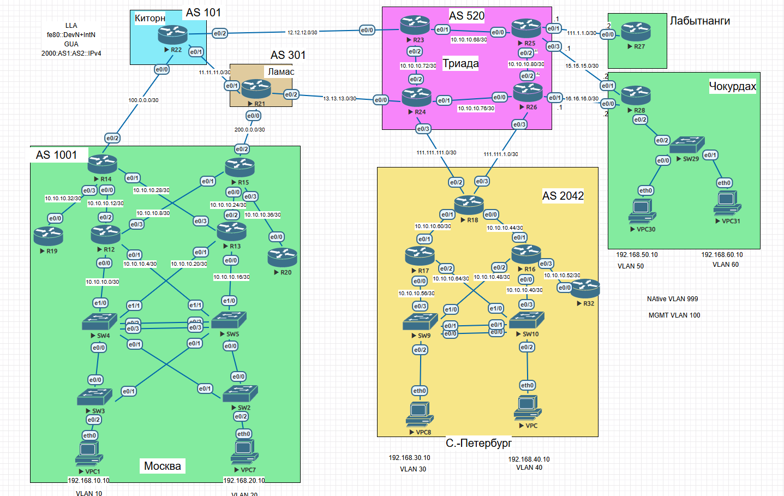
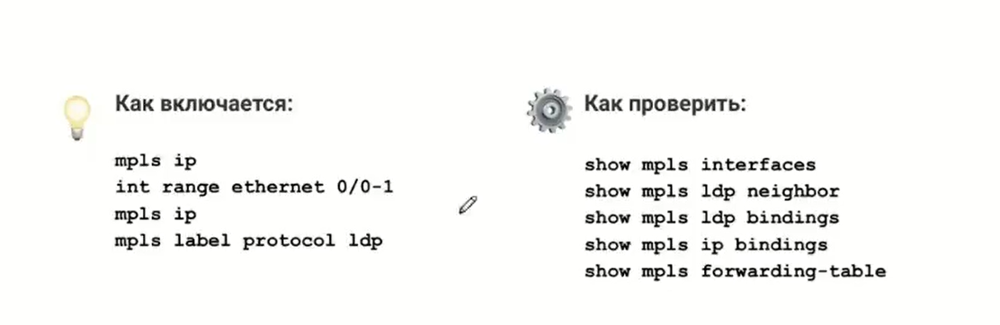

# Базовый сервис MPLS

## Цель:
Настроить BGP free core в офисах Москвы и Санкт-Петербурга.


## Описание/Пошаговая инструкция выполнения домашнего задания:
В этой самостоятельной работе мы ожидаем, что вы:

- Настроите BGP free core в офисе Москвы.
- Настроите BGP free core в офисе Санкт-Петербурга.


## Топология




## Настроите BGP free core в офисе Москвы.

Чтобы запустить BGP Free Core нам по сути надо запустить MPLS и LDP на интерфейсах в сторону нашей сети на всех устройствах в AS. iBGP сессии оставить только между бордерами (спасибо Николаю Колесову)
Действовать будем согласно плану:

Соответтственно, на R14 и R15 включим на интерфейсах E0/0-1, А на R12-13 на интерфейсах E0/2-3

Что получается:

</code></pre>
</details>
<details>
<summary>R14  </summary>
<pre><code>

```
R14(config)#mpls ip
R14(config)#int ra e0/0-1
R14(config-if-range)#mpls ip
R14(config-if-range)#mpls label pro
R14(config-if-range)#mpls label protocol ldp
R14(config-if-range)#
```

Проверка
```
R14#sh mpls int det
Interface Ethernet0/0:
        Type Unknown
        IP labeling enabled (ldp):
          Interface config
        LSP Tunnel labeling not enabled
        IP FRR labeling not enabled
        BGP labeling not enabled
        MPLS operational
        MTU = 1500
Interface Ethernet0/1:
        Type Unknown
        IP labeling enabled (ldp):
          Interface config
        LSP Tunnel labeling not enabled
        IP FRR labeling not enabled
        BGP labeling not enabled
        MPLS operational
        MTU = 1500
R14#sh mpls ldp nei
R14#sh mpls ldp neighbor
    Peer LDP Ident: 1.1.1.12:0; Local LDP Ident 200.20.20.14:0
        TCP connection: 1.1.1.12.646 - 200.20.20.14.18412
        State: Oper; Msgs sent/rcvd: 42/40; Downstream
        Up time: 00:16:47
        LDP discovery sources:
          Ethernet0/0, Src IP addr: 10.10.10.9
        Addresses bound to peer LDP Ident:
          10.10.10.1      10.10.10.5      10.10.10.9      10.10.10.13
          1.1.1.12
    Peer LDP Ident: 1.1.1.13:0; Local LDP Ident 200.20.20.14:0
        TCP connection: 1.1.1.13.646 - 200.20.20.14.57453
        State: Oper; Msgs sent/rcvd: 41/40; Downstream
        Up time: 00:16:19
        LDP discovery sources:
          Ethernet0/1, Src IP addr: 10.10.10.29
        Addresses bound to peer LDP Ident:
          10.10.10.17     10.10.10.21     10.10.10.25     10.10.10.29
          1.1.1.13
R14#sh mpls ip binding
  0.0.0.0/0
        out label:    imp-null  lsr: 1.1.1.12:0
        out label:    imp-null  lsr: 1.1.1.13:0
  1.1.1.4/32
        in label:     16
        out label:    16        lsr: 1.1.1.12:0       inuse
        out label:    16        lsr: 1.1.1.13:0       inuse
  1.1.1.5/32
        in label:     17
        out label:    17        lsr: 1.1.1.12:0       inuse
        out label:    17        lsr: 1.1.1.13:0       inuse
  1.1.1.12/32
        in label:     18
        out label:    imp-null  lsr: 1.1.1.12:0       inuse
        out label:    18        lsr: 1.1.1.13:0
  1.1.1.13/32
        in label:     19
        out label:    18        lsr: 1.1.1.12:0
        out label:    imp-null  lsr: 1.1.1.13:0       inuse
  1.1.1.14/32
        in label:     imp-null
        out label:    19        lsr: 1.1.1.12:0
        out label:    19        lsr: 1.1.1.13:0
  1.1.1.19/32
        in label:     20
        out label:    20        lsr: 1.1.1.12:0
        out label:    20        lsr: 1.1.1.13:0
  10.10.10.0/30
        in label:     21
        out label:    imp-null  lsr: 1.1.1.12:0       inuse
        out label:    21        lsr: 1.1.1.13:0
  10.10.10.4/30
        in label:     22
        out label:    imp-null  lsr: 1.1.1.12:0       inuse
        out label:    22        lsr: 1.1.1.13:0
  10.10.10.8/30
        in label:     imp-null
        out label:    imp-null  lsr: 1.1.1.12:0
        out label:    23        lsr: 1.1.1.13:0
  10.10.10.12/30
        in label:     23
        out label:    imp-null  lsr: 1.1.1.12:0       inuse
        out label:    24        lsr: 1.1.1.13:0
  10.10.10.16/30
        in label:     24
        out label:    21        lsr: 1.1.1.12:0
        out label:    imp-null  lsr: 1.1.1.13:0       inuse
  10.10.10.20/30
        in label:     25
        out label:    22        lsr: 1.1.1.12:0
        out label:    imp-null  lsr: 1.1.1.13:0       inuse
  10.10.10.24/30
        in label:     26
        out label:    23        lsr: 1.1.1.12:0
        out label:    imp-null  lsr: 1.1.1.13:0       inuse
  10.10.10.28/30
        in label:     imp-null
        out label:    24        lsr: 1.1.1.12:0
        out label:    imp-null  lsr: 1.1.1.13:0
  10.10.10.32/30
        in label:     imp-null
        out label:    25        lsr: 1.1.1.12:0
        out label:    25        lsr: 1.1.1.13:0
  100.0.0.0/30
        in label:     imp-null
  172.16.0.14/32
        in label:     imp-null
  192.168.10.0/24
        in label:     27
        out label:    26        lsr: 1.1.1.12:0       inuse
        out label:    26        lsr: 1.1.1.13:0       inuse
  192.168.20.0/24
        in label:     28
        out label:    27        lsr: 1.1.1.12:0       inuse
        out label:    27        lsr: 1.1.1.13:0       inuse
  200.20.20.0/22
        in label:     imp-null
R14#
R14#sh mpls ldp bind
R14#sh mpls ldp bindings
  lib entry: 0.0.0.0/0, rev 41
        remote binding: lsr: 1.1.1.12:0, label: imp-null
        remote binding: lsr: 1.1.1.13:0, label: imp-null
  lib entry: 1.1.1.4/32, rev 2
        local binding:  label: 16
        remote binding: lsr: 1.1.1.12:0, label: 16
        remote binding: lsr: 1.1.1.13:0, label: 16
  lib entry: 1.1.1.5/32, rev 4
        local binding:  label: 17
        remote binding: lsr: 1.1.1.12:0, label: 17
        remote binding: lsr: 1.1.1.13:0, label: 17
  lib entry: 1.1.1.12/32, rev 6
        local binding:  label: 18
        remote binding: lsr: 1.1.1.12:0, label: imp-null
        remote binding: lsr: 1.1.1.13:0, label: 18
  lib entry: 1.1.1.13/32, rev 8
        local binding:  label: 19
        remote binding: lsr: 1.1.1.12:0, label: 18
        remote binding: lsr: 1.1.1.13:0, label: imp-null
  lib entry: 1.1.1.14/32, rev 10
        local binding:  label: imp-null
        remote binding: lsr: 1.1.1.12:0, label: 19
        remote binding: lsr: 1.1.1.13:0, label: 19
  lib entry: 1.1.1.19/32, rev 12
        local binding:  label: 20
        remote binding: lsr: 1.1.1.12:0, label: 20
        remote binding: lsr: 1.1.1.13:0, label: 20
  lib entry: 10.10.10.0/30, rev 14
        local binding:  label: 21
        remote binding: lsr: 1.1.1.12:0, label: imp-null
        remote binding: lsr: 1.1.1.13:0, label: 21
  lib entry: 10.10.10.4/30, rev 16
        local binding:  label: 22
        remote binding: lsr: 1.1.1.12:0, label: imp-null
        remote binding: lsr: 1.1.1.13:0, label: 22
  lib entry: 10.10.10.8/30, rev 18
        local binding:  label: imp-null
        remote binding: lsr: 1.1.1.12:0, label: imp-null
        remote binding: lsr: 1.1.1.13:0, label: 23
  lib entry: 10.10.10.12/30, rev 20
        local binding:  label: 23
        remote binding: lsr: 1.1.1.12:0, label: imp-null
        remote binding: lsr: 1.1.1.13:0, label: 24
  lib entry: 10.10.10.16/30, rev 22
        local binding:  label: 24
        remote binding: lsr: 1.1.1.12:0, label: 21
        remote binding: lsr: 1.1.1.13:0, label: imp-null
  lib entry: 10.10.10.20/30, rev 24
        local binding:  label: 25
        remote binding: lsr: 1.1.1.12:0, label: 22
        remote binding: lsr: 1.1.1.13:0, label: imp-null
  lib entry: 10.10.10.24/30, rev 26
        local binding:  label: 26
        remote binding: lsr: 1.1.1.12:0, label: 23
        remote binding: lsr: 1.1.1.13:0, label: imp-null
  lib entry: 10.10.10.28/30, rev 28
        local binding:  label: imp-null
        remote binding: lsr: 1.1.1.12:0, label: 24
        remote binding: lsr: 1.1.1.13:0, label: imp-null
  lib entry: 10.10.10.32/30, rev 30
        local binding:  label: imp-null
        remote binding: lsr: 1.1.1.12:0, label: 25
        remote binding: lsr: 1.1.1.13:0, label: 25
  lib entry: 100.0.0.0/30, rev 32
        local binding:  label: imp-null
  lib entry: 172.16.0.14/32, rev 34
        local binding:  label: imp-null
  lib entry: 192.168.10.0/24, rev 36
        local binding:  label: 27
        remote binding: lsr: 1.1.1.12:0, label: 26
        remote binding: lsr: 1.1.1.13:0, label: 26
  lib entry: 192.168.20.0/24, rev 38
        local binding:  label: 28
        remote binding: lsr: 1.1.1.12:0, label: 27
        remote binding: lsr: 1.1.1.13:0, label: 27
  lib entry: 200.20.20.0/22, rev 40
        local binding:  label: imp-null
R14#sh mpls forwarding-table
Local      Outgoing   Prefix           Bytes Label   Outgoing   Next Hop
Label      Label      or Tunnel Id     Switched      interface
16         16         1.1.1.4/32       0             Et0/0      10.10.10.9
           16         1.1.1.4/32       0             Et0/1      10.10.10.29
17         17         1.1.1.5/32       0             Et0/0      10.10.10.9
           17         1.1.1.5/32       0             Et0/1      10.10.10.29
18         Pop Label  1.1.1.12/32      0             Et0/0      10.10.10.9
19         Pop Label  1.1.1.13/32      0             Et0/1      10.10.10.29
20         No Label   1.1.1.19/32      0             Et0/3      10.10.10.34
21         Pop Label  10.10.10.0/30    0             Et0/0      10.10.10.9
22         Pop Label  10.10.10.4/30    0             Et0/0      10.10.10.9
23         Pop Label  10.10.10.12/30   0             Et0/0      10.10.10.9
24         Pop Label  10.10.10.16/30   0             Et0/1      10.10.10.29
25         Pop Label  10.10.10.20/30   0             Et0/1      10.10.10.29
26         Pop Label  10.10.10.24/30   0             Et0/1      10.10.10.29
27         26         192.168.10.0/24  0             Et0/0      10.10.10.9
           26         192.168.10.0/24  0             Et0/1      10.10.10.29
28         27         192.168.20.0/24  0             Et0/0      10.10.10.9
           27         192.168.20.0/24  0             Et0/1      10.10.10.29

```

</code></pre>
</details>


## Настроите BGP free core в офисе Санкт-Петербурга.
Повторим то же самое
и как пример результат на R18


</code></pre>
</details>
<details>
<summary>Пример R18</summary>
<pre><code>

```
R18#sh mpls int det
Interface Ethernet0/0:
        Type Unknown
        IP labeling enabled (ldp):
          Interface config
        LSP Tunnel labeling not enabled
        IP FRR labeling not enabled
        BGP labeling not enabled
        MPLS operational
        MTU = 1500
Interface Ethernet0/1:
        Type Unknown
        IP labeling enabled (ldp):
          Interface config
        LSP Tunnel labeling not enabled
        IP FRR labeling not enabled
        BGP labeling not enabled
        MPLS operational
        MTU = 1500
R18#sh mpls nei
R18#sh mpls ldp nei
R18#sh mpls ldp neighbor
    Peer LDP Ident: 1.1.1.17:0; Local LDP Ident 1.1.1.18:0
        TCP connection: 1.1.1.17.646 - 1.1.1.18.45714
        State: Oper; Msgs sent/rcvd: 32/34; Downstream
        Up time: 00:12:44
        LDP discovery sources:
          Ethernet0/1, Src IP addr: 10.10.10.61
        Addresses bound to peer LDP Ident:
          10.10.10.57     10.10.10.61     10.10.10.65     1.1.1.17
    Peer LDP Ident: 1.1.1.16:0; Local LDP Ident 1.1.1.18:0
        TCP connection: 1.1.1.16.646 - 1.1.1.18.22777
        State: Oper; Msgs sent/rcvd: 31/33; Downstream
        Up time: 00:12:02
        LDP discovery sources:
          Ethernet0/0, Src IP addr: 10.10.10.45
        Addresses bound to peer LDP Ident:
          10.10.10.41     10.10.10.45     10.10.10.49     10.10.10.53
          1.1.1.16
R18#sh mpls ldp binfd
R18#sh mpls ldp bind
R18#sh mpls ldp bindings
  lib entry: 0.0.0.0/0, rev 2
        local binding:  label: imp-null
        remote binding: lsr: 1.1.1.17:0, label: imp-null
        remote binding: lsr: 1.1.1.16:0, label: imp-null
  lib entry: 1.1.1.9/32, rev 4
        local binding:  label: 16
        remote binding: lsr: 1.1.1.17:0, label: 16
        remote binding: lsr: 1.1.1.16:0, label: 16
  lib entry: 1.1.1.10/32, rev 6
        local binding:  label: 17
        remote binding: lsr: 1.1.1.17:0, label: 17
        remote binding: lsr: 1.1.1.16:0, label: 17
  lib entry: 1.1.1.16/32, rev 8
        local binding:  label: 18
        remote binding: lsr: 1.1.1.17:0, label: 18
        remote binding: lsr: 1.1.1.16:0, label: imp-null
  lib entry: 1.1.1.17/32, rev 10
        local binding:  label: 19
        remote binding: lsr: 1.1.1.17:0, label: imp-null
        remote binding: lsr: 1.1.1.16:0, label: 18
  lib entry: 1.1.1.18/32, rev 12
        local binding:  label: imp-null
        remote binding: lsr: 1.1.1.17:0, label: 19
        remote binding: lsr: 1.1.1.16:0, label: 19
  lib entry: 1.1.1.32/32, rev 14
        local binding:  label: 20
        remote binding: lsr: 1.1.1.17:0, label: 20
        remote binding: lsr: 1.1.1.16:0, label: 20
  lib entry: 10.10.10.32/27, rev 16
        local binding:  label: 21
        remote binding: lsr: 1.1.1.17:0, label: imp-null
        remote binding: lsr: 1.1.1.16:0, label: imp-null
  lib entry: 10.10.10.40/30, rev 31
        remote binding: lsr: 1.1.1.17:0, label: 21
        remote binding: lsr: 1.1.1.16:0, label: imp-null
  lib entry: 10.10.10.44/30, rev 18
        local binding:  label: imp-null
        remote binding: lsr: 1.1.1.17:0, label: 22
        remote binding: lsr: 1.1.1.16:0, label: imp-null
  lib entry: 10.10.10.48/30, rev 32
        remote binding: lsr: 1.1.1.17:0, label: 23
        remote binding: lsr: 1.1.1.16:0, label: imp-null
  lib entry: 10.10.10.52/30, rev 33
        remote binding: lsr: 1.1.1.17:0, label: 24
        remote binding: lsr: 1.1.1.16:0, label: imp-null
  lib entry: 10.10.10.56/30, rev 34
        remote binding: lsr: 1.1.1.17:0, label: imp-null
        remote binding: lsr: 1.1.1.16:0, label: 21
  lib entry: 10.10.10.60/30, rev 20
        local binding:  label: imp-null
        remote binding: lsr: 1.1.1.17:0, label: imp-null
        remote binding: lsr: 1.1.1.16:0, label: 22
  lib entry: 10.10.10.64/30, rev 22
        local binding:  label: 22
        remote binding: lsr: 1.1.1.17:0, label: imp-null
        remote binding: lsr: 1.1.1.16:0, label: 23
  lib entry: 10.15.18.0/30, rev 24
        local binding:  label: imp-null
  lib entry: 111.111.111.0/30, rev 26
        local binding:  label: imp-null
  lib entry: 192.168.30.0/24, rev 28
        local binding:  label: 23
        remote binding: lsr: 1.1.1.17:0, label: 25
        remote binding: lsr: 1.1.1.16:0, label: 24
  lib entry: 192.168.40.0/24, rev 30
        local binding:  label: 24
        remote binding: lsr: 1.1.1.17:0, label: 26
        remote binding: lsr: 1.1.1.16:0, label: 25
R18#
R18#
R18#sh mpls ip bin
R18#sh mpls ip binding
  0.0.0.0/0
        in label:     imp-null
        out label:    imp-null  lsr: 1.1.1.17:0
        out label:    imp-null  lsr: 1.1.1.16:0
  1.1.1.9/32
        in label:     16
        out label:    16        lsr: 1.1.1.17:0       inuse
        out label:    16        lsr: 1.1.1.16:0       inuse
  1.1.1.10/32
        in label:     17
        out label:    17        lsr: 1.1.1.17:0       inuse
        out label:    17        lsr: 1.1.1.16:0       inuse
  1.1.1.16/32
        in label:     18
        out label:    18        lsr: 1.1.1.17:0
        out label:    imp-null  lsr: 1.1.1.16:0       inuse
  1.1.1.17/32
        in label:     19
        out label:    imp-null  lsr: 1.1.1.17:0       inuse
        out label:    18        lsr: 1.1.1.16:0
  1.1.1.18/32
        in label:     imp-null
        out label:    19        lsr: 1.1.1.17:0
        out label:    19        lsr: 1.1.1.16:0
  1.1.1.32/32
        in label:     20
        out label:    20        lsr: 1.1.1.17:0
        out label:    20        lsr: 1.1.1.16:0       inuse
  10.10.10.32/27
        in label:     21
        out label:    imp-null  lsr: 1.1.1.17:0       inuse
        out label:    imp-null  lsr: 1.1.1.16:0       inuse
  10.10.10.40/30
        out label:    21        lsr: 1.1.1.17:0
        out label:    imp-null  lsr: 1.1.1.16:0
  10.10.10.44/30
        in label:     imp-null
        out label:    22        lsr: 1.1.1.17:0
        out label:    imp-null  lsr: 1.1.1.16:0
  10.10.10.48/30
        out label:    23        lsr: 1.1.1.17:0
        out label:    imp-null  lsr: 1.1.1.16:0
  10.10.10.52/30
        out label:    24        lsr: 1.1.1.17:0
        out label:    imp-null  lsr: 1.1.1.16:0
  10.10.10.56/30
        out label:    imp-null  lsr: 1.1.1.17:0
        out label:    21        lsr: 1.1.1.16:0
  10.10.10.60/30
        in label:     imp-null
        out label:    imp-null  lsr: 1.1.1.17:0
        out label:    22        lsr: 1.1.1.16:0
  10.10.10.64/30
        in label:     22
        out label:    imp-null  lsr: 1.1.1.17:0       inuse
        out label:    23        lsr: 1.1.1.16:0
  10.15.18.0/30
        in label:     imp-null
  111.111.111.0/30
        in label:     imp-null
  192.168.30.0/24
        in label:     23
        out label:    25        lsr: 1.1.1.17:0       inuse
        out label:    24        lsr: 1.1.1.16:0       inuse
  192.168.40.0/24
        in label:     24
        out label:    26        lsr: 1.1.1.17:0       inuse
        out label:    25        lsr: 1.1.1.16:0       inuse
R18#
R18#
R18#
R18#
R18#sh mpls fo
R18#sh mpls forwarding-table
Local      Outgoing   Prefix           Bytes Label   Outgoing   Next Hop
Label      Label      or Tunnel Id     Switched      interface
16         16         1.1.1.9/32       0             Et0/0      10.10.10.45
           16         1.1.1.9/32       0             Et0/1      10.10.10.61
17         17         1.1.1.10/32      0             Et0/0      10.10.10.45
           17         1.1.1.10/32      0             Et0/1      10.10.10.61
18         Pop Label  1.1.1.16/32      0             Et0/0      10.10.10.45
19         Pop Label  1.1.1.17/32      0             Et0/1      10.10.10.61
20         20         1.1.1.32/32      0             Et0/0      10.10.10.45
21         Pop Label  10.10.10.32/27   0             Et0/0      10.10.10.45
           Pop Label  10.10.10.32/27   0             Et0/1      10.10.10.61
22         Pop Label  10.10.10.64/30   0             Et0/1      10.10.10.61
23         24         192.168.30.0/24  0             Et0/0      10.10.10.45
           25         192.168.30.0/24  0             Et0/1      10.10.10.61
24         25         192.168.40.0/24  0             Et0/0      10.10.10.45
           26         192.168.40.0/24  0             Et0/1      10.10.10.61
R18#

```
</code></pre>
</details>